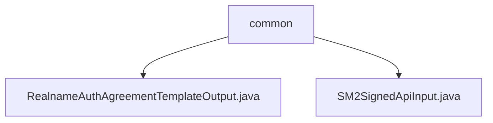

# 基础信息

|      |      |
|------|------|
| 名称 | common |
| 编码语言 | .java |
| 代码路径 | WeFe/union/union-service/src/main/java/com/welab/wefe/union/service/dto/common |
| 包名 | docs.union.union-service.src.main.java.com.welab.wefe.union.service.dto.common |
| 概述说明 | RealnameAuthAgreementTemplateOutput类含模板文件ID和名称属性及对应方法。SM2SignedApiInput类继承AbstractApiInput，含节点ID、签名和数据属性及方法。 |

# 说明

## 概述  
该模块核心职责是封装实名认证协议模板和SM2签名API的输入/输出数据。接口规范包含标准Java Bean设计，通过getter/setter暴露属性，例如RealnameAuthAgreementTemplateOutput管理文件ID/名称，SM2SignedApiInput处理区块链节点ID/签名/数据。关键数据结构包括模板文件标识、SM2签名参数组等。外部依赖仅为Java基础库。  

## 主要业务场景  
主要支持实名认证协议文件元数据传递（例如模板文件ID与文件名交互）和SM2签名请求处理（类似加密网关模式）。典型应用包括区块链节点签名数据封装、认证协议模板信息传输等。API类型均为DTO层数据容器，集成案例可见于文件元数据返回、加密API参数接收等场景。

### 包内部结构视图

该流程图展示了WeFe项目中union-service模块下common目录的结构关系。common作为父节点包含两个DTO类文件：RealnameAuthAgreementTemplateOutput.java处理实名认证协议模板输出，SM2SignedApiInput.java用于SM2签名API输入参数封装。整个结构清晰体现了服务层数据传输对象的组织方式。

# 文件列表

| 名称   | 类型  | 说明 |
|-------|------|-------------|
| [RealnameAuthAgreementTemplateOutput.java](RealnameAuthAgreementTemplateOutput.md) | file | 这是一个实名认证协议模板类，包含模板文件ID和文件名属性及其getter和setter方法。 |
| [SM2SignedApiInput.java](SM2SignedApiInput.md) | file | SM2签名API输入类，包含区块链节点ID、签名和数据字段及其getter和setter方法。 |

