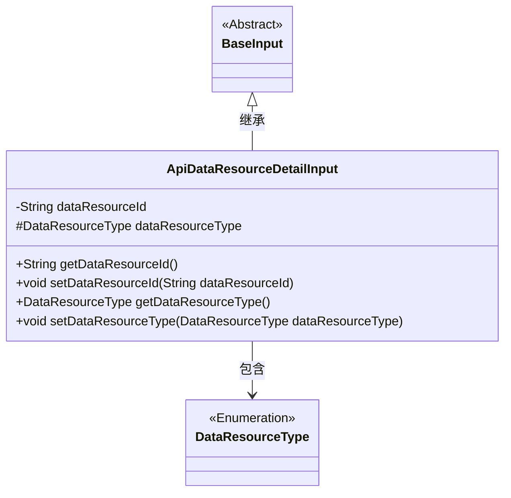
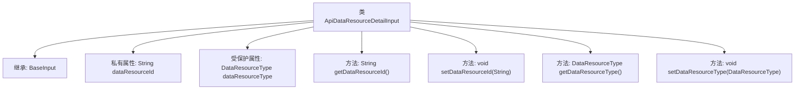

# 基础信息

|      |      |
|------|------|
| 名称 | ApiDataResourceDetailInput |
| 编码语言 | .java |
| 代码路径 | WeFe/union/union-service/src/main/java/com/welab/wefe/union/service/dto/dataresource/ApiDataResourceDetailInput.java |
| 包名 | com.welab.wefe.union.service.dto.dataresource |
| 依赖项 | ['com.welab.wefe.common.fieldvalidate.annotation.Check', 'com.welab.wefe.common.wefe.enums.DataResourceType', 'com.welab.wefe.union.service.dto.base.BaseInput'] |
| 概述说明 | ApiDataResourceDetailInput类继承BaseInput，包含必填字段dataResourceId和dataResourceType，提供getter和setter方法。 |

# 说明

ApiDataResourceDetailInput类继承自BaseInput，包含两个必填字段：dataResourceId（字符串类型）和dataResourceType（DataResourceType类型）。这两个字段通过注解@Check(require=true)标记为必须提供。类提供了标准的getter和setter方法用于访问和修改这两个字段的值。dataResourceType字段被声明为protected可见性。

# 类列表 Class Summary

| 名称   | 类型  | 说明 |
|-------|------|-------------|
| ApiDataResourceDetailInput | class | ApiDataResourceDetailInput类继承BaseInput，包含必填字段dataResourceId和dataResourceType，提供getter和setter方法。 |

## 类 ApiDataResourceDetailInput

|      |      |
|------|------|
| 访问范围 | public |
| 类型 | class |
| 名称 | ApiDataResourceDetailInput |
| 说明 | ApiDataResourceDetailInput类继承BaseInput，包含必填字段dataResourceId和dataResourceType，提供getter和setter方法。 |

### UML类图

这段类图展示了ApiDataResourceDetailInput类继承自BaseInput抽象类，并包含一个DataResourceType枚举类型。ApiDataResourceDetailInput类有两个主要属性：私有字符串dataResourceId和受保护的DataResourceType枚举dataResourceType，同时提供了对应的getter和setter方法。该类通过注解@Check对字段进行非空校验，体现了数据验证的设计意图。

### 内部方法调用关系图

这段代码定义了一个名为`ApiDataResourceDetailInput`的类，继承自`BaseInput`。类中包含两个带校验注解的属性：`dataResourceId`和`dataResourceType`，分别表示数据资源ID和类型。提供了标准的getter和setter方法来访问和修改这些属性。流程图清晰地展示了类的继承关系和内部结构，包括属性声明和方法定义。

### 字段列表 Field List

| 名称  | 类型  | 说明 |
|-------|-------|------|
| dataResourceType | DataResourceType | 必填字段，数据类型为DataResourceType。 |
| dataResourceId | String | 必填字段dataResourceId |

### 方法列表

| 名称  | 类型  | 说明 |
|-------|-------|------|
| getDataResourceId | String | 获取数据资源ID的方法，返回字符串类型dataResourceId。 |
| setDataResourceId | void | 设置数据资源ID的方法，将输入参数赋值给类的成员变量dataResourceId。 |
| getDataResourceType | DataResourceType | 获取数据资源类型的方法，返回dataResourceType。 |
| setDataResourceType | void | 设置数据资源类型的方法，参数为DataResourceType类型，赋值给当前对象的dataResourceType属性。 |

