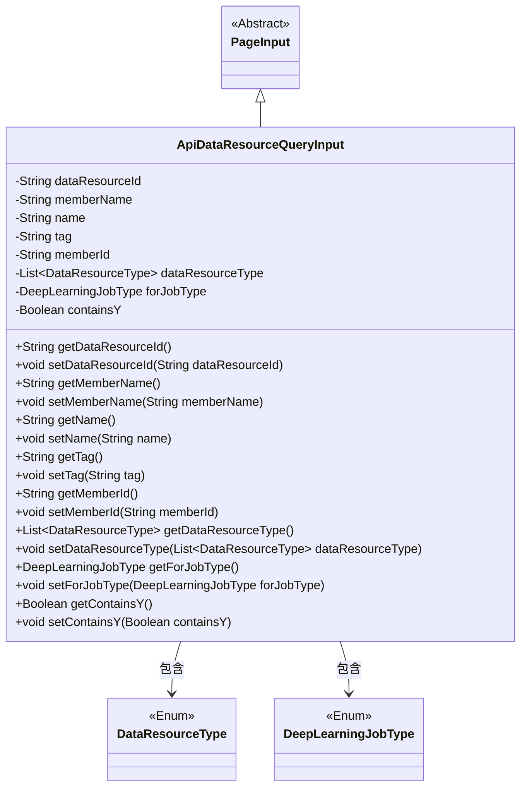

# 基础信息

|      |      |
|------|------|
| 名称 | ApiDataResourceQueryInput |
| 编码语言 | .java |
| 代码路径 | WeFe/union/union-service/src/main/java/com/welab/wefe/union/service/dto/dataresource/ApiDataResourceQueryInput.java |
| 包名 | com.welab.wefe.union.service.dto.dataresource |
| 依赖项 | ['com.welab.wefe.common.wefe.enums.DataResourceType', 'com.welab.wefe.common.wefe.enums.DeepLearningJobType', 'com.welab.wefe.union.service.dto.base.PageInput', 'java.util.List'] |
| 概述说明 | ApiDataResourceQueryInput类继承PageInput，包含数据资源ID、成员名、名称、标签、成员ID、资源类型列表、深度学习任务类型及是否包含Y等字段及其getter/setter方法。 |

# 说明

ApiDataResourceQueryInput类继承自PageInput，用于封装API数据资源查询的输入参数。包含以下字段：dataResourceId表示资源ID，memberName和memberId分别表示成员名称和ID，name和tag用于名称和标签筛选，dataResourceType是资源类型列表，forJobType指定深度学习任务类型，containsY为布尔值标志。每个字段均有对应的getter和setter方法。

# 类列表 Class Summary

| 名称   | 类型  | 说明 |
|-------|------|-------------|
| ApiDataResourceQueryInput | class | ApiDataResourceQueryInput类继承PageInput，包含数据资源ID、成员名、名称、标签、成员ID等字段，支持数据类型列表、深度学习任务类型及是否包含Y的查询条件。 |

## 类 ApiDataResourceQueryInput

|      |      |
|------|------|
| 访问范围 | public |
| 类型 | class |
| 名称 | ApiDataResourceQueryInput |
| 说明 | ApiDataResourceQueryInput类继承PageInput，包含数据资源ID、成员名、名称、标签、成员ID等字段，支持数据类型列表、深度学习任务类型及是否包含Y的查询条件。 |

### UML类图

这段类图展示了ApiDataResourceQueryInput继承自抽象类PageInput，并包含多个字符串类型字段和两个枚举类型字段。该类提供了标准的getter/setter方法，用于管理数据资源查询的输入参数，包括资源ID、成员名称、标签等属性，同时支持分页功能。枚举类型DataResourceType和DeepLearningJobType分别表示资源类型和深度学习任务类型。

### 内部方法调用关系图

```mermaid
graph TD
    A["类ApiDataResourceQueryInput"]
    B["继承自: PageInput"]
    C["属性: String dataResourceId"]
    D["属性: String memberName"]
    E["属性: String name"]
    F["属性: String tag"]
    G["属性: String memberId"]
    H["属性: List<DataResourceType> dataResourceType"]
    I["属性: DeepLearningJobType forJobType"]
    J["属性: Boolean containsY"]
    K["方法: getDataResourceId()"]
    L["方法: setDataResourceId(String)"]
    M["方法: getMemberName()"]
    N["方法: setMemberName(String)"]
    O["方法: getName()"]
    P["方法: setName(String)"]
    Q["方法: getTag()"]
    R["方法: setTag(String)"]
    S["方法: getMemberId()"]
    T["方法: setMemberId(String)"]
    U["方法: getDataResourceType()"]
    V["方法: setDataResourceType(List<DataResourceType>)"]
    W["方法: getForJobType()"]
    X["方法: setForJobType(DeepLearningJobType)"]
    Y["方法: getContainsY()"]
    Z["方法: setContainsY(Boolean)"]

    A --> B
    A --> C
    A --> D
    A --> E
    A --> F
    A --> G
    A --> H
    A --> I
    A --> J
    A --> K
    A --> L
    A --> M
    A --> N
    A --> O
    A --> P
    A --> Q
    A --> R
    A --> S
    A --> T
    A --> U
    A --> V
    A --> W
    A --> X
    A --> Y
    A --> Z
```

这段代码定义了一个名为`ApiDataResourceQueryInput`的类，继承自`PageInput`，包含多个属性和对应的getter/setter方法。属性包括字符串类型的`dataResourceId`、`memberName`、`name`、`tag`、`memberId`，以及复杂类型的`dataResourceType`、`forJobType`和`containsY`。每个属性都有对应的getter和setter方法，用于获取和设置属性值。这个类可能用于封装API查询输入参数，支持分页查询和多种过滤条件。

### 字段列表 Field List

| 名称  | 类型  | 说明 |
|-------|-------|------|
| containsY | Boolean | 布尔变量，标识是否包含Y。 |
| tag | String | 声明一个受保护的字符串变量tag。 |
| name | String | 声明一个受保护的字符串类型变量name。 |
| memberName | String | 声明一个受保护的字符串类型成员变量memberName。 |
| dataResourceId | String | 声明一个受保护的字符串变量dataResourceId，用于存储数据资源标识。 |
| memberId | String | 成员ID字符串保护字段 |
| dataResourceType | List<DataResourceType> | 私有数据资源类型列表。 |
| forJobType | DeepLearningJobType | 私有深度学习任务类型变量forJobType。 |

### 方法列表

| 名称  | 类型  | 说明 |
|-------|-------|------|
| setDataResourceType | void | 设置数据资源类型的方法，接收一个DataResourceType列表参数并赋值给当前对象的dataResourceType属性。 |
| setDataResourceId | void | 设置数据资源ID的方法，将参数值赋给类成员变量dataResourceId。 |
| getDataResourceType | List<DataResourceType> | 方法返回数据资源类型列表。 |
| getTag | String | 这是一个Java方法，返回字符串类型的成员变量tag的值。 |
| getDataResourceId | String | 获取数据资源ID的方法，返回值为dataResourceId。 |
| getMemberId | String | 获取成员ID的方法，返回字符串类型的memberId。 |
| setTag | void | 设置对象的标签属性值。 |
| setMemberId | void | 设置成员ID的方法，将参数memberId赋值给当前对象的memberId属性。 |
| setMemberName | void | 设置成员名称的方法，将输入参数赋值给成员变量memberName。 |
| getName | String | 这是一个Java方法，返回字符串类型的name变量值。 |
| setName | void | 设置对象名称的方法，将参数name赋值给对象的name属性。 |
| getMemberName | String | 这是一个Java方法，返回成员变量memberName的值。方法名为getMemberName，无参数，返回类型为String。 |
| getForJobType | DeepLearningJobType | 获取深度学习作业类型的方法，返回forJobType字段值。 |
| setForJobType | void | 设置深度学习任务类型的方法，将参数赋值给类成员变量。 |
| getContainsY | Boolean | 这是一个Java方法，返回布尔类型变量containsY的值。 |
| setContainsY | void | 这是一个Java方法，用于设置布尔类型变量containsY的值。方法名为setContainsY，接受一个Boolean参数。 |

