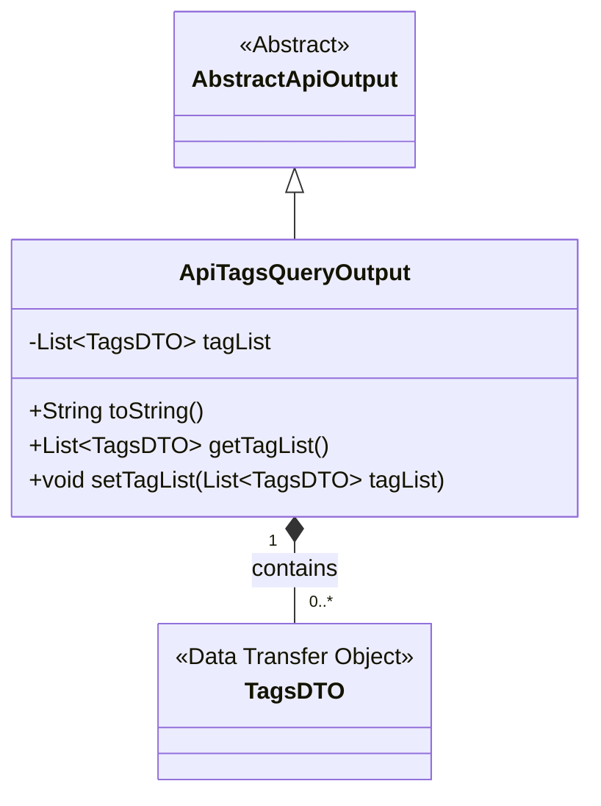
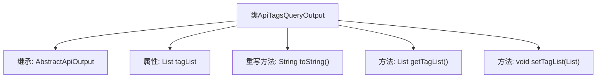

# 基础信息

|      |      |
|------|------|
| 名称 | ApiTagsQueryOutput |
| 编码语言 | .java |
| 代码路径 | WeFe/union/union-service/src/main/java/com/welab/wefe/union/service/dto/dataresource/ApiTagsQueryOutput.java |
| 包名 | com.welab.wefe.union.service.dto.dataresource |
| 依赖项 | ['com.welab.wefe.common.web.dto.AbstractApiOutput', 'java.util.List'] |
| 概述说明 | ApiTagsQueryOutput类继承AbstractApiOutput，包含tagList属性和其getter/setter方法，重写了toString方法。 |

# 说明

ApiTagsQueryOutput类继承自AbstractApiOutput，包含一个私有成员变量tagList，类型为TagsDTO对象的列表。提供了toString方法返回包含tagList的字符串表示，以及getter和setter方法用于访问和修改tagList。该类主要用于封装API查询标签列表的输出结果。

# 类列表 Class Summary

| 名称   | 类型  | 说明 |
|-------|------|-------------|
| ApiTagsQueryOutput | class | ApiTagsQueryOutput类继承AbstractApiOutput，包含tagList属性和对应的getter/setter方法，重写了toString方法。 |

## 类 ApiTagsQueryOutput

|      |      |
|------|------|
| 访问范围 | public |
| 类型 | class |
| 名称 | ApiTagsQueryOutput |
| 说明 | ApiTagsQueryOutput类继承AbstractApiOutput，包含tagList属性和对应的getter/setter方法，重写了toString方法。 |

### UML类图

这段代码展示了一个继承关系，其中ApiTagsQueryOutput类继承自抽象类AbstractApiOutput，并包含一个TagsDTO对象的列表。ApiTagsQueryOutput提供了对tagList的getter和setter方法，以及重写了toString()方法用于输出对象内容。TagsDTO作为数据传递对象，通过组合关系被ApiTagsQueryOutput所包含。该设计实现了对标签数据的封装和操作，体现了面向对象编程的继承和组合特性。

### 内部方法调用关系图

该流程图展示了`ApiTagsQueryOutput`类的结构，它继承自`AbstractApiOutput`，包含一个`tagList`属性列表，并提供了`toString()`方法重写、`getTagList()`和`setTagList()`方法。箭头表示类与成员之间的从属关系，清晰地呈现了类的继承层次和功能组成。

### 字段列表 Field List

| 名称  | 类型  | 说明 |
|-------|-------|------|
| tagList | List<TagsDTO> | 私有标签列表，类型为TagsDTO对象的集合。 |

### 方法列表

| 名称  | 类型  | 说明 |
|-------|-------|------|
| toString | String | Java方法重写toString，返回包含tagList的字符串。 |
| getTagList | List<TagsDTO> | 这是一个Java方法，返回一个标签列表对象。方法名为getTagList，返回类型为List<TagsDTO>，直接返回成员变量tagList。 |
| setTagList | void | Java方法：设置标签列表，参数为TagsDTO列表。 |

