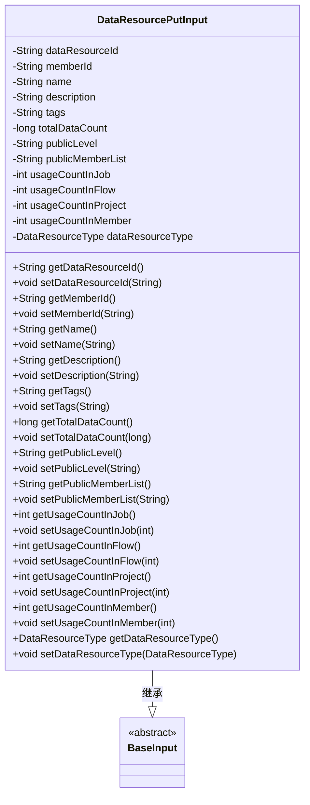

# 基础信息

|      |      |
|------|------|
| 名称 | DataResourcePutInput |
| 编码语言 | .java |
| 代码路径 | WeFe/union/union-service/src/main/java/com/welab/wefe/union/service/dto/dataresource/DataResourcePutInput.java |
| 包名 | com.welab.wefe.union.service.dto.dataresource |
| 依赖项 | ['com.welab.wefe.common.fieldvalidate.annotation.Check', 'com.welab.wefe.common.wefe.enums.DataResourceType', 'com.welab.wefe.union.service.dto.base.BaseInput'] |
| 概述说明 | DataResourcePutInput类继承BaseInput，包含数据资源ID、成员ID、名称、描述、标签、数据总量、公开级别、公开成员列表、各类使用计数及资源类型等属性，其中数据资源ID和类型为必填项。 |

# 说明

DataResourcePutInput类继承自BaseInput，包含多个属性用于描述数据资源。必填字段包括dataResourceId和dataResourceType，其他可选字段有memberId、name、description、tags、totalDataCount、publicLevel、publicMemberList以及在不同场景下的使用计数（usageCountInJob、usageCountInFlow、usageCountInProject、usageCountInMember）。每个属性都有对应的getter和setter方法用于访问和修改。

# 类列表 Class Summary

| 名称   | 类型  | 说明 |
|-------|------|-------------|
| DataResourcePutInput | class | DataResourcePutInput类继承BaseInput，包含数据资源ID、成员ID、名称、描述、标签、数据总数、公开级别、公开成员列表、各类使用计数及资源类型等字段，其中数据资源ID和类型为必填项。 |

## 类 DataResourcePutInput

|      |      |
|------|------|
| 访问范围 | public |
| 类型 | class |
| 名称 | DataResourcePutInput |
| 说明 | DataResourcePutInput类继承BaseInput，包含数据资源ID、成员ID、名称、描述、标签、数据总数、公开级别、公开成员列表、各类使用计数及资源类型等字段，其中数据资源ID和类型为必填项。 |

### UML类图

这段代码定义了一个`DataResourcePutInput`类，继承自抽象基类`BaseInput`。该类包含多个受保护的字段（如dataResourceId、name、description等）和对应的getter/setter方法，用于封装数据资源的相关信息。其中dataResourceId和dataResourceType字段通过@Check注解标记为必填项。类图清晰地展示了继承关系和所有成员属性/方法，体现了数据封装的设计模式。

### 内部方法调用关系图

这段代码定义了一个名为DataResourcePutInput的类，该类继承自BaseInput类。它包含多个属性，如dataResourceId、memberId、name等，以及对应的getter和setter方法。其中dataResourceId和dataResourceType属性被标记为必须检查（@Check(require = true)）。该类主要用于封装数据资源的相关信息，包括资源ID、成员ID、名称、描述、标签、总数据量、公开级别、公开成员列表以及在作业、流程、项目和成员中的使用次数等。通过getter和setter方法可以对这些属性进行访问和修改。

### 字段列表 Field List

| 名称  | 类型  | 说明 |
|-------|-------|------|
| usageCountInFlow | int | 受保护的整型变量，记录流程中的使用次数。 |
| publicMemberList | String | 声明了一个受保护的字符串类型成员变量publicMemberList。 |
| usageCountInMember | int | 成员变量usageCountInMember，整型，受保护访问权限。 |
| tags | String | 受保护的字符串类型变量tags。 |
| dataResourceType | DataResourceType | 代码定义了一个受保护的DataResourceType类型变量dataResourceType，并使用@Check注解标记其必须为非空（require=true）。 |
| usageCountInJob | int | 受保护的整型变量，记录作业中的使用次数。 |
| name | String | 声明一个受保护的字符串变量name。 |
| description | String | 声明一个受保护的字符串类型变量description。 |
| usageCountInProject | int | 项目内使用次数计数器，整型保护变量。 |
| dataResourceId | String | 必填字段dataResourceId，受保护字符串类型。 |
| publicLevel | String | 保护字符串类型的公开级别变量。 |
| totalDataCount | long | 保护类型的长整型变量，用于存储总数据量。 |
| memberId | String | 成员ID字符串保护字段 |

### 方法列表

| 名称  | 类型  | 说明 |
|-------|-------|------|
| setDataResourceId | void | 设置数据资源ID的方法，将输入参数赋值给类的成员变量dataResourceId。 |
| setUsageCountInProject | void | 设置项目内使用次数的方法，参数为整型usageCountInProject。 |
| setDescription | void | 设置描述信息的方法，将输入参数赋值给对象的description属性。 |
| setName | void | 这是一个Java方法，用于设置对象的name属性，将传入的字符串参数赋值给当前对象的name字段。 |
| getPublicLevel | String | 获取publicLevel值的公共方法。 |
| getPublicMemberList | String | 获取公共成员列表的方法，返回publicMemberList变量值。 |
| setTags | void | 这是一个Java方法，用于设置对象的tags属性值。方法接收一个字符串参数tags，并将其赋值给当前对象的tags成员变量。 |
| getMemberId | String | 获取成员ID的方法，返回字符串类型的memberId。 |
| getDataResourceId | String | 该方法返回数据资源ID字符串。 |
| setUsageCountInJob | void | 设置作业内使用次数的公共方法，参数为整型usageCountInJob。 |
| setTotalDataCount | void | 设置数据总数的方法，将输入值赋给类变量totalDataCount。 |
| setUsageCountInFlow | void | 设置流程内使用次数的公共方法，参数为usageCountInFlow。 |
| setPublicMemberList | void | 设置公共成员列表的方法，将输入字符串赋值给类的publicMemberList成员变量。 |
| setPublicLevel | void | 定义公共方法setPublicLevel，用于设置publicLevel属性的值。 |
| getUsageCountInFlow | int | 方法返回流程中的使用次数。 |
| getUsageCountInJob | int | 获取任务中的使用次数。 |
| getName | String | 获取对象名称的方法，返回字符串类型的name属性值。 |
| getTotalDataCount | long | 获取数据总量方法，返回totalDataCount值。 |
| getDescription | String | 获取描述信息的方法，返回字符串类型的description变量。 |
| getUsageCountInProject | int | 方法返回项目中的使用次数。 |
| setMemberId | void | 设置成员ID的方法，将传入的字符串参数赋值给类的成员变量memberId。 |
| getUsageCountInMember | int | 方法返回成员内的使用次数。 |
| setUsageCountInMember | void | 设置成员使用次数的方法，将参数值赋给成员变量usageCountInMember。 |
| getDataResourceType | DataResourceType | 获取数据资源类型的方法，返回dataResourceType对象。 |
| setDataResourceType | void | 该方法用于设置数据资源类型，将传入的DataResourceType参数赋值给类的成员变量dataResourceType。 |
| getTags | String | 方法返回字符串类型的tags变量值。 |

