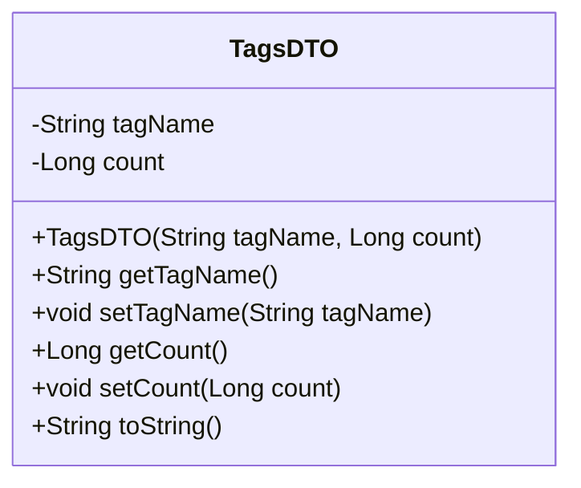
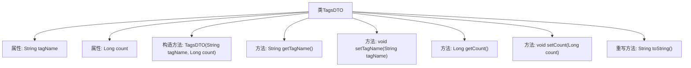

# 基础信息

|      |      |
|------|------|
| 名称 | TagsDTO |
| 编码语言 | .java |
| 代码路径 | WeFe/union/union-service/src/main/java/com/welab/wefe/union/service/dto/dataresource/TagsDTO.java |
| 包名 | com.welab.wefe.union.service.dto.dataresource |
| 依赖项 | [] |
| 概述说明 | TagsDTO类包含tagName和count属性，提供构造方法、getter/setter及toString方法。 |

# 说明

这是一个名为TagsDTO的Java类，用于表示标签数据。类中包含两个私有字段：tagName（字符串类型，表示标签名称）和count（长整型，表示标签计数）。提供了带参数的构造函数来初始化这两个字段，并为每个字段提供了对应的getter和setter方法。此外，重写了toString方法，以特定格式返回对象的字符串表示。该类主要用于封装和操作标签相关的数据。

# 类列表 Class Summary

| 名称   | 类型  | 说明 |
|-------|------|-------------|
| TagsDTO | class | TagsDTO类包含tagName和count属性，提供构造方法、getter/setter及toString方法。 |

## 类 TagsDTO

|      |      |
|------|------|
| 访问范围 | public |
| 类型 | class |
| 名称 | TagsDTO |
| 说明 | TagsDTO类包含tagName和count属性，提供构造方法、getter/setter及toString方法。 |

### UML类图

这段代码定义了一个名为TagsDTO的类，用于封装标签名称(tagName)和计数(count)两个属性。该类提供了完整的构造方法、getter/setter方法以及重写的toString()方法，实现了对标签数据的封装和基本操作。TagsDTO作为一个数据传输对象(DTO)，主要用于在不同层之间传递标签相关的数据，其toString()方法以JSON格式输出对象内容，便于调试和日志记录。

### 内部方法调用关系图

这段代码定义了一个名为TagsDTO的类，用于存储标签名称和对应的计数。类中包含两个私有属性tagName和count，分别表示标签名称和计数。类提供了构造方法、getter和setter方法，以及重写的toString方法用于格式化输出对象内容。流程图展示了类结构及其方法之间的关联关系，清晰地反映了数据封装和访问控制的面向对象特性。

### 字段列表 Field List

| 名称  | 类型  | 说明 |
|-------|-------|------|
| count | Long | 私有长整型变量count。 |
| tagName | String | 私有字符串变量tagName，用于存储标签名称。 |

### 方法列表

| 名称  | 类型  | 说明 |
|-------|-------|------|
| toString | String | Java重写toString方法，返回包含tagName和count字段的字符串格式。 |
| setTagName | void | 这是一个Java方法，用于设置对象的tagName属性值。方法接收一个字符串参数tagName，并将其赋值给当前对象的同名属性。 |
| getTagName | String | 方法返回字符串类型的标签名称。 |
| getCount | Long | 获取计数值的方法，返回长整型变量count。 |
| setCount | void | 设置count属性的方法，参数为Long类型。 |

