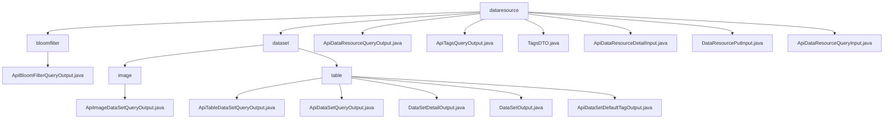

# 基础信息

|      |      |
|------|------|
| 名称 | dataresource |
| 编码语言 | .java |
| 代码路径 | WeFe/union/union-service/src/main/java/com/welab/wefe/union/service/dto/dataresource |
| 包名 | docs.union.union-service.src.main.java.com.welab.wefe.union.service.dto.dataresource |
| 概述说明 | ApiBloomFilterQueryOutput继承ApiDataResourceQueryOutput，含ExtraData内部类存储hashFunction。ApiDataResourceQueryOutput包含资源ID、名称等属性。TagsDTO类封装标签数据。输入类如ApiDataResourceDetailInput含必填字段dataResourceId和dataResourceType。模块提供数据集查询标准化输出，支持联合学习元数据管理。 |

# 说明

## 概述  
该模块核心职责是统一管理联合学习中的数据资源元信息，包括基础属性、标签系统和查询交互。接口规范采用分层继承设计，例如`ApiBloomFilterQueryOutput`扩展`ApiDataResourceQueryOutput`并嵌套`ExtraData`存储哈希函数等专有属性。关键数据结构涵盖资源ID、成员信息、标签列表（如`TagsDTO`）、使用计数和类型标识（如`DataResourceType`）。外部依赖仅涉及基础类如`AbstractTimedApiOutput`和`PageInput`。例如`DataResourcePutInput`支持通过必填字段`dataResourceId`实现资源更新。

## 主要业务场景  
模块支撑数据资源的全生命周期管理，类似CRUD仓库模式。业务流程包括：元数据查询（如通过`ApiDataResourceQueryInput`筛选标签）、详情获取（如`ApiDataResourceDetailInput`指定资源类型）、标签统计（如`ApiTagsQueryOutput`返回计数）和资源维护（如`DataResourcePutInput`更新描述）。交互通过标准化getter/setter实现，例如`publicLevel`控制访问权限。典型应用包括资源检索（如按任务类型过滤）、标签分析（如`tagName`聚合）和状态追踪（如`usageCountInJob`统计）。API类型覆盖基础查询、分页查询和标签输出三类，例如`ApiTableDataSetQueryOutput`扩展基础结构返回列特征。

### 包内部结构视图

该流程图展示了WeFe项目中数据资源DTO的层级结构。顶层是dataresource目录，包含bloomfilter和dataset两个子目录以及多个直接文件。bloomfilter下有一个输出类，dataset下分为image和table两个子目录，其中table目录包含最丰富的文件类型，涉及数据集查询、详情和标签等多种输出/输入类。

# 文件列表

| 名称   | 类型  | 说明 |
|-------|------|-------------|
| [bloomfilter](bloomfilter/_module.md) | package | ApiBloomFilterQueryOutput类继承ApiDataResourceQueryOutput，包含ExtraData内部类，用于存储hashFunction字符串及其getter/setter方法。 |
| [ApiDataResourceQueryOutput.java](ApiDataResourceQueryOutput.md) | file | ApiDataResourceQueryOutput类继承AbstractTimedApiOutput，包含数据资源ID、成员信息、名称、描述、标签、数据量、公开级别、使用统计等属性及其getter/setter方法。 |
| [ApiTagsQueryOutput.java](ApiTagsQueryOutput.md) | file | ApiTagsQueryOutput类继承AbstractApiOutput，包含tagList属性和其getter/setter方法，重写了toString方法。 |
| [TagsDTO.java](TagsDTO.md) | file | TagsDTO类包含tagName和count属性，提供构造方法、getter/setter及toString方法。 |
| [ApiDataResourceDetailInput.java](ApiDataResourceDetailInput.md) | file | ApiDataResourceDetailInput类继承BaseInput，包含必填字段dataResourceId和dataResourceType，提供getter和setter方法。 |
| [DataResourcePutInput.java](DataResourcePutInput.md) | file | DataResourcePutInput类继承BaseInput，包含数据资源ID、成员ID、名称、描述、标签、数据总量、公开级别、公开成员列表、各类使用计数及资源类型等属性，其中数据资源ID和类型为必填项。 |
| [ApiDataResourceQueryInput.java](ApiDataResourceQueryInput.md) | file | ApiDataResourceQueryInput类继承PageInput，包含数据资源ID、成员名、名称、标签、成员ID、资源类型列表、深度学习任务类型及是否包含Y等字段及其getter/setter方法。 |
| [dataset](dataset/_module.md) | package | ApiImageDataSetQueryOutput继承ApiDataResourceQueryOutput，包含嵌套类ExtraData，记录任务类型、标签、标注状态等。模块提供数据集查询统一输出结构，支持联合学习元数据查询，如数据预览和权限控制。 |

