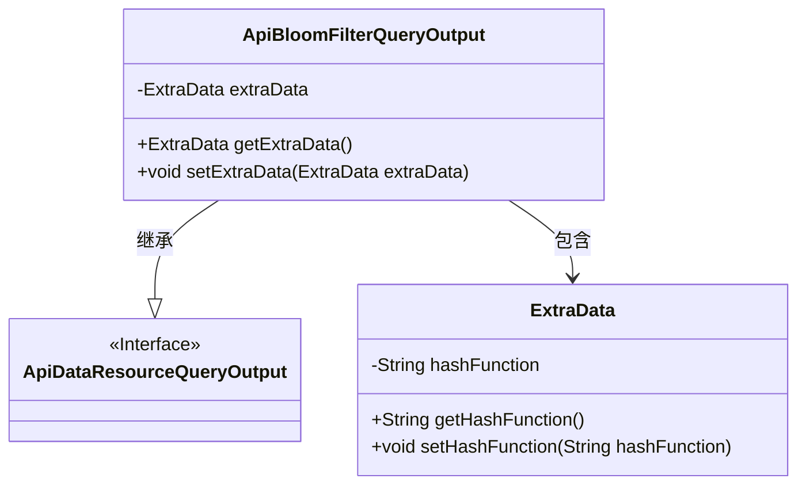
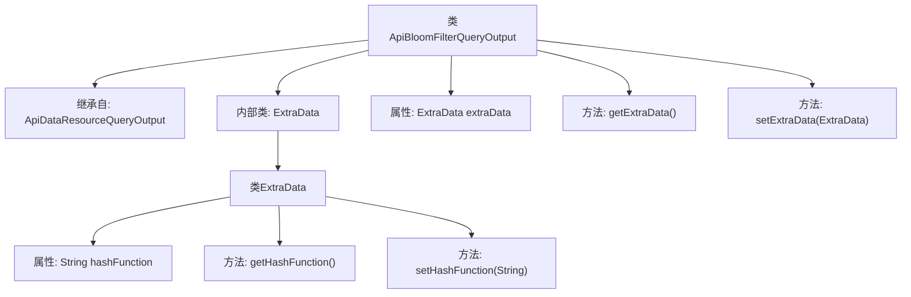

# 基础信息

|      |      |
|------|------|
| 名称 | ApiBloomFilterQueryOutput |
| 编码语言 | .java |
| 代码路径 | WeFe/union/union-service/src/main/java/com/welab/wefe/union/service/dto/dataresource/bloomfilter/ApiBloomFilterQueryOutput.java |
| 包名 | com.welab.wefe.union.service.dto.dataresource.bloomfilter |
| 依赖项 | ['com.welab.wefe.union.service.dto.dataresource.ApiDataResourceQueryOutput'] |
| 概述说明 | ApiBloomFilterQueryOutput类继承ApiDataResourceQueryOutput，包含ExtraData内部类，用于存储hashFunction字符串及其getter/setter方法。 |

# 说明

ApiBloomFilterQueryOutput类继承自ApiDataResourceQueryOutput，包含一个ExtraData内部类。ExtraData类有一个hashFunction字符串属性，并提供了对应的getter和setter方法。ApiBloomFilterQueryOutput类也提供了对ExtraData对象的getter和setter方法，用于访问和设置extraData字段。

# 类列表 Class Summary

| 名称   | 类型  | 说明 |
|-------|------|-------------|
| ApiBloomFilterQueryOutput | class | ApiBloomFilterQueryOutput继承自ApiDataResourceQueryOutput，包含ExtraData内部类，其中定义了hashFunction字段及其getter/setter方法。 |

## 类 ApiBloomFilterQueryOutput

|      |      |
|------|------|
| 访问范围 | public |
| 类型 | class |
| 名称 | ApiBloomFilterQueryOutput |
| 说明 | ApiBloomFilterQueryOutput继承自ApiDataResourceQueryOutput，包含ExtraData内部类，其中定义了hashFunction字段及其getter/setter方法。 |

### UML类图

这段类图展示了ApiBloomFilterQueryOutput继承自ApiDataResourceQueryOutput接口，并包含一个嵌套类ExtraData的结构关系。ApiBloomFilterQueryOutput作为实现类，通过聚合方式持有一个ExtraData对象，该对象封装了hashFunction属性和对应的访问方法。整体设计体现了接口继承与对象组合的模式，ExtraData作为私有内部类提供了扩展数据存储能力。

### 内部方法调用关系图

这段代码描述了一个继承自ApiDataResourceQueryOutput的ApiBloomFilterQueryOutput类，其中包含一个内部类ExtraData用于存储哈希函数信息。流程图展示了类的继承关系、内部类结构及其方法调用链，清晰地呈现了数据封装和访问逻辑。ExtraData类通过getter/setter提供对hashFunction属性的安全访问，而主类则管理ExtraData实例的存储和传递。

### 字段列表 Field List

| 名称  | 类型  | 说明 |
|-------|-------|------|
| extraData | ExtraData | 私有变量extraData，类型为ExtraData。 |

### 方法列表

| 名称  | 类型  | 说明 |
|-------|-------|------|
| getExtraData | ExtraData | 方法getExtraData返回extraData对象。 |
| setExtraData | void | 方法setExtraData用于设置extraData属性，参数为ExtraData类型对象。 |

