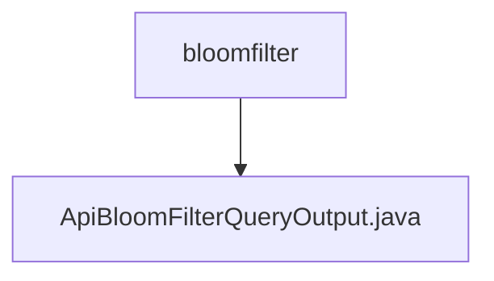

# 基础信息

|      |      |
|------|------|
| 名称 | bloomfilter |
| 编码语言 | .java |
| 代码路径 | WeFe/union/union-service/src/main/java/com/welab/wefe/union/service/dto/dataresource/bloomfilter |
| 包名 | docs.union.union-service.src.main.java.com.welab.wefe.union.service.dto.dataresource.bloomfilter |
| 概述说明 | ApiBloomFilterQueryOutput类继承ApiDataResourceQueryOutput，包含ExtraData内部类，用于存储hashFunction字符串及其getter/setter方法。 |

# 说明

ApiBloomFilterQueryOutput类继承自ApiDataResourceQueryOutput，包含一个ExtraData内部类。ExtraData类有一个hashFunction字符串属性，并提供了对应的getter和setter方法。ApiBloomFilterQueryOutput类也提供了对ExtraData对象的getter和setter方法，用于访问和设置extraData字段。

### 包内部结构视图

该流程图展示了WeFe项目中union-service模块下dataresource/bloomfilter目录的层级结构。bloomfilter作为父目录，包含一个子文件ApiBloomFilterQueryOutput.java。这个结构反映了数据资源布隆过滤器相关DTO类的存放位置，用于处理布隆过滤器查询的输出结果。

# 文件列表

| 名称   | 类型  | 说明 |
|-------|------|-------------|
| [ApiBloomFilterQueryOutput.java](ApiBloomFilterQueryOutput.md) | file | ApiBloomFilterQueryOutput类继承ApiDataResourceQueryOutput，包含ExtraData内部类，用于存储hashFunction字符串及其getter/setter方法。 |

