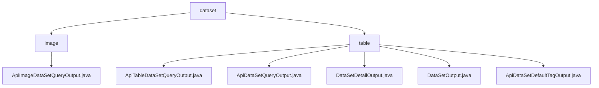

# 基础信息

|      |      |
|------|------|
| 名称 | dataset |
| 编码语言 | .java |
| 代码路径 | WeFe/union/union-service/src/main/java/com/welab/wefe/union/service/dto/dataresource/dataset |
| 包名 | docs.union.union-service.src.main.java.com.welab.wefe.union.service.dto.dataresource.dataset |
| 概述说明 | ApiImageDataSetQueryOutput继承ApiDataResourceQueryOutput，包含嵌套类ExtraData，记录任务类型、标签、标注状态等。模块提供数据集查询统一输出结构，支持联合学习元数据查询，如数据预览和权限控制。 |

# 说明

## 概述  
该模块核心职责是提供联合学习中数据集查询结果的标准化输出，涵盖基础信息、统计特征和元数据管理。接口规范采用分层设计，例如`ApiImageDataSetQueryOutput`继承`ApiDataResourceQueryOutput`并扩展`ExtraData`嵌套类存储任务类型、标签等附加数据。关键数据结构包括数据集ID、行列数、列名/特征名列表（如表数据集）、标签列表和文件大小（如图像数据集）。外部依赖仅涉及基础父类如`AbstractTimedApiOutput`。例如`DataSetDetailOutput`通过重写`toString`支持调试。

## 主要业务场景  
模块服务于联合学习的数据集元数据查询与交互，类似目录服务模式。业务流程包括：查询基础信息（如行列数）、获取详细特征（如`containsY`标志）、管理标签状态（如`labelCompleted`）。交互通过统一getter/setter实现，例如通过`extraData`访问嵌套属性。典型应用包括数据预览（如文件大小统计）、权限控制（如公开级别）和资源追踪（如作业使用次数）。API类型覆盖基础输出、时间戳输出和标签输出三类，例如表数据集通过`ApiTableDataSetQueryOutput`返回列特征信息。

### 包内部结构视图

该流程图展示了数据资源目录下数据集(dataset)模块的结构关系，包含image和table两个子目录。image目录下有一个API输出类文件，table目录下则包含5个不同功能的输出类文件，主要用于处理表格型数据集的查询和输出操作。整个结构清晰地反映了数据集模块的文件组织方式。

# 文件列表

| 名称   | 类型  | 说明 |
|-------|------|-------------|
| [table](table/_module.md) | package | ApiTableDataSetQueryOutput继承ApiDataResourceQueryOutput，含ExtraData嵌套类，记录列数、特征等。ApiDataSetQueryOutput继承AbstractTimedApiOutput，含数据集基本信息和元数据。DataSetDetailOutput继承AbstractTimedApiOutput，含数据集详细信息。DataSetOutput继承AbstractApiOutput，功能依赖父类。ApiDataSetDefaultTagOutput含标签id和名称。 |
| [image](image/_module.md) | package | ApiImageDataSetQueryOutput类继承ApiDataResourceQueryOutput，包含ExtraData内部类，存储任务类型、标签列表、标注数量、完成状态和文件大小等信息。 |

