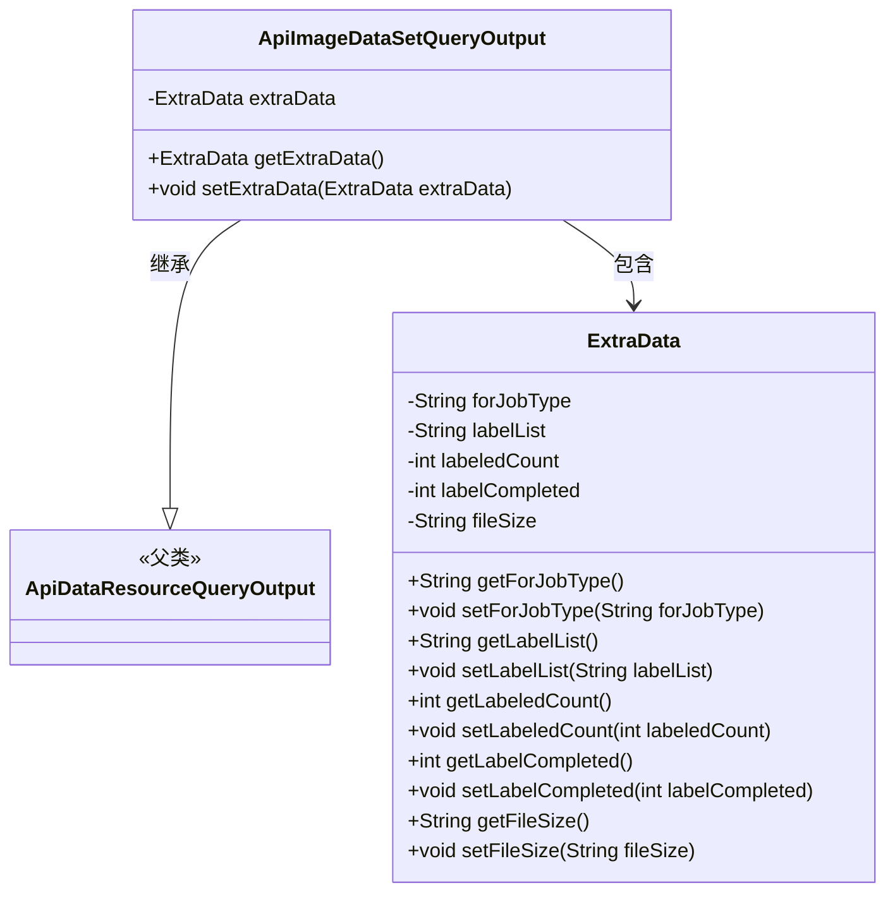
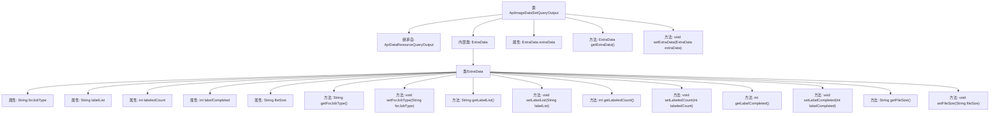

# 基础信息

|      |      |
|------|------|
| 名称 | ApiImageDataSetQueryOutput |
| 编码语言 | .java |
| 代码路径 | WeFe/union/union-service/src/main/java/com/welab/wefe/union/service/dto/dataresource/dataset/image/ApiImageDataSetQueryOutput.java |
| 包名 | com.welab.wefe.union.service.dto.dataresource.dataset.image |
| 依赖项 | ['com.welab.wefe.union.service.dto.dataresource.ApiDataResourceQueryOutput'] |
| 概述说明 | ApiImageDataSetQueryOutput类继承ApiDataResourceQueryOutput，包含ExtraData内部类，存储任务类型、标签列表、标注数量、完成状态和文件大小等信息。 |

# 说明

ApiImageDataSetQueryOutput类继承自ApiDataResourceQueryOutput，包含一个嵌套类ExtraData。ExtraData类具有五个属性：forJobType表示任务类型，labelList存储标签列表，labeledCount记录已标注数量，labelCompleted表示标注完成状态，fileSize存储文件大小。主类通过getter和setter方法访问和修改ExtraData对象。

# 类列表 Class Summary

| 名称   | 类型  | 说明 |
|-------|------|-------------|
| ApiImageDataSetQueryOutput | class | ApiImageDataSetQueryOutput继承ApiDataResourceQueryOutput，包含ExtraData内部类，存储任务类型、标签列表、标注数量、完成状态及文件大小等信息。 |

## 类 ApiImageDataSetQueryOutput

|      |      |
|------|------|
| 访问范围 | public |
| 类型 | class |
| 名称 | ApiImageDataSetQueryOutput |
| 说明 | ApiImageDataSetQueryOutput继承ApiDataResourceQueryOutput，包含ExtraData内部类，存储任务类型、标签列表、标注数量、完成状态及文件大小等信息。 |

### UML类图

这段代码展示了一个图像数据集查询输出类ApiImageDataSetQueryOutput，它继承自ApiDataResourceQueryOutput父类，并包含一个嵌套类ExtraData。ExtraData类封装了与图像标注任务相关的元数据，包括任务类型、标签列表、标注数量、完成状态和文件大小等信息。主类通过getter/setter方法管理ExtraData对象，形成清晰的层级结构，适用于图像标注系统的数据返回场景。

### 内部方法调用关系图

这段代码定义了一个名为ApiImageDataSetQueryOutput的类，它继承自ApiDataResourceQueryOutput。该类包含一个内部类ExtraData，用于存储与图像数据集相关的额外信息，如任务类型、标签列表、已标记数量、标记完成状态和文件大小。ApiImageDataSetQueryOutput类提供了对ExtraData对象的获取和设置方法，而ExtraData内部类则提供了对所有属性的getter和setter方法，以便于访问和修改这些属性。

### 字段列表 Field List

| 名称  | 类型  | 说明 |
|-------|-------|------|
| extraData | ExtraData | 私有额外数据对象。 |

### 方法列表

| 名称  | 类型  | 说明 |
|-------|-------|------|
| getExtraData | ExtraData | 方法getExtraData返回extraData对象。 |
| setExtraData | void | 方法setExtraData接收ExtraData对象参数，并将其赋值给当前对象的extraData成员变量。 |

