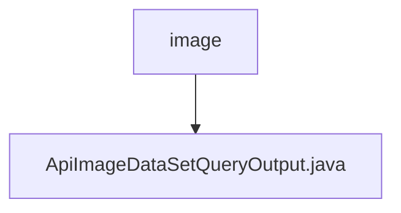

# 基础信息

|      |      |
|------|------|
| 名称 | image |
| 编码语言 | .java |
| 代码路径 | WeFe/union/union-service/src/main/java/com/welab/wefe/union/service/dto/dataresource/dataset/image |
| 包名 | docs.union.union-service.src.main.java.com.welab.wefe.union.service.dto.dataresource.dataset.image |
| 概述说明 | ApiImageDataSetQueryOutput类继承ApiDataResourceQueryOutput，包含ExtraData内部类，存储任务类型、标签列表、标注数量、完成状态和文件大小等信息。 |

# 说明

ApiImageDataSetQueryOutput类继承自ApiDataResourceQueryOutput，包含一个嵌套类ExtraData。ExtraData类具有五个属性：forJobType表示任务类型，labelList存储标签列表，labeledCount记录已标注数量，labelCompleted表示标注完成状态，fileSize存储文件大小。主类通过getter和setter方法访问和修改ExtraData对象。

### 包内部结构视图

该流程图展示了WeFe项目中数据集图像资源的结构关系。根节点"image"表示图像资源目录，其下包含一个具体的输出类文件"ApiImageDataSetQueryOutput.java"，用于处理图像数据集的查询输出功能。这种结构体现了典型的DTO层设计模式，将特定领域的输出模型集中管理。

# 文件列表

| 名称   | 类型  | 说明 |
|-------|------|-------------|
| [ApiImageDataSetQueryOutput.java](ApiImageDataSetQueryOutput.md) | file | ApiImageDataSetQueryOutput类继承ApiDataResourceQueryOutput，包含ExtraData内部类，存储任务类型、标签列表、标注数量、完成状态和文件大小等信息。 |

