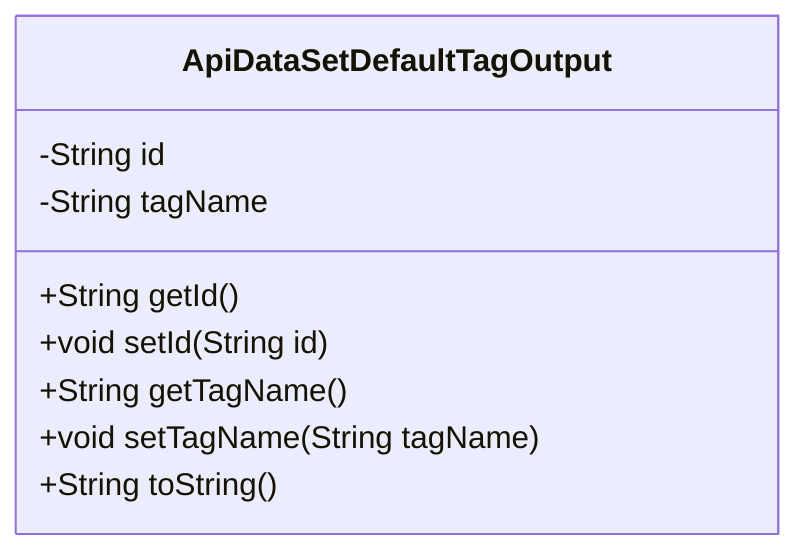
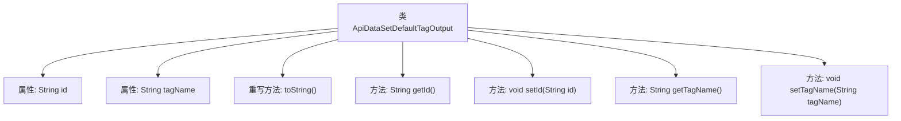

# 基础信息

|      |      |
|------|------|
| 名称 | ApiDataSetDefaultTagOutput |
| 编码语言 | .java |
| 代码路径 | WeFe/union/union-service/src/main/java/com/welab/wefe/union/service/dto/dataresource/dataset/table/ApiDataSetDefaultTagOutput.java |
| 包名 | com.welab.wefe.union.service.dto.dataresource.dataset.table |
| 依赖项 | [] |
| 概述说明 | ApiDataSetDefaultTagOutput类包含id和tagName属性，提供getter和setter方法，toString方法返回属性值的字符串表示。 |

# 说明

这是一个名为ApiDataSetDefaultTagOutput的Java类，用于表示API数据集的默认标签输出。该类包含两个私有字符串字段：id和tagName，分别用于存储标签的唯一标识和名称。提供了这两个字段的getter和setter方法，用于获取和设置字段值。此外，重写了toString方法，以特定格式返回包含id和tagName的字符串表示。

# 类列表 Class Summary

| 名称   | 类型  | 说明 |
|-------|------|-------------|
| ApiDataSetDefaultTagOutput | class | ApiDataSetDefaultTagOutput类包含id和tagName属性，提供getter/setter方法和toString重写。 |

## 类 ApiDataSetDefaultTagOutput

|      |      |
|------|------|
| 访问范围 | public |
| 类型 | class |
| 名称 | ApiDataSetDefaultTagOutput |
| 说明 | ApiDataSetDefaultTagOutput类包含id和tagName属性，提供getter/setter方法和toString重写。 |

### UML类图

这段代码定义了一个名为`ApiDataSetDefaultTagOutput`的类，用于表示API数据集的默认标签输出。该类包含两个私有属性`id`和`tagName`，分别用于存储标签的唯一标识和名称。提供了这些属性的getter和setter方法，以及一个重写的`toString()`方法用于格式化输出对象内容。这个类主要用于封装和传输标签数据，适用于需要处理标签信息的API交互场景。

### 内部方法调用关系图

这段代码定义了一个名为ApiDataSetDefaultTagOutput的类，包含两个私有属性id和tagName，以及对应的getter和setter方法。类重写了toString()方法，用于格式化输出对象的属性值。流程图展示了类结构与各方法间的从属关系，清晰地呈现了数据封装和访问控制的设计模式。

### 字段列表 Field List

| 名称  | 类型  | 说明 |
|-------|-------|------|
| tagName | String | 私有字符串变量tagName，用于存储标签名称。 |
| id | String | 声明一个私有字符串类型变量id。 |

### 方法列表

| 名称  | 类型  | 说明 |
|-------|-------|------|
| toString | String | 重写toString方法，返回包含id和tagName的JSON格式字符串。 |
| getTagName | String | 获取标签名称的方法，返回字符串类型的tagName。 |
| setTagName | void | 这是一个Java方法，用于设置对象的标签名称。方法接受一个字符串参数tagName，并将其赋值给对象的成员变量tagName。 |
| getId | String | 获取ID的方法，返回字符串类型的id。 |
| setId | void | 设置对象ID的方法，将参数id赋值给当前对象的id属性。 |

