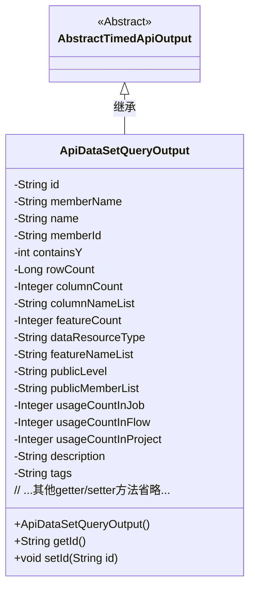

# 基础信息

|      |      |
|------|------|
| 名称 | ApiDataSetQueryOutput |
| 编码语言 | .java |
| 代码路径 | WeFe/union/union-service/src/main/java/com/welab/wefe/union/service/dto/dataresource/dataset/table/ApiDataSetQueryOutput.java |
| 包名 | com.welab.wefe.union.service.dto.dataresource.dataset.table |
| 依赖项 | ['com.welab.wefe.common.web.dto.AbstractTimedApiOutput', 'com.welab.wefe.common.wefe.enums.DataResourceType'] |
| 概述说明 | ApiDataSetQueryOutput类继承AbstractTimedApiOutput，包含数据集ID、名称、成员信息、行列数、特征列表、公开级别、使用统计及描述标签等属性。 |

# 说明

ApiDataSetQueryOutput类继承自AbstractTimedApiOutput，用于表示数据集查询的输出结果。该类包含数据集的基本信息如id、名称、成员名称和成员id，以及数据特征如行数、列数、列名列表和特征数量。还包含数据资源类型、公开级别、公开成员列表、在作业、流程和项目中的使用次数，以及描述和标签等元数据。所有字段都提供了对应的getter和setter方法。

# 类列表 Class Summary

| 名称   | 类型  | 说明 |
|-------|------|-------------|
| ApiDataSetQueryOutput | class | ApiDataSetQueryOutput类继承AbstractTimedApiOutput，包含数据集ID、名称、行列数、特征数、公开级别、使用统计等属性，用于查询数据集信息。 |

## 类 ApiDataSetQueryOutput

|      |      |
|------|------|
| 访问范围 | public |
| 类型 | class |
| 名称 | ApiDataSetQueryOutput |
| 说明 | ApiDataSetQueryOutput类继承AbstractTimedApiOutput，包含数据集ID、名称、行列数、特征数、公开级别、使用统计等属性，用于查询数据集信息。 |

### UML类图

这段代码定义了一个`ApiDataSetQueryOutput`类，继承自抽象类`AbstractTimedApiOutput`。该类主要用于封装数据集查询的输出结果，包含20多个私有字段（如id、name、rowCount等）和对应的getter/setter方法。其中dataResourceType字段默认值为"TableDataSet"，表示数据资源类型。类图清晰地展示了继承关系和完整的属性结构，体现了对数据集元信息的全面封装能力。

### 内部方法调用关系图

```mermaid
graph TD
    A["类ApiDataSetQueryOutput"]
    B["继承: AbstractTimedApiOutput"]
    C["属性: String id"]
    D["属性: String memberName"]
    E["属性: String name"]
    F["属性: String memberId"]
    G["属性: int containsY"]
    H["属性: Long rowCount"]
    I["属性: Integer columnCount"]
    J["属性: String columnNameList"]
    K["属性: Integer featureCount"]
    L["属性: String dataResourceType"]
    M["属性: String featureNameList"]
    N["属性: String publicLevel"]
    O["属性: String publicMemberList"]
    P["属性: Integer usageCountInJob"]
    Q["属性: Integer usageCountInFlow"]
    R["属性: Integer usageCountInProject"]
    S["属性: String description"]
    T["属性: String tags"]
    U["构造方法: ApiDataSetQueryOutput()"]
    V["Getter/Setter方法: 所有属性"]

    A --|继承| B
    A --> C
    A --> D
    A --> E
    A --> F
    A --> G
    A --> H
    A --> I
    A --> J
    A --> K
    A --> L
    A --> M
    A --> N
    A --> O
    A --> P
    A --> Q
    A --> R
    A --> S
    A --> T
    A --> U
    A -.-> V
```

该流程图展示了ApiDataSetQueryOutput类的完整结构，包括从AbstractTimedApiOutput继承的关系、16个不同数据类型的属性字段、无参构造函数以及所有属性的Getter/Setter方法。这个类主要用于封装数据集查询结果的输出信息，包含数据集标识、成员信息、行列统计、特征信息、使用计数和描述标签等元数据，是一个典型的数据传输对象(Data Transfer Object)实现。

### 字段列表 Field List

| 名称  | 类型  | 说明 |
|-------|-------|------|
| containsY | int | 私有整型变量，用于判断是否包含Y。 |
| rowCount | Long | 私有长整型变量rowCount，用于记录行数。 |
| name | String | 声明一个私有字符串变量name。 |
| usageCountInProject | Integer | 项目内使用次数统计，类型为整型，私有属性。 |
| featureNameList | String | 定义了一个私有字符串变量featureNameList，用于存储特征名称列表。 |
| memberId | String | 声明一个私有字符串类型变量memberId。 |
| featureCount | Integer | 私有整型变量，用于记录特征数量。 |
| usageCountInFlow | Integer | 流使用次数计数器，记录流程中的使用次数。 |
| id | String | 私有字符串类型变量id。 |
| publicMemberList | String | 私有字符串变量publicMemberList，用于存储公共成员列表。 |
| columnCount | Integer | 私有整型变量，表示列数。 |
| usageCountInJob | Integer | 私有整型变量，记录作业中的使用次数。 |
| description | String | 私有字符串类型变量，用于存储描述信息。 |
| memberName | String | 声明一个私有字符串变量memberName。 |
| dataResourceType = DataResourceType.TableDataSet.name() | String | 定义字符串变量dataResourceType，初始值为DataResourceType.TableDataSet的枚举名称。 |
| tags | String | 私有字符串变量tags，用于存储标签信息。 |
| publicLevel | String | 私有字符串变量publicLevel，用于存储公共级别信息。 |
| columnNameList | String | 字段columnNameList用于存储列名列表的字符串。 |

### 方法列表

| 名称  | 类型  | 说明 |
|-------|-------|------|
| getMemberId | String | 获取成员ID的方法，返回字符串类型的memberId。 |
| setContainsY | void | 设置containsY变量的值。 |
| setDataResourceType | void | 设置数据资源类型的方法，将输入参数赋值给类成员变量dataResourceType。 |
| setPublicLevel | void | 定义公共方法setPublicLevel，用于设置publicLevel属性的值。 |
| getColumnCount | Integer | 获取列数的方法，返回整型数值columnCount。 |
| getContainsY | int | 这是一个Java方法，返回整型变量containsY的值。 |
| getName | String | 方法返回字符串类型的name属性值。 |
| setFeatureCount | void | 设置特征数量方法，将输入参数赋给类成员变量featureCount。 |
| getUsageCountInProject | Integer | 获取项目内使用次数的整数值。 |
| setId | void | 设置对象ID的方法，将参数id赋值给当前对象的id属性。 |
| setDescription | void | 设置对象描述的方法，将输入字符串赋值给对象的description属性。 |
| setRowCount | void | 设置行数的方法，将参数rowCount赋值给类成员变量rowCount。 |
| getUsageCountInFlow | Integer | 获取流程中的使用次数。 |
| setUsageCountInProject | void | 设置项目内使用次数的方法，参数为整型数值。 |
| getDataResourceType | String | 获取数据资源类型的方法，返回字符串类型值dataResourceType。 |
| getTags | String | 这是一个Java方法，返回字符串类型的成员变量tags的值。 |
| getPublicMemberList | String | 获取公共成员列表的方法，返回字符串类型变量publicMemberList。 |
| setUsageCountInFlow | void | 设置流程内使用次数的整数值。 |
| getMemberName | String | 获取成员名称的方法，返回成员变量memberName的值。 |
| getColumnNameList | String | 该方法返回列名列表字符串。 |
| getUsageCountInJob | Integer | 获取作业中的使用次数。 |
| setUsageCountInJob | void | 设置作业中使用次数的函数，参数为整型usageCountInJob。 |
| setPublicMemberList | void | 设置公共成员列表的方法，将输入字符串赋值给类的publicMemberList变量。 |
| getFeatureCount | Integer | 获取特征数量方法，返回整型变量featureCount的值。 |
| getFeatureNameList | String | 方法返回特征名称列表字符串。 |
| setColumnNameList | void | 设置列名列表的方法，将输入字符串赋值给类的列名列表变量。 |
| setMemberId | void | 设置成员ID的方法，将输入参数memberId赋值给当前对象的memberId属性。 |
| setTags | void | 设置标签字符串的方法。 |
| setFeatureNameList | void | 这是一个Java方法，用于设置featureNameList属性的值。方法接收一个字符串参数，并将其赋值给类的成员变量featureNameList。 |
| getPublicLevel | String | 方法getPublicLevel返回字符串类型的publicLevel值。 |
| getId | String | 获取对象ID的方法，返回字符串类型的id值。 |
| setMemberName | void | 设置成员变量memberName的值。 |
| getRowCount | Long | 获取行数的方法，返回长整型变量rowCount的值。 |
| setName | void | 设置对象名称的方法，将参数name赋值给对象的name属性。 |
| getDescription | String | 获取描述信息的方法，返回字符串类型的description值。 |
| setColumnCount | void | 设置列数方法，接收整型参数columnCount并赋值给类成员变量columnCount。 |

