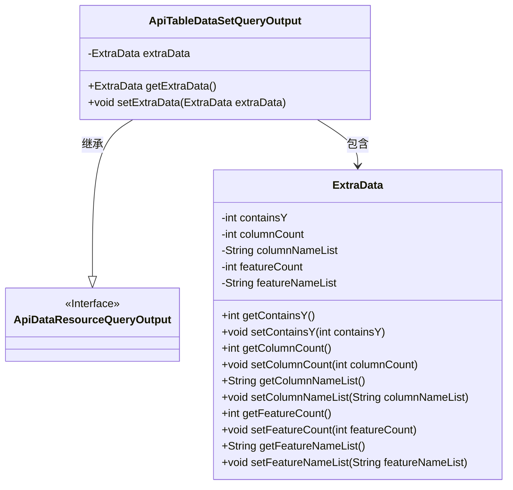
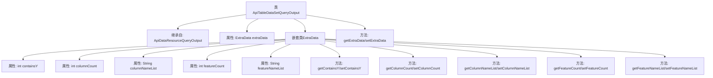

# 基础信息

|      |      |
|------|------|
| 名称 | ApiTableDataSetQueryOutput |
| 编码语言 | .java |
| 代码路径 | WeFe/union/union-service/src/main/java/com/welab/wefe/union/service/dto/dataresource/dataset/table/ApiTableDataSetQueryOutput.java |
| 包名 | com.welab.wefe.union.service.dto.dataresource.dataset.table |
| 依赖项 | ['com.welab.wefe.union.service.dto.dataresource.ApiDataResourceQueryOutput'] |
| 概述说明 | ApiTableDataSetQueryOutput继承ApiDataResourceQueryOutput，包含ExtraData内部类，存储列数、列名列表、特征数、特征名列表及是否包含Y的标志。 |

# 说明

ApiTableDataSetQueryOutput类继承自ApiDataResourceQueryOutput，包含一个名为extraData的嵌套类ExtraData。ExtraData类具有五个属性：containsY表示是否包含Y值，columnCount记录列数，columnNameList存储列名列表，featureCount记录特征数量，featureNameList存储特征名列表。每个属性都有对应的getter和setter方法。主类也提供了对extraData的getter和setter方法。

# 类列表 Class Summary

| 名称   | 类型  | 说明 |
|-------|------|-------------|
| ApiTableDataSetQueryOutput | class | ApiTableDataSetQueryOutput继承ApiDataResourceQueryOutput，包含ExtraData内部类，存储列数、列名、特征数、特征名及是否含Y的标志。 |

## 类 ApiTableDataSetQueryOutput

|      |      |
|------|------|
| 访问范围 | public |
| 类型 | class |
| 名称 | ApiTableDataSetQueryOutput |
| 说明 | ApiTableDataSetQueryOutput继承ApiDataResourceQueryOutput，包含ExtraData内部类，存储列数、列名、特征数、特征名及是否含Y的标志。 |

### UML类图

类图描述：该图展示了ApiTableDataSetQueryOutput类继承自ApiDataResourceQueryOutput接口，并包含一个ExtraData内部类。ExtraData类封装了数据集查询的附加信息，如列数、特征数等字段及其访问方法。ApiTableDataSetQueryOutput通过聚合关系管理ExtraData实例，形成两级数据结构。

### 内部方法调用关系图

这段代码定义了一个继承自`ApiDataResourceQueryOutput`的`ApiTableDataSetQueryOutput`类，包含一个嵌套类`ExtraData`用于存储表数据集的额外信息。流程图展示了类的继承关系、属性结构和方法调用链，其中嵌套类`ExtraData`封装了包含Y标记、列数、列名列表、特征数和特征名列表等元数据，主类通过getter/setter方法管理这些数据。

### 字段列表 Field List

| 名称  | 类型  | 说明 |
|-------|-------|------|
| extraData | ExtraData | 私有变量extraData，类型为ExtraData。 |

### 方法列表

| 名称  | 类型  | 说明 |
|-------|-------|------|
| getExtraData | ExtraData | 方法getExtraData返回extraData对象。 |
| setExtraData | void | 方法setExtraData用于设置对象的extraData属性，参数为ExtraData类型。 |

