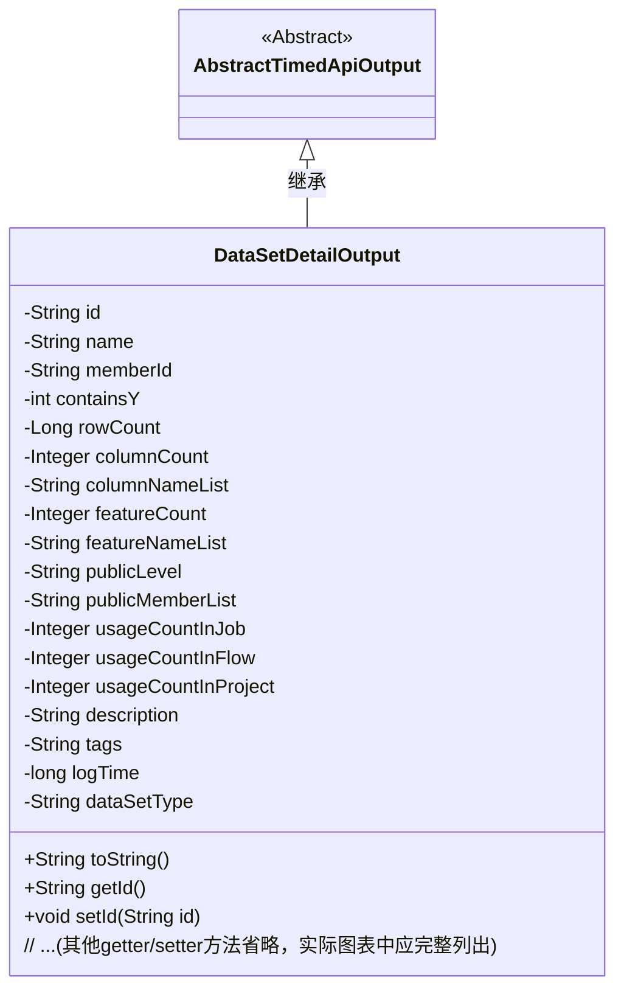

# 基础信息

|      |      |
|------|------|
| 名称 | DataSetDetailOutput |
| 编码语言 | .java |
| 代码路径 | WeFe/union/union-service/src/main/java/com/welab/wefe/union/service/dto/dataresource/dataset/table/DataSetDetailOutput.java |
| 包名 | com.welab.wefe.union.service.dto.dataresource.dataset.table |
| 依赖项 | ['com.welab.wefe.common.web.dto.AbstractTimedApiOutput', 'com.welab.wefe.common.wefe.enums.DataResourceType'] |
| 概述说明 | DataSetDetailOutput类继承AbstractTimedApiOutput，包含数据集ID、名称、成员ID、行列数、特征列表、公开级别、使用统计、描述、标签、日志时间和数据集类型等属性。 |

# 说明

DataSetDetailOutput类继承自AbstractTimedApiOutput，用于表示数据集详细信息。包含数据集ID、名称、成员ID、是否包含Y值、行数、列数、列名列表、特征数量、特征名列表、公开级别、公开成员列表、在作业、流程和项目中的使用次数、描述、标签、日志时间和数据集类型等属性。所有属性均提供对应的getter和setter方法，并重写了toString方法以输出所有字段信息。

# 类列表 Class Summary

| 名称   | 类型  | 说明 |
|-------|------|-------------|
| DataSetDetailOutput | class | DataSetDetailOutput类继承AbstractTimedApiOutput，包含数据集ID、名称、成员ID、行列数、特征列表、公开级别、使用统计、描述、标签等属性，用于表示数据集详细信息。 |

## 类 DataSetDetailOutput

|      |      |
|------|------|
| 访问范围 | public |
| 类型 | class |
| 名称 | DataSetDetailOutput |
| 说明 | DataSetDetailOutput类继承AbstractTimedApiOutput，包含数据集ID、名称、成员ID、行列数、特征列表、公开级别、使用统计、描述、标签等属性，用于表示数据集详细信息。 |

### UML类图

类图描述：DataSetDetailOutput类继承自AbstractTimedApiOutput抽象类，用于表示数据集详细信息。包含20+私有字段（如id/name/rowCount等）和对应的getter/setter方法，其中dataSetType默认值为TableDataSet.name()。该类重写了toString()方法以JSON格式输出所有字段值，典型用于API响应数据封装。

### 内部方法调用关系图

这段代码定义了一个名为DataSetDetailOutput的类，继承自AbstractTimedApiOutput，包含多个属性如id、name、memberId等，以及对应的getter和setter方法。该类主要用于表示数据集详细信息，包括行数、列数、特征数等元数据，并提供了toString方法用于格式化输出。流程图展示了类的继承关系、属性定义以及方法调用关系，清晰地反映了类的结构和功能。

### 字段列表 Field List

| 名称  | 类型  | 说明 |
|-------|-------|------|
| name | String | 私有字符串变量name |
| usageCountInJob = -1 | Integer | 私有整型变量usageCountInJob初始值为-1。 |
| publicMemberList | String | 私有字符串变量publicMemberList |
| columnCount | Integer | 私有整型变量，表示列数。 |
| tags | String | 类中定义的私有字符串变量tags。 |
| columnNameList | String | 私有字符串变量columnNameList，用于存储列名列表。 |
| id | String | 私有字符串类型变量id |
| dataSetType = DataResourceType.TableDataSet.name() | String | 变量dataSetType赋值为DataResourceType.TableDataSet的枚举名称字符串。 |
| rowCount | Long | 私有长整型变量，记录行数。 |
| usageCountInProject = -1 | Integer | 项目内使用次数计数器，初始值为-1。 |
| usageCountInFlow = -1 | Integer | 变量usageCountInFlow初始化为-1，用于记录流程中的使用次数。 |
| containsY | int | 私有整型变量containsY。 |
| featureCount | Integer | 私有整型变量featureCount，用于记录特征数量。 |
| description | String | 私有字符串类型变量description。 |
| featureNameList | String | 私有字符串变量featureNameList，用于存储特征名称列表。 |
| memberId | String | 声明一个私有字符串类型变量memberId。 |
| logTime | long | 日志时间戳，记录事件发生的时间点。 |
| publicLevel | String | 私有字符串变量publicLevel，用于存储公开级别信息。 |

### 方法列表

| 名称  | 类型  | 说明 |
|-------|-------|------|
| getDescription | String | 这是一个Java方法，返回字符串类型的description属性值。 |
| getMemberId | String | 获取成员ID的方法，返回字符串类型的memberId。 |
| setLogTime | void | 方法setLogTime用于设置logTime属性值，参数为长整型logTime。 |
| getUsageCountInFlow | Integer | 方法返回流程中的使用次数。 |
| getLogTime | long | 获取日志时间的方法，返回长整型变量logTime的值。 |
| getPublicMemberList | String | 获取公共成员列表的方法，返回publicMemberList字符串。 |
| getColumnCount | Integer | 获取列数的方法，返回整型变量columnCount的值。 |
| getFeatureCount | Integer | 获取特征数量方法，返回整型变量featureCount的值。 |
| setFeatureNameList | void | 这是一个Java方法，用于设置featureNameList属性的值。方法接收一个字符串参数并将其赋值给类的成员变量。 |
| getRowCount | Long | 获取行数的方法，返回长整型数值rowCount。 |
| getId | String | 这是一个Java方法，返回字符串类型的id属性值。 |
| setName | void | 这是一个Java方法，用于设置对象的名称属性，将传入的字符串参数赋值给对象的name字段。 |
| getDataSetType | String | 获取数据集类型的方法，返回字符串类型的数据集类型值。 |
| getFeatureNameList | String | 这是一个Java方法，返回名为featureNameList的字符串变量。 |
| setPublicMemberList | void | 设置公共成员列表的方法，将输入字符串赋值给类的成员变量publicMemberList。 |
| getName | String | 这是一个Java方法，返回私有变量name的值。 |
| getTags | String | 获取tags字符串的方法。 |
| setId | void | 设置对象ID的方法，将参数id赋值给当前对象的id属性。 |
| setUsageCountInProject | void | 设置项目内使用次数的公共方法，参数为整型。 |
| setUsageCountInFlow | void | 设置流程内使用次数的公共方法。 |
| setUsageCountInJob | void | 这是一个Java方法，用于设置作业中的使用次数属性值。方法接受一个整数参数，并将其赋值给类的成员变量usageCountInJob。 |
| setPublicLevel | void | 这是一个Java方法，用于设置publicLevel属性的值。方法接收一个字符串参数，并将其赋值给当前对象的publicLevel字段。 |
| setFeatureCount | void | 设置特征数量方法，将输入参数赋给类变量featureCount。 |
| setColumnCount | void | 设置列数方法，参数为整型columnCount，赋值给当前对象的columnCount属性。 |
| setTags | void | 设置标签字符串的方法。 |
| getUsageCountInJob | Integer | 获取作业中的使用次数。 |
| getUsageCountInProject | Integer | 获取项目中的使用次数，返回整型数值usageCountInProject。 |
| setColumnNameList | void | 设置列名列表的方法，将输入参数赋值给类的成员变量columnNameList。 |
| setRowCount | void | 设置行数属性的方法，将输入值赋给类的rowCount成员变量。 |
| setMemberId | void | 这是一个Java方法，用于设置成员变量memberId的值。方法接收一个字符串参数memberId，并将其赋值给当前对象的memberId属性。 |
| getPublicLevel | String | 获取publicLevel值的公共方法。 |
| getContainsY | int | 方法getContainsY返回整型变量containsY的值。 |
| getColumnNameList | String | 获取列名列表的方法，返回字符串类型columnNameList。 |
| toString | String | 重写toString方法，返回包含id、name、memberId等16个字段的JSON格式字符串。 |
| setDescription | void | 这是一个Java方法，用于设置对象的描述属性。方法名为setDescription，接受一个字符串参数description，并将其赋值给对象的description成员变量。 |
| setContainsY | void | 这是一个Java方法，用于设置类成员变量containsY的值。方法接受一个整数参数，并将其赋值给当前对象的containsY属性。 |
| setDataSetType | void | 这是一个Java方法，用于设置类的数据集类型属性。方法接收字符串参数dataSetType，并将其赋值给类的同名成员变量。 |

