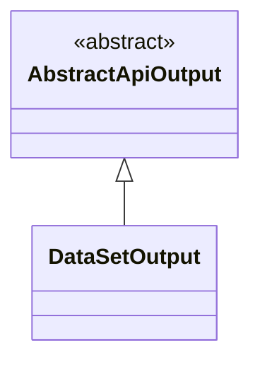
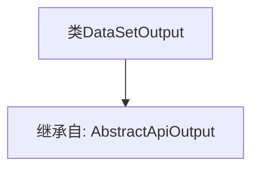

# 基础信息

|      |      |
|------|------|
| 名称 | DataSetOutput |
| 编码语言 | .java |
| 代码路径 | WeFe/union/union-service/src/main/java/com/welab/wefe/union/service/dto/dataresource/dataset/table/DataSetOutput.java |
| 包名 | com.welab.wefe.union.service.dto.dataresource.dataset.table |
| 依赖项 | ['com.welab.wefe.common.web.dto.AbstractApiOutput'] |
| 概述说明 | 数据集输出类继承自抽象API输出基类。 |

# 说明

DataSetOutput是一个继承自AbstractApiOutput的公开类，用于表示数据集输出。该类作为抽象API输出的具体实现，可能用于封装和处理与数据集相关的输出操作。由于当前类体为空，其具体功能和行为将依赖于父类AbstractApiOutput的定义和实现。这种设计遵循了面向对象编程中的继承原则，允许通过扩展基类来创建特定功能的子类。

# 类列表 Class Summary

| 名称   | 类型  | 说明 |
|-------|------|-------------|
| DataSetOutput | class | DataSetOutput类继承自AbstractApiOutput基类。 |

## 类 DataSetOutput

|      |      |
|------|------|
| 访问范围 | public |
| 类型 | class |
| 名称 | DataSetOutput |
| 说明 | DataSetOutput类继承自AbstractApiOutput基类。 |

### UML类图

这段类图展示了DataSetOutput类继承自AbstractApiOutput抽象类的关系。AbstractApiOutput被标记为抽象类（<<abstract>>），而DataSetOutput作为其具体实现子类通过空心三角箭头表示继承关系。该结构表明DataSetOutput继承了AbstractApiOutput的所有属性和方法，同时可以扩展或重写父类功能，适用于需要统一输出接口但实现细节不同的场景。

### 内部方法调用关系图

这段代码展示了一个简单的类继承关系。DataSetOutput类继承自AbstractApiOutput抽象类，表明DataSetOutput将具备AbstractApiOutput定义的基本结构和功能。由于当前类体为空，暂未扩展新功能，但为后续添加数据集输出相关方法提供了基础框架。这种设计常用于实现API响应输出的标准化处理。

### 字段列表 Field List

| 名称  | 类型  | 说明 |
|-------|-------|------|

### 方法列表

| 名称  | 类型  | 说明 |
|-------|-------|------|

