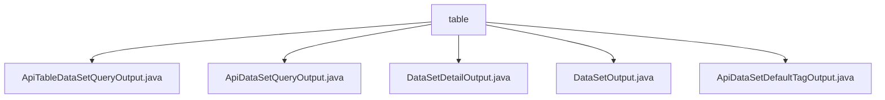

# 基础信息

|      |      |
|------|------|
| 名称 | table |
| 编码语言 | .java |
| 代码路径 | WeFe/union/union-service/src/main/java/com/welab/wefe/union/service/dto/dataresource/dataset/table |
| 包名 | docs.union.union-service.src.main.java.com.welab.wefe.union.service.dto.dataresource.dataset.table |
| 概述说明 | ApiTableDataSetQueryOutput继承ApiDataResourceQueryOutput，含ExtraData嵌套类，记录列数、特征等。ApiDataSetQueryOutput继承AbstractTimedApiOutput，含数据集基本信息和元数据。DataSetDetailOutput继承AbstractTimedApiOutput，含数据集详细信息。DataSetOutput继承AbstractApiOutput，功能依赖父类。ApiDataSetDefaultTagOutput含标签id和名称。 |

# 说明

## 概述  
该模块核心职责是提供数据集查询结果的统一输出结构，包括基础信息、统计特征和元数据管理。接口规范遵循分层设计，通过继承`AbstractTimedApiOutput`和`AbstractApiOutput`实现标准化输出，例如`ApiTableDataSetQueryOutput`扩展了嵌套的`ExtraData`类存储列和特征信息。关键数据结构包含数据集ID、行列数、列名/特征名列表、公开级别和使用统计等。外部依赖仅涉及基础父类。例如`DataSetDetailOutput`通过`toString`重写实现调试支持。

## 主要业务场景  
模块支持联合学习场景下的数据集元数据查询，类似目录服务模式。业务流程包括：查询基础信息（如`ApiDataSetQueryOutput`）、获取详细特征（如`containsY`标志）、管理标签（如`ApiDataSetDefaultTagOutput`）。交互模式统一通过getter/setter操作属性，例如通过`extraData`访问嵌套特征。典型应用包括数据预览、权限控制和资源统计，如跟踪数据集在作业中的使用次数。API类型涵盖基础输出、带时间戳输出和标签输出三类。

### 包内部结构视图

该流程图展示了table目录下的5个Java文件层级关系。所有文件均直接位于table节点下，包含数据集查询、详情和标签等不同功能的输出类文件，反映了数据资源模块中表数据集相关的DTO结构。

# 文件列表

| 名称   | 类型  | 说明 |
|-------|------|-------------|
| [ApiTableDataSetQueryOutput.java](ApiTableDataSetQueryOutput.md) | file | ApiTableDataSetQueryOutput继承ApiDataResourceQueryOutput，包含ExtraData内部类，存储列数、列名列表、特征数、特征名列表及是否包含Y的标志。 |
| [ApiDataSetQueryOutput.java](ApiDataSetQueryOutput.md) | file | ApiDataSetQueryOutput类继承AbstractTimedApiOutput，包含数据集ID、名称、成员信息、行列数、特征列表、公开级别、使用统计及描述标签等属性。 |
| [DataSetDetailOutput.java](DataSetDetailOutput.md) | file | DataSetDetailOutput类继承AbstractTimedApiOutput，包含数据集ID、名称、成员ID、行列数、特征列表、公开级别、使用统计、描述、标签、日志时间和数据集类型等属性。 |
| [DataSetOutput.java](DataSetOutput.md) | file | 数据集输出类继承自抽象API输出基类。 |
| [ApiDataSetDefaultTagOutput.java](ApiDataSetDefaultTagOutput.md) | file | ApiDataSetDefaultTagOutput类包含id和tagName属性，提供getter和setter方法，toString方法返回属性值的字符串表示。 |

