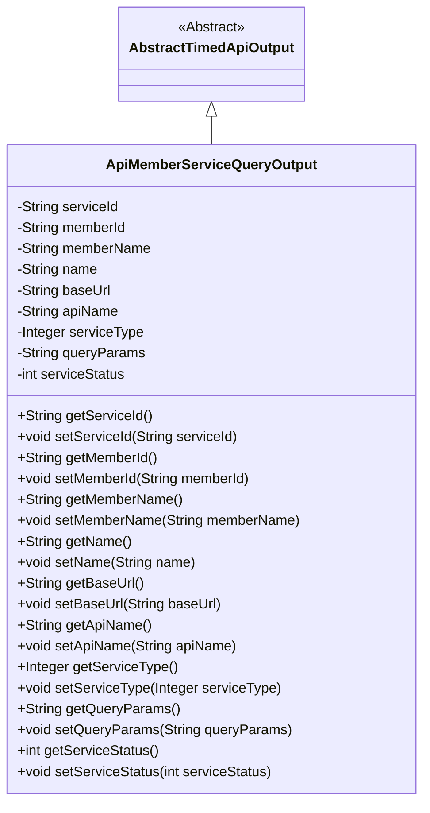

# 基础信息

|      |      |
|------|------|
| 名称 | ApiMemberServiceQueryOutput |
| 编码语言 | .java |
| 代码路径 | WeFe/union/union-service/src/main/java/com/welab/wefe/union/service/dto/member/ApiMemberServiceQueryOutput.java |
| 包名 | com.welab.wefe.union.service.dto.member |
| 依赖项 | ['com.welab.wefe.common.web.dto.AbstractTimedApiOutput'] |
| 概述说明 | ApiMemberServiceQueryOutput类继承AbstractTimedApiOutput，包含服务ID、成员ID、名称、基础URL、API名称、服务类型、查询参数和服务状态等属性及其getter和setter方法。 |

# 说明

ApiMemberServiceQueryOutput类继承自AbstractTimedApiOutput，包含服务ID、成员ID、成员名称、名称、基础URL、API名称、服务类型、查询参数和服务状态等属性，每个属性都有对应的getter和setter方法。

# 类列表 Class Summary

| 名称   | 类型  | 说明 |
|-------|------|-------------|
| ApiMemberServiceQueryOutput | class | ApiMemberServiceQueryOutput类继承AbstractTimedApiOutput，包含服务ID、成员ID、名称、基础URL、API名称、服务类型、查询参数和服务状态等字段及其getter/setter方法。 |

## 类 ApiMemberServiceQueryOutput

|      |      |
|------|------|
| 访问范围 | public |
| 类型 | class |
| 名称 | ApiMemberServiceQueryOutput |
| 说明 | ApiMemberServiceQueryOutput类继承AbstractTimedApiOutput，包含服务ID、成员ID、名称、基础URL、API名称、服务类型、查询参数和服务状态等字段及其getter/setter方法。 |

### UML类图

这段代码定义了一个`ApiMemberServiceQueryOutput`类，继承自抽象类`AbstractTimedApiOutput`。该类包含多个私有字段，如`serviceId`、`memberId`、`apiName`等，以及对应的getter和setter方法。这些字段主要用于存储API成员服务的查询结果信息，包括服务ID、成员信息、基础URL、服务类型等。通过继承关系，该类继承了父类的定时输出功能，同时扩展了具体的API成员服务查询相关属性。

### 内部方法调用关系图

```mermaid
graph TD
    A["类ApiMemberServiceQueryOutput"]
    B["继承: AbstractTimedApiOutput"]
    C["属性: String serviceId"]
    D["属性: String memberId"]
    E["属性: String memberName"]
    F["属性: String name"]
    G["属性: String baseUrl"]
    H["属性: String apiName"]
    I["属性: Integer serviceType"]
    J["属性: String queryParams"]
    K["属性: int serviceStatus"]
    L["方法: getServiceId/setServiceId"]
    M["方法: getMemberId/setMemberId"]
    N["方法: getMemberName/setMemberName"]
    O["方法: getName/setName"]
    P["方法: getBaseUrl/setBaseUrl"]
    Q["方法: getApiName/setApiName"]
    R["方法: getServiceType/setServiceType"]
    S["方法: getQueryParams/setQueryParams"]
    T["方法: getServiceStatus/setServiceStatus"]

    A --> B
    A --> C
    A --> D
    A --> E
    A --> F
    A --> G
    A --> H
    A --> I
    A --> J
    A --> K
    A --> L
    A --> M
    A --> N
    A --> O
    A --> P
    A --> Q
    A --> R
    A --> S
    A --> T
```

这段代码定义了一个ApiMemberServiceQueryOutput类，继承自AbstractTimedApiOutput，主要用于封装API成员服务查询的输出数据。类中包含9个私有属性，分别表示服务ID、成员ID、成员名称、名称、基础URL、API名称、服务类型、查询参数和服务状态，并为每个属性提供了对应的getter和setter方法。该类的设计目的是为了标准化API调用的返回数据结构，便于统一处理和服务状态管理。

### 字段列表 Field List

| 名称  | 类型  | 说明 |
|-------|-------|------|
| serviceType | Integer | 私有整型变量serviceType，用于表示服务类型。 |
| name | String | 声明一个私有字符串变量name。 |
| apiName | String | 私有字符串变量apiName。 |
| queryParams | String | 私有字符串变量queryParams，用于存储查询参数。 |
| serviceStatus | int | 私有整型变量，表示服务状态。 |
| memberId | String | 成员ID字符串变量 |
| serviceId | String | 声明一个私有字符串变量serviceId。 |
| baseUrl | String | 声明一个私有字符串变量baseUrl，用于存储基础URL地址。 |
| memberName | String | 成员变量名称为memberName，类型为String。 |

### 方法列表

| 名称  | 类型  | 说明 |
|-------|-------|------|
| setName | void | 设置对象名称的方法，将输入参数name赋值给对象的name属性。 |
| getMemberName | String | 获取成员名称的方法，返回成员变量memberName的值。 |
| getName | String | 这是一个Java方法，返回字符串类型的name变量值。 |
| getBaseUrl | String | 该方法返回一个字符串类型的baseUrl变量值。 |
| getServiceId | String | 获取serviceId的公共方法，返回字符串类型的serviceId。 |
| getServiceType | Integer | 获取服务类型的方法，返回整型值serviceType。 |
| setApiName | void | 这是一个Java方法，用于设置类的apiName属性值。方法接收一个字符串参数apiName，并将其赋值给类的同名成员变量。 |
| setServiceType | void | 这是一个Java方法，用于设置类的serviceType属性，接受一个Integer类型参数。 |
| getApiName | String | 这是一个Java方法，返回字符串类型的apiName属性值。 |
| setServiceStatus | void | 这是一个Java方法，用于设置类的serviceStatus属性值。方法接收一个整型参数serviceStatus，并将其赋值给类的同名成员变量。 |
| setBaseUrl | void | 设置baseUrl属性的方法，将输入参数baseUrl赋值给类的成员变量this.baseUrl。 |
| setMemberId | void | 设置成员ID的方法，将输入参数赋值给类的成员变量memberId。 |
| setServiceId | void | 这是一个Java方法，用于设置类的serviceId属性值。方法接收一个字符串参数serviceId，并将其赋值给类的同名成员变量。 |
| getMemberId | String | 方法返回成员ID字符串。 |
| setQueryParams | void | 这是一个Java方法，用于设置类的queryParams属性值。方法接收一个字符串参数，并将其赋值给类的成员变量queryParams。 |
| getQueryParams | String | 获取查询参数字符串的方法。 |
| setMemberName | void | 设置成员变量memberName的值。 |
| getServiceStatus | int | 获取服务状态的方法，返回整型变量serviceStatus的值。 |

