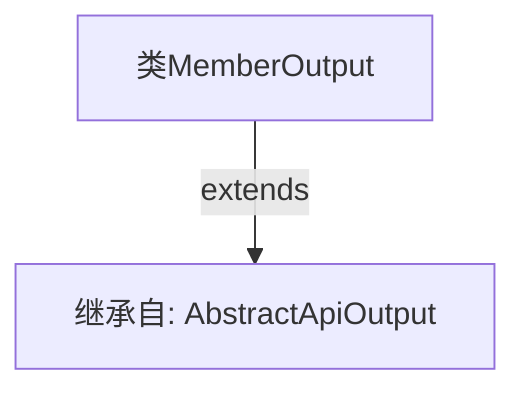

# 基础信息

|      |      |
|------|------|
| 名称 | MemberOutput |
| 编码语言 | .java |
| 代码路径 | WeFe/union/union-service/src/main/java/com/welab/wefe/union/service/dto/member/MemberOutput.java |
| 包名 | com.welab.wefe.union.service.dto.member |
| 依赖项 | ['com.welab.wefe.common.web.dto.AbstractApiOutput'] |
| 概述说明 | MemberOutput类继承自AbstractApiOutput基类，用于封装API输出数据。 |

# 说明

该内容定义了一个名为MemberOutput的Java类，该类继承自AbstractApiOutput基类。这个类目前为空实现，没有声明任何成员变量或方法，仅通过继承关系表明它是某个API输出结构的子类实现。从类名推断，其设计目的是用于封装与成员相关的API响应数据。

# 类列表 Class Summary

| 名称   | 类型  | 说明 |
|-------|------|-------------|
| MemberOutput | class | MemberOutput类继承自AbstractApiOutput基类。 |


## 类 MemberOutput

|      |      |
|------|------|
| 访问范围 | public |
| 类型 | class |
| 名称 | MemberOutput |
| 说明 | MemberOutput类继承自AbstractApiOutput基类。 |


### UML类图

```mermaid
classDiagram
    class AbstractApiOutput {
        <<Interface>>
    }
    class MemberOutput {
    }
    AbstractApiOutput <|-- MemberOutput // 继承
```

这段类图展示了MemberOutput类继承自AbstractApiOutput接口的简单层级关系。AbstractApiOutput被标记为接口（<<Interface>>），MemberOutput作为其实现类通过空心三角箭头表示继承关系。该结构表明MemberOutput需要实现AbstractApiOutput定义的所有抽象方法，体现了面向对象中"实现"的核心概念。


### 内部方法调用关系图



这段代码展示了一个简单的Java类继承关系。MemberOutput类通过extends关键字继承了AbstractApiOutput抽象类，表明MemberOutput将拥有AbstractApiOutput的所有非私有成员（属性和方法），同时可以扩展或重写父类功能。该图清晰地呈现了这种继承层级关系，是面向对象编程中类继承的典型结构。

### 字段列表 Field List

| 名称  | 类型  | 说明 |
|-------|-------|------|

### 方法列表

| 名称  | 类型  | 说明 |
|-------|-------|------|


