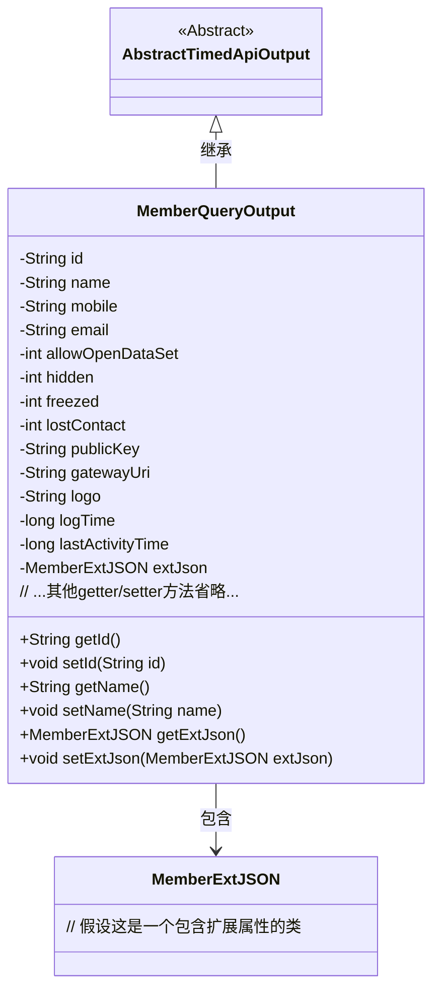

# 基础信息

|      |      |
|------|------|
| 名称 | MemberQueryOutput |
| 编码语言 | .java |
| 代码路径 | WeFe/union/union-service/src/main/java/com/welab/wefe/union/service/dto/member/MemberQueryOutput.java |
| 包名 | com.welab.wefe.union.service.dto.member |
| 依赖项 | ['com.welab.wefe.common.data.mongodb.entity.union.ext.MemberExtJSON', 'com.welab.wefe.common.web.dto.AbstractTimedApiOutput'] |
| 概述说明 | MemberQueryOutput类继承AbstractTimedApiOutput，包含成员ID、姓名、联系方式、状态标志、公钥、网关URI、logo及时间戳等属性，并提供getter和setter方法。 |

# 说明

MemberQueryOutput类继承自AbstractTimedApiOutput，用于封装成员查询结果。包含成员ID、姓名、手机、邮箱等基本信息，以及允许开放数据集、隐藏、冻结、失联等状态标识。还包含公钥、网关URI、LOGO地址等扩展信息，以及日志时间和最后活动时间两个时间戳。最后通过MemberExtJSON类型的extJson字段支持额外扩展属性。所有字段均通过getter和setter方法进行访问和修改。

# 类列表 Class Summary

| 名称   | 类型  | 说明 |
|-------|------|-------------|
| MemberQueryOutput | class | MemberQueryOutput类继承AbstractTimedApiOutput，包含成员ID、姓名、联系方式、状态标志、公钥、网关URI、logo及时间戳等属性，并提供getter/setter方法。 |

## 类 MemberQueryOutput

|      |      |
|------|------|
| 访问范围 | public |
| 类型 | class |
| 名称 | MemberQueryOutput |
| 说明 | MemberQueryOutput类继承AbstractTimedApiOutput，包含成员ID、姓名、联系方式、状态标志、公钥、网关URI、logo及时间戳等属性，并提供getter/setter方法。 |

### UML类图

类图描述：MemberQueryOutput继承自AbstractTimedApiOutput，包含成员基本属性（如id、name等）和扩展属性MemberExtJSON。该类通过getter/setter方法提供对私有字段的访问控制，其中状态属性（如hidden、freezed）使用int类型表示，时间相关属性使用long类型存储。MemberExtJSON作为扩展信息容器与主类形成组合关系。

### 内部方法调用关系图

该流程图展示了`MemberQueryOutput`类的完整结构，包括其继承关系、14个私有属性以及对应的getter/setter方法。该类作为API输出模型，封装了成员查询结果的所有字段（如基础信息、状态标志、扩展数据等），并通过继承`AbstractTimedApiOutput`获得时间相关功能。每个属性都严格遵循JavaBean规范提供访问方法，确保数据封装性。

### 字段列表 Field List

| 名称  | 类型  | 说明 |
|-------|-------|------|
| id | String | 私有字符串类型变量id。 |
| mobile | String | 定义私有字符串变量mobile。 |
| lastActivityTime | long | 私有长整型变量，记录最后活动时间。 |
| gatewayUri | String | 私有字符串变量gatewayUri，用于存储网关URI。 |
| logTime | long | 私有长整型变量logTime，用于记录时间。 |
| logo | String | 定义私有字符串变量logo。 |
| lostContact | int | 私有整型变量，记录丢失联系次数。 |
| extJson | MemberExtJSON | 成员扩展JSON数据对象 |
| publicKey | String | 声明一个私有字符串变量publicKey，用于存储公钥。 |
| freezed | int | 私有整型变量freezed，用于表示冻结状态。 |
| email | String | 声明一个私有字符串变量email。 |
| name | String | 声明一个私有字符串变量name。 |
| allowOpenDataSet | int | 私有整型变量，用于控制数据集开放权限。 |
| hidden | int | 私有整型变量hidden。 |

### 方法列表

| 名称  | 类型  | 说明 |
|-------|-------|------|
| getFreezed | int | 获取冻结状态值的方法，返回整数类型变量freezed。 |
| getId | String | 获取ID的公共方法，返回字符串类型的id。 |
| setName | void | 设置对象名称的方法，将参数name赋值给对象的name属性。 |
| setId | void | 设置对象ID的方法，将参数id赋值给对象的id属性。 |
| getHidden | int | 获取hidden变量的值。 |
| setEmail | void | 这是一个Java方法，用于设置对象的email属性，接收一个字符串参数email并将其赋值给当前对象的email字段。 |
| getLostContact | int | 获取丢失联系次数的整数值。 |
| getAllowOpenDataSet | int | 这是一个Java方法，返回整型变量allowOpenDataSet的值。 |
| getPublicKey | String | 获取公钥的方法，返回publicKey变量。 |
| getGatewayUri | String | 这是一个Java方法，返回字符串类型的gatewayUri成员变量值。 |
| setFreezed | void | 设置冻结状态的方法，参数为整型freezed，赋值给类成员变量freezed。 |
| setAllowOpenDataSet | void | 该方法用于设置允许打开的数据集数量，参数为整型allowOpenDataSet。 |
| getEmail | String | 获取email的字符串方法。 |
| setMobile | void | 这是一个Java方法，用于设置类的mobile属性值。方法接收一个字符串参数mobile，并将其赋值给类的同名成员变量。 |
| getMobile | String | 获取手机号的方法，返回字符串类型变量mobile。 |
| getName | String | 获取名称的方法，返回字符串类型的name变量值。 |
| setPublicKey | void | 设置公钥的方法，将输入字符串赋值给类的publicKey成员变量。 |
| setHidden | void | 设置隐藏状态的方法，参数为整型hidden，赋值给当前对象的hidden属性。 |
| setLastActivityTime | void | 设置最后活动时间的方法，将参数lastActivityTime赋值给类的同名成员变量。 |
| getExtJson | MemberExtJSON | 方法getExtJson返回成员扩展JSON对象extJson。 |
| setExtJson | void | 方法setExtJson用于设置成员扩展JSON数据，参数为MemberExtJSON类型，赋值给当前对象的extJson属性。 |
| getLogo | String | 获取logo字符串的方法。 |
| setLostContact | void | 设置丢失联系状态的方法，参数为整型lostContact。 |
| setGatewayUri | void | 设置网关URI的方法，将输入参数赋值给类的gatewayUri成员变量。 |
| setLogo | void | 设置logo字符串的方法。 |
| getLogTime | long | 获取日志时间的方法，返回长整型数值logTime。 |
| setLogTime | void | 设置日志时间的方法，将参数logTime赋值给成员变量logTime。 |
| getLastActivityTime | long | 获取最后活动时间的方法，返回长整型数值。 |

