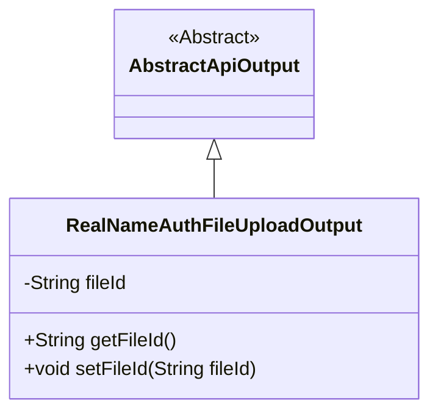
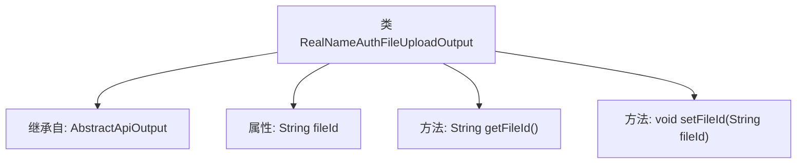

# 基础信息

|      |      |
|------|------|
| 名称 | RealNameAuthFileUploadOutput |
| 编码语言 | .java |
| 代码路径 | WeFe/union/union-service/src/main/java/com/welab/wefe/union/service/dto/member/RealNameAuthFileUploadOutput.java |
| 包名 | com.welab.wefe.union.service.dto.member |
| 依赖项 | ['com.welab.wefe.common.web.dto.AbstractApiOutput'] |
| 概述说明 | RealNameAuthFileUploadOutput类继承AbstractApiOutput，包含fileId字段及其getter和setter方法。 |

# 说明

RealNameAuthFileUploadOutput是一个继承自AbstractApiOutput的类，用于处理实名认证文件上传的输出结果。该类包含一个私有字符串属性fileId，表示上传文件的唯一标识。提供了getFileId和setFileId方法用于获取和设置该属性的值。

# 类列表 Class Summary

| 名称   | 类型  | 说明 |
|-------|------|-------------|
| RealNameAuthFileUploadOutput | class | RealNameAuthFileUploadOutput类继承AbstractApiOutput，包含fileId属性和其getter/setter方法。 |

## 类 RealNameAuthFileUploadOutput

|      |      |
|------|------|
| 访问范围 | public |
| 类型 | class |
| 名称 | RealNameAuthFileUploadOutput |
| 说明 | RealNameAuthFileUploadOutput类继承AbstractApiOutput，包含fileId属性和其getter/setter方法。 |

### UML类图

类图描述：该图展示了一个继承关系，RealNameAuthFileUploadOutput类继承自抽象类AbstractApiOutput。子类包含私有字段fileId和对应的getter/setter方法，用于处理实名认证文件上传后的输出结果。这种设计体现了对文件标识信息的封装和基础输出结构的复用。

### 内部方法调用关系图

该流程图展示了RealNameAuthFileUploadOutput类的结构，它继承自AbstractApiOutput类，包含一个私有属性fileId以及对应的getter和setter方法。通过继承关系，该类具备了父类的特性，同时扩展了文件ID管理功能，用于实名认证场景下的文件上传输出处理。

### 字段列表 Field List

| 名称  | 类型  | 说明 |
|-------|-------|------|
| fileId | String | 声明一个私有字符串变量fileId。 |

### 方法列表

| 名称  | 类型  | 说明 |
|-------|-------|------|
| getFileId | String | 获取文件ID的方法，返回fileId字符串。 |
| setFileId | void | 设置文件ID的方法，将输入参数fileId赋值给当前对象的fileId属性。 |

