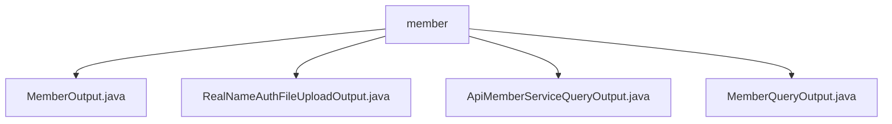

# 基础信息

|      |      |
|------|------|
| 名称 | member |
| 编码语言 | .java |
| 代码路径 | WeFe/union/union-service/src/main/java/com/welab/wefe/union/service/dto/member |
| 包名 | docs.union.union-service.src.main.java.com.welab.wefe.union.service.dto.member |
| 概述说明 | MemberOutput是空实现的API输出子类。RealNameAuthFileUploadOutput处理实名认证文件上传，含fileId属性。ApiMemberServiceQueryOutput包含服务相关属性。MemberQueryOutput封装成员查询结果，含基本信息和状态标识。 |

# 说明

## 概述  
该模块核心职责是封装与成员管理相关的API响应数据，提供不同场景下的标准化输出结构。接口规范统一继承AbstractApiOutput或其子类AbstractTimedApiOutput，包含基础字段和扩展能力。关键数据结构包括MemberOutput（空实现）、RealNameAuthFileUploadOutput（文件ID）、ApiMemberServiceQueryOutput（服务信息）和MemberQueryOutput（成员详情）。外部依赖仅为Java基础类库。例如RealNameAuthFileUploadOutput通过fileId标识上传文件，类似云存储的回调凭证。

## 主要业务场景  
模块支持成员信息全生命周期管理，包括基础信息查询（MemberQueryOutput）、服务状态查询（ApiMemberServiceQueryOutput）和实名认证（RealNameAuthFileUploadOutput）。交互模式采用标准Getter/Setter，通过继承实现时间戳等公共字段。典型应用如查询成员详情时，MemberQueryOutput会封装ID、联系方式、状态标志等20+字段。API类型涵盖数据实体类，集成案例包括文件上传回调、服务状态监控等。例如extJson字段采用JSON扩展模式，类似微服务的开放扩展点设计。

### 包内部结构视图

该流程图展示了WeFe项目中union-service模块下member目录的结构关系。根节点为member文件夹，其下包含四个Java类文件：MemberOutput、RealNameAuthFileUploadOutput、ApiMemberServiceQueryOutput和MemberQueryOutput。这些文件都属于会员服务相关的数据传输对象(DTO)，用于处理会员信息的输出和查询功能。整个结构呈现典型的DTO层文件组织方式，所有文件均直接隶属于member目录。

# 文件列表

| 名称   | 类型  | 说明 |
|-------|------|-------------|
| [MemberOutput.java](MemberOutput.md) | file | MemberOutput类继承自AbstractApiOutput基类，用于封装API输出数据。 |
| [RealNameAuthFileUploadOutput.java](RealNameAuthFileUploadOutput.md) | file | RealNameAuthFileUploadOutput类继承AbstractApiOutput，包含fileId字段及其getter和setter方法。 |
| [ApiMemberServiceQueryOutput.java](ApiMemberServiceQueryOutput.md) | file | ApiMemberServiceQueryOutput类继承AbstractTimedApiOutput，包含服务ID、成员ID、名称、基础URL、API名称、服务类型、查询参数和服务状态等属性及其getter和setter方法。 |
| [MemberQueryOutput.java](MemberQueryOutput.md) | file | MemberQueryOutput类继承AbstractTimedApiOutput，包含成员ID、姓名、联系方式、状态标志、公钥、网关URI、logo及时间戳等属性，并提供getter和setter方法。 |

