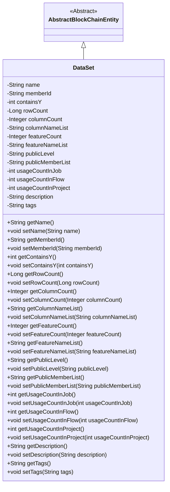

# 基础信息

|      |      |
|------|------|
| 名称 | DataSet |
| 编码语言 | .java |
| 代码路径 | WeFe/union/union-service/src/main/java/com/welab/wefe/union/service/entity/DataSet.java |
| 包名 | com.welab.wefe.union.service.entity |
| 依赖项 | ['com.welab.wefe.common.data.mysql.entity.AbstractBlockChainEntity'] |
| 概述说明 | DataSet类继承AbstractBlockChainEntity，包含名称、成员ID、行列数、特征、公开级别、使用统计、描述和标签等属性及其getter/setter方法。 |

# 说明

DataSet类继承自AbstractBlockChainEntity，包含数据集名称、成员ID、是否包含Y值标记、行数、列数、列名列表、特征数量、特征名列表、公开级别、公开成员列表、在作业流程项目中的使用次数、描述和标签等属性。每个属性都有对应的getter和setter方法用于访问和修改。

# 类列表 Class Summary

| 名称   | 类型  | 说明 |
|-------|------|-------------|
| DataSet | class | DataSet类继承AbstractBlockChainEntity，包含名称、成员ID、行列数、特征、公开级别、使用统计、描述和标签等属性及对应getter/setter方法。 |

## 类 DataSet

|      |      |
|------|------|
| 访问范围 | public |
| 类型 | class |
| 名称 | DataSet |
| 说明 | DataSet类继承AbstractBlockChainEntity，包含名称、成员ID、行列数、特征、公开级别、使用统计、描述和标签等属性及对应getter/setter方法。 |

### UML类图

这段代码定义了一个DataSet类，它继承自AbstractBlockChainEntity抽象类。DataSet类包含多个私有字段，用于存储数据集的各种属性，如名称、成员ID、行数、列数、特征数等，并为每个字段提供了公有的getter和setter方法。这个类主要用于管理数据集的基本信息和元数据，包括数据集的结构、使用统计以及描述信息等。通过继承关系，DataSet类获得了区块链实体的一些基本特性。

### 内部方法调用关系图

```mermaid
graph TD
    A["类DataSet"]
    B["继承: AbstractBlockChainEntity"]
    C["属性: String name"]
    D["属性: String memberId"]
    E["属性: int containsY"]
    F["属性: Long rowCount"]
    G["属性: Integer columnCount"]
    H["属性: String columnNameList"]
    I["属性: Integer featureCount"]
    J["属性: String featureNameList"]
    K["属性: String publicLevel"]
    L["属性: String publicMemberList"]
    M["属性: int usageCountInJob"]
    N["属性: int usageCountInFlow"]
    O["属性: int usageCountInProject"]
    P["属性: String description"]
    Q["属性: String tags"]
    R["方法: getName/setName"]
    S["方法: getMemberId/setMemberId"]
    T["方法: getContainsY/setContainsY"]
    U["方法: getRowCount/setRowCount"]
    V["方法: getColumnCount/setColumnCount"]
    W["方法: getColumnNameList/setColumnNameList"]
    X["方法: getFeatureCount/setFeatureCount"]
    Y["方法: getFeatureNameList/setFeatureNameList"]
    Z["方法: getPublicLevel/setPublicLevel"]
    AA["方法: getPublicMemberList/setPublicMemberList"]
    AB["方法: getUsageCountInJob/setUsageCountInJob"]
    AC["方法: getUsageCountInFlow/setUsageCountInFlow"]
    AD["方法: getUsageCountInProject/setUsageCountInProject"]
    AE["方法: getDescription/setDescription"]
    AF["方法: getTags/setTags"]

    A --> B
    A --> C
    A --> D
    A --> E
    A --> F
    A --> G
    A --> H
    A --> I
    A --> J
    A --> K
    A --> L
    A --> M
    A --> N
    A --> O
    A --> P
    A --> Q
    A --> R
    A --> S
    A --> T
    A --> U
    A --> V
    A --> W
    A --> X
    A --> Y
    A --> Z
    A --> AA
    A --> AB
    A --> AC
    A --> AD
    A --> AE
    A --> AF
```

这段代码定义了一个DataSet类，继承自AbstractBlockChainEntity，包含15个私有属性和对应的getter/setter方法。该类主要用于描述数据集的基本信息，包括名称、成员ID、行列数、特征信息、公开级别、使用统计以及描述标签等。每个属性都有对应的访问和修改方法，提供了完整的数据封装能力。流程图清晰地展示了类的继承关系和所有属性/方法的组织结构。

### 字段列表 Field List

| 名称  | 类型  | 说明 |
|-------|-------|------|
| name | String | 私有字符串变量name |
| usageCountInProject | int | 项目内使用次数计数器 |
| featureNameList | String | 私有字符串变量featureNameList，用于存储特征名称列表。 |
| containsY | int | 私有整型变量containsY，用于存储Y相关状态或数值。 |
| tags | String | 声明一个私有字符串变量tags。 |
| featureCount | Integer | 私有整型变量，用于记录特征数量。 |
| rowCount | Long | 私有长整型变量rowCount，用于记录行数。 |
| columnNameList | String | 字段columnNameList用于存储列名列表的字符串。 |
| publicLevel | String | 私有字符串变量publicLevel，用于存储公开级别信息。 |
| usageCountInFlow | int | 私有整型变量，记录流程中的使用次数。 |
| usageCountInJob | int | 私有整型变量，记录作业内使用次数。 |
| publicMemberList | String | 私有字符串变量publicMemberList。 |
| description | String | 私有字符串类型变量description。 |
| columnCount | Integer | 私有整型变量columnCount，用于记录列数。 |
| memberId | String | 成员ID字符串变量 |

### 方法列表

| 名称  | 类型  | 说明 |
|-------|-------|------|
| setColumnCount | void | 设置列数的方法，将输入参数columnCount赋值给类的成员变量columnCount。 |
| setPublicMemberList | void | 设置公共成员列表的方法，将输入字符串赋值给类的publicMemberList变量。 |
| setRowCount | void | 方法setRowCount接收一个Long类型参数rowCount，并将其赋值给类的同名成员变量。 |
| getFeatureCount | Integer | 获取特征数量方法，返回整型值featureCount。 |
| getUsageCountInProject | int | 方法返回项目中的使用次数。 |
| setFeatureCount | void | 设置特征数量的方法，将输入参数赋给类变量featureCount。 |
| setColumnNameList | void | 设置列名列表的方法，将参数columnNameList赋值给类的同名成员变量。 |
| setTags | void | 设置标签字符串。 |
| setFeatureNameList | void | 设置特征名称列表的方法，将输入字符串赋值给类成员变量featureNameList。 |
| getColumnNameList | String | 获取列名列表的方法，返回字符串类型的列名列表。 |
| setUsageCountInFlow | void | 设置流程内使用次数的公共方法，参数为整型usageCountInFlow。 |
| getUsageCountInJob | int | 获取作业中的使用次数。 |
| getPublicLevel | String | 方法getPublicLevel返回publicLevel字符串值。 |
| getRowCount | Long | 获取行数的方法，返回rowCount值。 |
| setMemberId | void | 设置成员ID的方法，将传入的字符串参数赋值给类的成员变量memberId。 |
| getMemberId | String | 获取成员ID的方法，返回字符串类型的memberId。 |
| getName | String | 方法返回字符串类型的name变量值。 |
| getColumnCount | Integer | 获取列数的公共方法，返回整型变量columnCount的值。 |
| getFeatureNameList | String | 获取featureNameList的公共方法。 |
| setContainsY | void | 设置containsY属性的方法，参数为int类型。 |
| setPublicLevel | void | 定义公共方法setPublicLevel，用于设置成员变量publicLevel的值。 |
| getPublicMemberList | String | 获取公共成员列表的方法，返回字符串类型变量publicMemberList。 |
| getTags | String | 获取标签字符串的方法。 |
| setDescription | void | 设置对象描述信息的方法，将输入参数赋值给内部变量。 |
| getContainsY | int | 方法getContainsY返回整型变量containsY的值。 |
| getDescription | String | 获取描述信息的方法，返回字符串类型的description。 |
| setName | void | 设置对象名称的方法，将输入参数name赋值给对象的name属性。 |
| setUsageCountInProject | void | 设置项目内使用次数的方法，参数为整型usageCountInProject。 |
| setUsageCountInJob | void | 设置作业中的使用次数变量值。 |
| getUsageCountInFlow | int | 方法返回流程中的使用次数。 |

