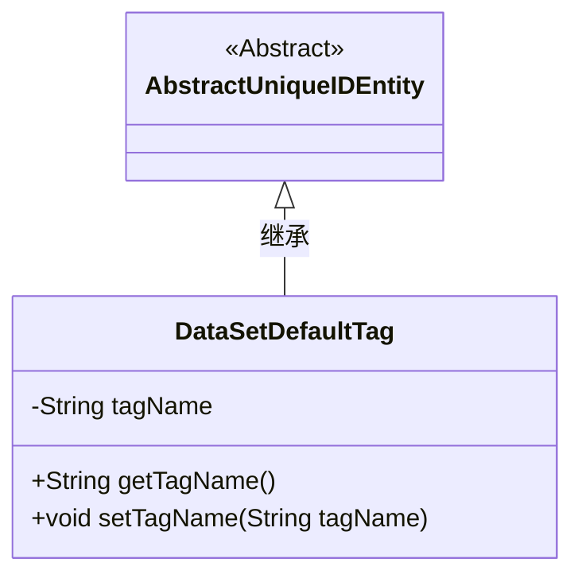
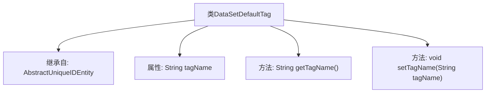

# 基础信息

|      |      |
|------|------|
| 名称 | DataSetDefaultTag |
| 编码语言 | .java |
| 代码路径 | WeFe/union/union-service/src/main/java/com/welab/wefe/union/service/entity/DataSetDefaultTag.java |
| 包名 | com.welab.wefe.union.service.entity |
| 依赖项 | ['com.welab.wefe.common.data.mysql.entity.AbstractUniqueIDEntity'] |
| 概述说明 | DataSetDefaultTag类继承AbstractUniqueIDEntity，包含私有属性tagName及其getter和setter方法。 |

# 说明

DataSetDefaultTag类是一个继承自AbstractUniqueIDEntity的Java类，用于表示数据集默认标签。该类包含一个私有字符串属性tagName，用于存储标签名称。提供了getTagName和setTagName两个公共方法，分别用于获取和设置tagName属性的值。这个类主要用于管理数据集标签的基本信息，通过封装属性确保了数据的安全访问。

# 类列表 Class Summary

| 名称   | 类型  | 说明 |
|-------|------|-------------|
| DataSetDefaultTag | class | DataSetDefaultTag类继承AbstractUniqueIDEntity，包含私有属性tagName及其getter和setter方法。 |

## 类 DataSetDefaultTag

|      |      |
|------|------|
| 访问范围 | public |
| 类型 | class |
| 名称 | DataSetDefaultTag |
| 说明 | DataSetDefaultTag类继承AbstractUniqueIDEntity，包含私有属性tagName及其getter和setter方法。 |

### UML类图

这段类图展示了DataSetDefaultTag继承自抽象类AbstractUniqueIDEntity的关系。DataSetDefaultTag包含私有字段tagName及其对应的getter/setter方法，继承了父类的唯一标识功能。该设计体现了对数据标签基础属性的封装，通过继承实现代码复用，典型用于需要唯一标识的数据标签管理系统。

### 内部方法调用关系图

这段代码定义了一个名为DataSetDefaultTag的类，该类继承自AbstractUniqueIDEntity。类中包含一个私有字符串属性tagName，以及对应的getter和setter方法。getTagName方法用于获取tagName的值，setTagName方法用于设置tagName的值。这个类主要用于管理数据集默认标签的名称，通过封装属性提供了对标签名的安全访问和修改机制。

### 字段列表 Field List

| 名称  | 类型  | 说明 |
|-------|-------|------|
| tagName | String | 私有字符串变量tagName。 |

### 方法列表

| 名称  | 类型  | 说明 |
|-------|-------|------|
| setTagName | void | 这是一个Java方法，用于设置对象的tagName属性值。方法接收一个字符串参数tagName，并将其赋值给当前对象的同名成员变量。 |
| getTagName | String | 获取标签名称的方法，返回字符串类型的tagName。 |

