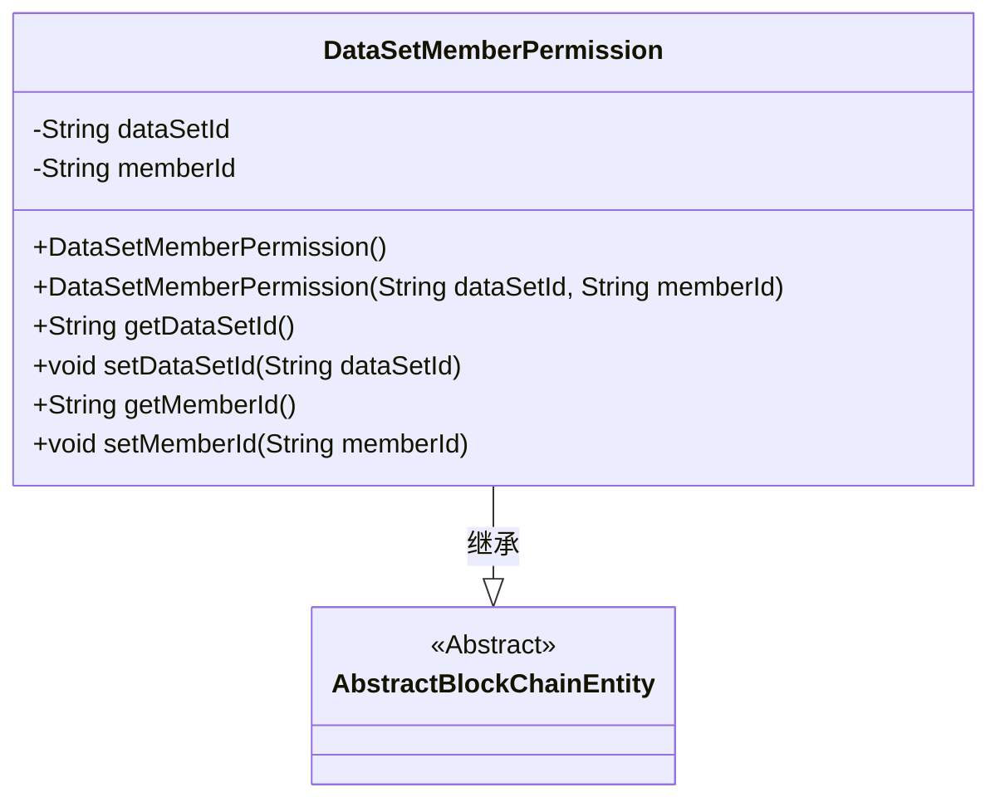
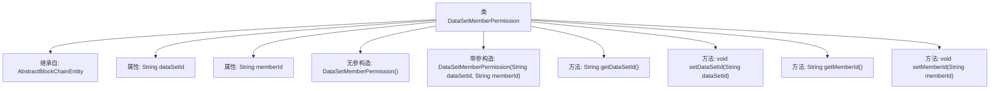

# 基础信息

|      |      |
|------|------|
| 名称 | DataSetMemberPermission |
| 编码语言 | .java |
| 代码路径 | WeFe/union/union-service/src/main/java/com/welab/wefe/union/service/entity/DataSetMemberPermission.java |
| 包名 | com.welab.wefe.union.service.entity |
| 依赖项 | ['com.welab.wefe.common.data.mysql.entity.AbstractBlockChainEntity'] |
| 概述说明 | DataSetMemberPermission类继承AbstractBlockChainEntity，包含数据集ID和成员ID字段，提供构造方法和getter/setter。 |

# 说明

DataSetMemberPermission类继承自AbstractBlockChainEntity，用于表示数据集成员权限。该类包含两个私有字符串属性dataSetId和memberId，分别存储数据集ID和成员ID。提供无参构造器和带参构造器，支持通过getter和setter方法访问和修改这两个属性。

# 类列表 Class Summary

| 名称   | 类型  | 说明 |
|-------|------|-------------|
| DataSetMemberPermission | class | 数据集成员权限类，包含数据集ID和成员ID字段及对应方法。 |

## 类 DataSetMemberPermission

|      |      |
|------|------|
| 访问范围 | public |
| 类型 | class |
| 名称 | DataSetMemberPermission |
| 说明 | 数据集成员权限类，包含数据集ID和成员ID字段及对应方法。 |

### UML类图

这段类图展示了DataSetMemberPermission类继承自AbstractBlockChainEntity抽象类的关系。DataSetMemberPermission包含两个私有字符串属性dataSetId和memberId，提供了空构造器和带参构造器，以及标准的getter/setter方法。作为区块链实体，它继承了父类的核心特性，专门用于管理数据集与成员之间的权限关系，体现了面向对象设计中"is-a"的继承关系。

### 内部方法调用关系图

这段代码定义了一个名为DataSetMemberPermission的类，继承自AbstractBlockChainEntity，用于管理数据集成员权限。类中包含两个私有属性dataSetId和memberId，分别表示数据集ID和成员ID。提供了无参构造方法和带参构造方法，以及对应的getter和setter方法用于访问和修改这两个属性。该类的设计主要用于封装数据集成员权限相关的数据，便于在区块链系统中进行权限管理和数据操作。

### 字段列表 Field List

| 名称  | 类型  | 说明 |
|-------|-------|------|
| dataSetId | String | 数据集ID的私有字符串变量。 |
| memberId | String | 声明一个私有字符串类型变量memberId。 |

### 方法列表

| 名称  | 类型  | 说明 |
|-------|-------|------|
| getDataSetId | String | 获取数据集ID的方法，返回字符串类型的数据集ID。 |
| getMemberId | String | 这是一个Java方法，返回成员ID字符串。方法名为getMemberId，无参数，直接返回成员变量memberId的值。 |
| setDataSetId | void | 设置数据集ID的方法，将输入参数赋值给类的成员变量dataSetId。 |
| setMemberId | void | 设置成员ID的方法，将输入字符串赋值给类的成员变量memberId。 |

