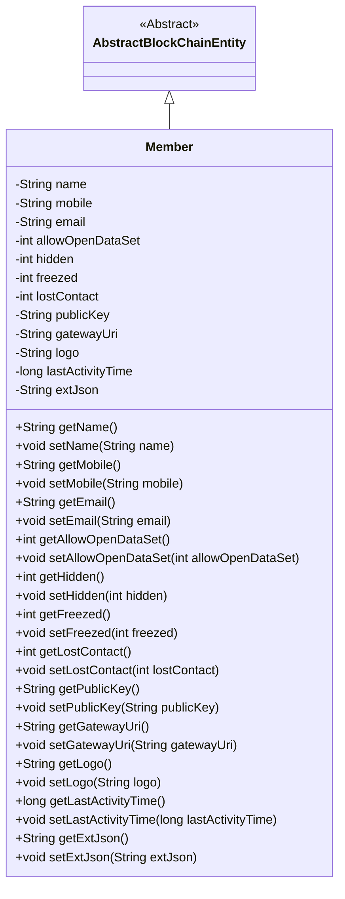

# 基础信息

|      |      |
|------|------|
| 名称 | Member |
| 编码语言 | .java |
| 代码路径 | WeFe/union/union-service/src/main/java/com/welab/wefe/union/service/entity/Member.java |
| 包名 | com.welab.wefe.union.service.entity |
| 依赖项 | ['com.welab.wefe.common.data.mysql.entity.AbstractBlockChainEntity'] |
| 概述说明 | 区块链成员类，包含姓名、联系方式、状态标识、公钥、网关URI、最后活动时间等属性及对应方法。 |

# 说明

该代码定义了一个名为Member的类，继承自AbstractBlockChainEntity。类中包含多个私有属性，包括name、mobile、email等基本信息，以及allowOpenDataSet、hidden、freezed、lostContact等状态标识。此外，还包含publicKey、gatewayUri、logo等与区块链相关的属性，以及lastActivityTime和extJson等扩展信息。每个属性都有对应的getter和setter方法，用于访问和修改属性值。

# 类列表 Class Summary

| 名称   | 类型  | 说明 |
|-------|------|-------------|
| Member | class | 区块链成员类，包含姓名、联系方式、状态标志、公钥、网关URI、最后活动时间及扩展信息。 |

## 类 Member

|      |      |
|------|------|
| 访问范围 | public |
| 类型 | class |
| 名称 | Member |
| 说明 | 区块链成员类，包含姓名、联系方式、状态标志、公钥、网关URI、最后活动时间及扩展信息。 |

### UML类图

类图描述：Member类继承自抽象类AbstractBlockChainEntity，包含多个私有属性如name、mobile、email等，以及对应的getter和setter方法。这些属性用于描述区块链成员的基本信息、状态和扩展数据，体现了成员实体的核心属性和行为。类图清晰地展示了继承关系和属性封装特性。

### 内部方法调用关系图

```mermaid
graph TD
    A["类Member继承AbstractBlockChainEntity"]
    B["属性: String name"]
    C["属性: String mobile"]
    D["属性: String email"]
    E["属性: int allowOpenDataSet"]
    F["属性: int hidden"]
    G["属性: int freezed"]
    H["属性: int lostContact"]
    I["属性: String publicKey"]
    J["属性: String gatewayUri"]
    K["属性: String logo"]
    L["属性: long lastActivityTime"]
    M["属性: String extJson"]
    N["方法: getName/setName"]
    O["方法: getMobile/setMobile"]
    P["方法: getEmail/setEmail"]
    Q["方法: getAllowOpenDataSet/setAllowOpenDataSet"]
    R["方法: getHidden/setHidden"]
    S["方法: getFreezed/setFreezed"]
    T["方法: getLostContact/setLostContact"]
    U["方法: getPublicKey/setPublicKey"]
    V["方法: getGatewayUri/setGatewayUri"]
    W["方法: getLogo/setLogo"]
    X["方法: getLastActivityTime/setLastActivityTime"]
    Y["方法: getExtJson/setExtJson"]

    A --> B
    A --> C
    A --> D
    A --> E
    A --> F
    A --> G
    A --> H
    A --> I
    A --> J
    A --> K
    A --> L
    A --> M
    A --> N
    A --> O
    A --> P
    A --> Q
    A --> R
    A --> S
    A --> T
    A --> U
    A --> V
    A --> W
    A --> X
    A --> Y
```

该流程图展示了Member类的完整结构，该类继承自AbstractBlockChainEntity，包含12个私有属性和对应的getter/setter方法。属性涵盖基础数据类型和字符串类型，分别用于存储成员名称、联系方式、状态标志、密钥信息等数据。每个属性都有严格匹配的访问方法，形成标准的JavaBean结构，适用于区块链场景下的成员数据封装。

### 字段列表 Field List

| 名称  | 类型  | 说明 |
|-------|-------|------|
| name | String | 私有字符串变量name |
| extJson | String | 私有字符串变量extJson |
| freezed | int | 变量freezed是私有整型，用于标记冻结状态。 |
| logo | String | 私有字符串变量logo，用于存储标识信息。 |
| mobile | String | 定义私有字符串变量mobile。 |
| lastActivityTime | long | 私有长整型变量，记录最后活动时间。 |
| email | String | 私有字符串类型变量email |
| gatewayUri | String | 私有字符串变量gatewayUri，用于存储网关URI地址。 |
| hidden | int | 私有整型变量hidden。 |
| allowOpenDataSet | int | 私有整型变量，用于控制数据集开放权限。 |
| publicKey | String | 私有字符串变量publicKey |
| lostContact | int | 私有整型变量lostContact，用于记录失去联系的次数或状态。 |

### 方法列表

| 名称  | 类型  | 说明 |
|-------|-------|------|
| setGatewayUri | void | 设置网关URI的方法，将参数gatewayUri赋值给类的同名成员变量。 |
| getLogo | String | 获取logo字符串的方法。 |
| setLastActivityTime | void | 设置最后活动时间的方法，将参数值赋给类的成员变量lastActivityTime。 |
| getLastActivityTime | long | 获取最后活动时间的方法，返回变量lastActivityTime的值。 |
| getName | String | 这是一个Java方法，返回字符串类型的成员变量name的值。 |
| setName | void | 这是一个Java方法，用于设置对象的名称属性。方法接受一个字符串参数name，并将其赋值给当前对象的name字段。 |
| getGatewayUri | String | 这是一个Java方法，返回名为gatewayUri的字符串变量值。 |
| getLostContact | int | 获取丢失联系次数的方法，返回lostContact变量值。 |
| setLogo | void | 这是一个Java方法，用于设置对象的logo属性，接收一个字符串参数logo并将其赋值给对象的logo成员变量。 |
| setHidden | void | 设置隐藏属性的方法，参数为整型hidden。 |
| setAllowOpenDataSet | void | 该方法用于设置允许打开的数据集数量，参数为整型值。 |
| getEmail | String | 这是一个Java方法，返回字符串类型的email变量值。 |
| getMobile | String | 获取手机号的方法，返回字符串类型变量mobile。 |
| setMobile | void | 设置手机号的方法，将输入参数mobile赋值给当前对象的mobile属性。 |
| getFreezed | int | 获取freezed变量的值。 |
| getHidden | int | 获取隐藏值的方法，返回整型变量hidden的值。 |
| setPublicKey | void | 设置公钥的方法，将输入字符串赋值给类的publicKey成员变量。 |
| getAllowOpenDataSet | int | 这是一个Java方法，返回整型变量allowOpenDataSet的值。 |
| getExtJson | String | 获取extJson字符串的方法。 |
| setLostContact | void | 设置失联状态的方法，参数为lostContact。 |
| setEmail | void | 这是一个Java方法，用于设置对象的email属性，接收一个字符串参数email并将其赋值给当前对象的email字段。 |
| getPublicKey | String | 获取公钥的方法，返回publicKey变量值。 |
| setFreezed | void | 定义方法setFreezed，用于设置freezed变量的值。 |
| setExtJson | void | 这是一个Java方法，用于设置对象的extJson属性值。方法接收一个字符串参数extJson，并将其赋值给当前对象的同名属性。 |

