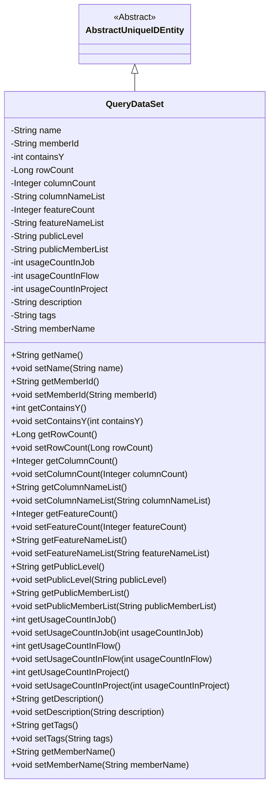

# 基础信息

|      |      |
|------|------|
| 名称 | QueryDataSet |
| 编码语言 | .java |
| 代码路径 | WeFe/union/union-service/src/main/java/com/welab/wefe/union/service/entity/QueryDataSet.java |
| 包名 | com.welab.wefe.union.service.entity |
| 依赖项 | ['com.welab.wefe.common.data.mysql.entity.AbstractUniqueIDEntity'] |
| 概述说明 | QueryDataSet类包含数据集名称、成员ID、行列数、特征列表、公开级别、使用统计、描述和标签等属性，用于管理数据集元信息。 |

# 说明

QueryDataSet类是一个继承自AbstractUniqueIDEntity的实体类，用于表示查询数据集。该类包含多个属性，包括数据集名称、成员ID、是否包含Y值、行数、列数、列名列表、特征数量、特征名列表、公开级别、公开成员列表、在作业、流程和项目中的使用次数、描述、标签以及成员名称。每个属性都有对应的getter和setter方法，用于获取和设置属性值。

# 类列表 Class Summary

| 名称   | 类型  | 说明 |
|-------|------|-------------|
| QueryDataSet | class | QueryDataSet类包含数据集名称、成员ID、行列数、特征信息、公开级别、使用统计及描述标签等属性，用于管理数据集元数据。 |

## 类 QueryDataSet

|      |      |
|------|------|
| 访问范围 | public |
| 类型 | class |
| 名称 | QueryDataSet |
| 说明 | QueryDataSet类包含数据集名称、成员ID、行列数、特征信息、公开级别、使用统计及描述标签等属性，用于管理数据集元数据。 |

### UML类图

这段代码展示了一个继承自`AbstractUniqueIDEntity`的`QueryDataSet`类，主要用于存储和管理数据集相关的元信息。类中包含15个私有字段，涵盖数据集名称、成员ID、行列统计、特征信息、公开级别、使用计数等属性，每个字段都有对应的getter和setter方法。该类通过继承获得唯一标识符功能，适合用于数据管理系统中的数据集元数据建模。

### 内部方法调用关系图

```mermaid
graph TD
    A["类QueryDataSet"]
    B["继承: AbstractUniqueIDEntity"]
    C["属性: String name"]
    D["属性: String memberId"]
    E["属性: int containsY"]
    F["属性: Long rowCount"]
    G["属性: Integer columnCount"]
    H["属性: String columnNameList"]
    I["属性: Integer featureCount"]
    J["属性: String featureNameList"]
    K["属性: String publicLevel"]
    L["属性: String publicMemberList"]
    M["属性: int usageCountInJob"]
    N["属性: int usageCountInFlow"]
    O["属性: int usageCountInProject"]
    P["属性: String description"]
    Q["属性: String tags"]
    R["属性: String memberName"]
    S["Getter/Setter方法: 所有属性"]

    A --> B
    A --> C
    A --> D
    A --> E
    A --> F
    A --> G
    A --> H
    A --> I
    A --> J
    A --> K
    A --> L
    A --> M
    A --> N
    A --> O
    A --> P
    A --> Q
    A --> R
    A --> S
```

这段代码定义了一个名为QueryDataSet的Java类，它继承自AbstractUniqueIDEntity。该类包含16个私有属性，涵盖了数据集的各种元信息，如名称、成员ID、行列统计、特征信息、使用计数和描述等。每个属性都配有对应的getter和setter方法，用于封装属性的访问和修改。这个类主要用于表示查询数据集的结构化信息，通过属性可以全面描述数据集的元数据特征和使用情况。继承关系表明该类可能具有父类定义的唯一标识功能。

### 字段列表 Field List

| 名称  | 类型  | 说明 |
|-------|-------|------|
| usageCountInFlow | int | 私有整型变量，记录流程中的使用次数。 |
| featureCount | Integer | 类私有整型变量，记录特征数量。 |
| containsY | int | 私有整型变量containsY。 |
| publicMemberList | String | 私有字符串变量publicMemberList，用于存储公共成员列表。 |
| description | String | 私有字符串类型变量description。 |
| memberName | String | 成员变量memberName，类型为String，私有访问权限。 |
| featureNameList | String | 私有字符串变量，用于存储特征名称列表。 |
| memberId | String | 成员ID字符串变量 |
| usageCountInProject | int | 项目内使用次数计数器 |
| tags | String | 声明一个私有字符串变量tags。 |
| columnCount | Integer | 私有整型变量，记录列数。 |
| rowCount | Long | 私有长整型变量，用于记录行数。 |
| columnNameList | String | 字段columnNameList存储列名列表，类型为String。 |
| name | String | 私有字符串变量name |
| usageCountInJob | int | 私有整型变量，记录作业中的使用次数。 |
| publicLevel | String | 私有字符串变量publicLevel，用于存储公开级别信息。 |

### 方法列表

| 名称  | 类型  | 说明 |
|-------|-------|------|
| setColumnNameList | void | 设置列名列表的方法，将输入参数赋值给类的成员变量columnNameList。 |
| getDescription | String | 获取描述信息的方法，返回字符串类型的description变量值。 |
| getPublicMemberList | String | 获取公共成员列表的方法，返回字符串类型变量publicMemberList。 |
| getColumnCount | Integer | 获取列数的方法，返回整型值columnCount。 |
| setName | void | 设置对象名称的方法，将参数name赋值给对象的name属性。 |
| getUsageCountInJob | int | 获取当前作业中的使用次数。 |
| getTags | String | 获取标签字符串的方法，直接返回成员变量tags的值。 |
| setTags | void | 设置标签字符串。 |
| getMemberName | String | 获取成员名称的方法，返回成员变量memberName的值。 |
| setMemberName | void | 设置成员名称的方法，将输入参数赋值给类的成员变量。 |
| setFeatureCount | void | 设置特征数量的方法，将输入参数赋给类变量featureCount。 |
| setColumnCount | void | 设置列数方法，接收整型参数columnCount并赋值给类成员变量columnCount。 |
| getMemberId | String | 获取成员ID的方法，返回字符串类型的memberId。 |
| setUsageCountInFlow | void | 设置流程内使用次数的公共方法，参数为整型usageCountInFlow。 |
| getColumnNameList | String | 该方法返回列名列表字符串。 |
| getName | String | 这是一个Java方法，返回私有变量name的值。 |
| setPublicLevel | void | 定义公共方法setPublicLevel，用于设置成员变量publicLevel的值。 |
| setUsageCountInJob | void | 这是一个Java方法，用于设置作业中的使用次数变量。方法接受一个整型参数，并将其赋值给类成员变量usageCountInJob。 |
| setRowCount | void | 设置行数的方法，将输入的长整型值赋给类的rowCount属性。 |
| getFeatureNameList | String | 获取特性名称列表的方法，返回字符串类型的featureNameList。 |
| setPublicMemberList | void | 设置公共成员列表的方法，将输入字符串赋值给类的公共成员列表变量。 |
| getUsageCountInFlow | int | 获取流程中的使用次数。 |
| getRowCount | Long | 方法返回行数计数值。 |
| setMemberId | void | 设置成员ID的方法，将输入字符串赋值给类的成员变量memberId。 |
| setUsageCountInProject | void | 设置项目内使用次数的方法，参数为usageCountInProject。 |
| getUsageCountInProject | int | 获取项目内使用次数的整型数值方法。 |
| getContainsY | int | 获取containsY的整数值。 |
| setDescription | void | 这是一个Java方法，用于设置对象的描述属性。方法接收一个字符串参数description，并将其赋值给对象的description成员变量。 |
| setFeatureNameList | void | 设置特征名称列表的方法，将输入字符串赋值给类成员变量featureNameList。 |
| getFeatureCount | Integer | 获取特征数量方法，返回整型变量featureCount的值。 |
| setContainsY | void | 设置containsY属性的方法，参数为int类型。 |
| getPublicLevel | String | 获取publicLevel值的公共方法。 |

