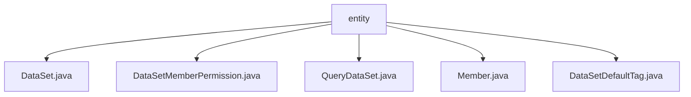

# 基础信息

|      |      |
|------|------|
| 名称 | entity |
| 编码语言 | .java |
| 代码路径 | WeFe/union/union-service/src/main/java/com/welab/wefe/union/service/entity |
| 包名 | docs.union.union-service.src.main.java.com.welab.wefe.union.service.entity |
| 概述说明 | DataSet类包含数据集属性和访问方法。DataSetMemberPermission类管理数据集成员权限。QueryDataSet类扩展数据集查询功能。Member类存储成员信息和状态。DataSetDefaultTag类处理数据集标签。 |

# 说明

## 概述  
该模块核心职责为管理联邦学习中的数据集元信息与成员权限，类似数据资产目录服务。接口规范统一采用Getter/Setter模式访问实体属性，关键数据结构包括DataSet（数据集基础属性）、DataSetMemberPermission（成员权限映射）和Member（节点成员信息）。外部依赖项涉及区块链基础实体AbstractBlockChainEntity。例如DataSet包含特征名列表等机器学习特征，DataSetDefaultTag实现标签管理。

## 主要业务场景  
模块支持联邦学习中数据集的权限控制与共享流程，采用"申请-授权"交互模式。典型应用包括：1) 成员通过Member实体注册节点信息；2) DataSet与QueryDataSet实现数据集元数据查询；3) DataSetMemberPermission控制跨机构数据访问。例如通过publicLevel字段实现分级公开，结合allowOpenDataSet标志位完成动态授权。

### 包内部结构视图

该流程图展示了WeFe项目中union-service模块下entity目录的文件结构关系。根节点为entity文件夹，包含5个Java实体类文件：DataSet.java、DataSetMemberPermission.java、QueryDataSet.java、Member.java和DataSetDefaultTag.java。这些文件都属于数据模型层，用于定义联盟服务中的核心数据结构，包括数据集、成员权限和默认标签等业务实体。

# 文件列表

| 名称   | 类型  | 说明 |
|-------|------|-------------|
| [DataSet.java](DataSet.md) | file | DataSet类继承AbstractBlockChainEntity，包含名称、成员ID、行列数、特征、公开级别、使用统计、描述和标签等属性及其getter/setter方法。 |
| [DataSetMemberPermission.java](DataSetMemberPermission.md) | file | DataSetMemberPermission类继承AbstractBlockChainEntity，包含数据集ID和成员ID字段，提供构造方法和getter/setter。 |
| [QueryDataSet.java](QueryDataSet.md) | file | QueryDataSet类包含数据集名称、成员ID、行列数、特征列表、公开级别、使用统计、描述和标签等属性，用于管理数据集元信息。 |
| [Member.java](Member.md) | file | 区块链成员类，包含姓名、联系方式、状态标识、公钥、网关URI、最后活动时间等属性及对应方法。 |
| [DataSetDefaultTag.java](DataSetDefaultTag.md) | file | DataSetDefaultTag类继承AbstractUniqueIDEntity，包含私有属性tagName及其getter和setter方法。 |

