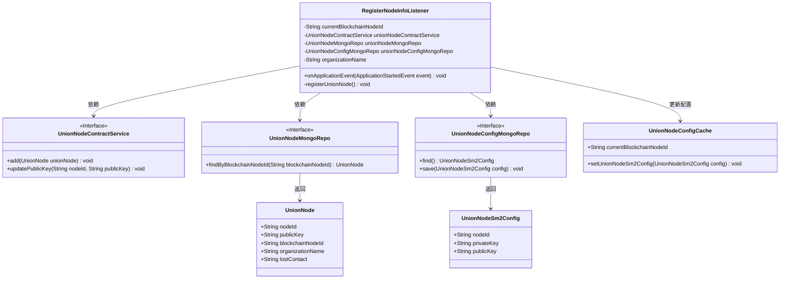
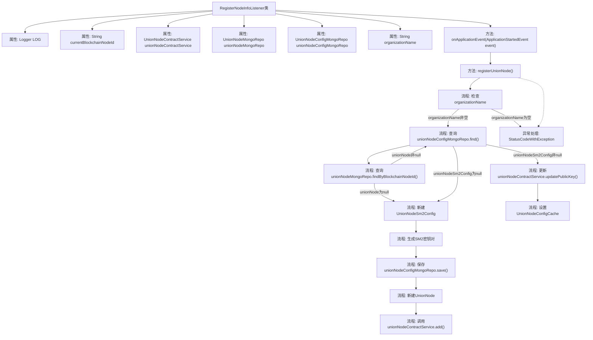

# 基础信息

|      |      |
|------|------|
| 名称 | RegisterNodeInfoListener |
| 编码语言 | .java |
| 代码路径 | WeFe/union/union-service/src/main/java/com/welab/wefe/union/service/listener/RegisterNodeInfoListener.java |
| 包名 | com.welab.wefe.union.service.listener |
| 依赖项 | ['com.welab.wefe.common.data.mongodb.entity.union.UnionNode', 'com.welab.wefe.common.data.mongodb.entity.union.UnionNodeSm2Config', 'com.welab.wefe.common.data.mongodb.repo.UnionNodeConfigMongoRepo', 'com.welab.wefe.common.data.mongodb.repo.UnionNodeMongoRepo', 'com.welab.wefe.common.exception.StatusCodeWithException', 'com.welab.wefe.common.util.SM2Util', 'com.welab.wefe.common.util.StringUtil', 'com.welab.wefe.union.service.cache.UnionNodeConfigCache', 'com.welab.wefe.union.service.constant.UnionNodeConfigType', 'com.welab.wefe.union.service.service.contract.UnionNodeContractService', 'org.slf4j.Logger', 'org.slf4j.LoggerFactory', 'org.springframework.beans.factory.annotation.Autowired', 'org.springframework.beans.factory.annotation.Value', 'org.springframework.boot.context.event.ApplicationStartedEvent', 'org.springframework.context.ApplicationListener', 'org.springframework.stereotype.Component'] |
| 概述说明 | 组件类RegisterNodeInfoListener监听应用启动事件，自动注册节点信息至区块链。检查配置后生成或更新SM2密钥对，保存至MongoDB并通过合约服务同步公钥，失败则退出系统。 |

# 说明

RegisterNodeInfoListener是一个Spring组件，监听应用启动事件。它依赖多个服务与配置，包括节点ID、合约服务、Mongo仓库和组织名称。主要功能是在应用启动时注册联盟节点。若组织名未配置则报错退出。检查Mongo中是否存在节点配置，若无则生成SM2密钥对并保存。根据节点是否存在执行新增或更新操作，包括密钥更新。最后缓存节点ID和配置。异常时记录日志并退出。

# 类列表 Class Summary

| 名称   | 类型  | 说明 |
|-------|------|-------------|
| RegisterNodeInfoListener | class | 注册节点监听器，启动时检查配置并注册节点信息，生成SM2密钥对，更新或保存节点数据至区块链和数据库。 |

## 类 RegisterNodeInfoListener

|      |      |
|------|------|
| 访问范围 | @Component;public |
| 类型 | class |
| 名称 | RegisterNodeInfoListener |
| 说明 | 注册节点监听器，启动时检查配置并注册节点信息，生成SM2密钥对，更新或保存节点数据至区块链和数据库。 |

### UML类图

该图展示了RegisterNodeInfoListener类及其依赖关系。该类是一个Spring组件，监听应用启动事件，通过调用UnionNodeContractService、UnionNodeMongoRepo和UnionNodeConfigMongoRepo等接口完成节点注册功能。主要流程包括：检查配置、生成/更新SM2密钥对、保存节点信息到区块链和数据库，并更新缓存配置。图中清晰呈现了类之间的依赖关系和接口实现关系。

### 内部方法调用关系图

该流程图展示了RegisterNodeInfoListener类的主要执行流程。当应用启动事件触发时，会调用registerUnionNode方法，该方法首先检查组织名称配置，然后查询节点配置信息。根据查询结果决定是创建新节点还是更新现有节点，包括生成SM2密钥对、保存配置、调用合约服务等操作。最后设置缓存信息，并在异常情况下终止程序。整个过程体现了节点注册的完整逻辑和异常处理机制。

### 字段列表 Field List

| 名称  | 类型  | 说明 |
|-------|-------|------|
| currentBlockchainNodeId | String | 代码中通过@Autowired自动注入当前区块链节点的ID字符串。 |
| unionNodeMongoRepo | UnionNodeMongoRepo | 使用@Autowired自动注入UnionNodeMongoRepo仓库实例。 |
| LOG = LoggerFactory.getLogger(RegisterNodeInfoListener.class) | Logger | 定义RegisterNodeInfoListener类的静态日志对象LOG，用于记录日志信息。 |
| unionNodeContractService | UnionNodeContractService | 代码片段使用@Autowired自动注入UnionNodeContractService服务实例。 |
| unionNodeConfigMongoRepo | UnionNodeConfigMongoRepo | 使用@Autowired自动注入UnionNodeConfigMongoRepo实例。 |
| organizationName | String | 代码使用Spring的@Value注解，从配置文件中注入organization.name属性值到私有变量organizationName。 |

### 方法列表

| 名称  | 类型  | 说明 |
|-------|-------|------|
| onApplicationEvent | void | 这段代码重写了Spring Boot应用启动事件的处理方法，在应用启动时调用registerUnionNode()函数进行节点注册。 |
| registerUnionNode | void | 注册联盟节点方法：检查组织名，查询或生成SM2密钥对，保存节点配置并更新区块链。失败则退出。 |

