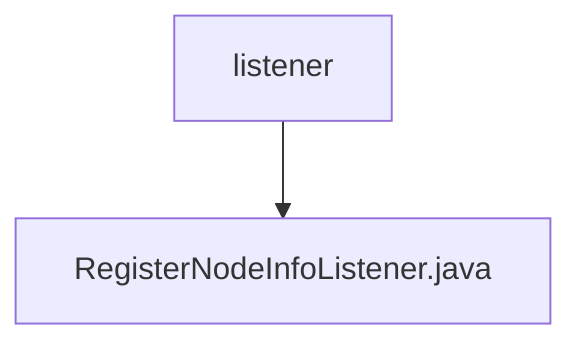

# 基础信息

|      |      |
|------|------|
| 名称 | listener |
| 编码语言 | .java |
| 代码路径 | WeFe/union/union-service/src/main/java/com/welab/wefe/union/service/listener |
| 包名 | docs.union.union-service.src.main.java.com.welab.wefe.union.service.listener |
| 概述说明 | 组件类RegisterNodeInfoListener监听应用启动事件，自动注册节点信息至区块链。检查配置后生成或更新SM2密钥对，保存至MongoDB并通过合约服务同步公钥，失败则退出系统。 |

# 说明

RegisterNodeInfoListener是一个Spring组件，监听应用启动事件。它依赖多个服务与配置，包括节点ID、合约服务、Mongo仓库和组织名称。主要功能是在应用启动时注册联盟节点。若组织名未配置则报错退出。检查Mongo中是否存在节点配置，若无则生成SM2密钥对并保存。根据节点是否存在执行新增或更新操作，包括密钥更新。最后缓存节点ID和配置。异常时记录日志并退出。

### 包内部结构视图

该流程图展示了WeFe项目中union-service模块下的监听器目录结构。顶层节点为listener文件夹，其下包含一个具体的监听器实现文件RegisterNodeInfoListener.java。这种结构体现了典型的Java项目监听器层设计模式，其中监听器类被集中管理在特定目录中。

# 文件列表

| 名称   | 类型  | 说明 |
|-------|------|-------------|
| [RegisterNodeInfoListener.java](RegisterNodeInfoListener.md) | file | 组件类RegisterNodeInfoListener监听应用启动事件，自动注册节点信息至区块链。检查配置后生成或更新SM2密钥对，保存至MongoDB并通过合约服务同步公钥，失败则退出系统。 |

