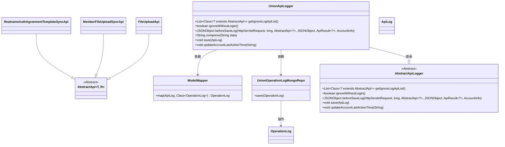
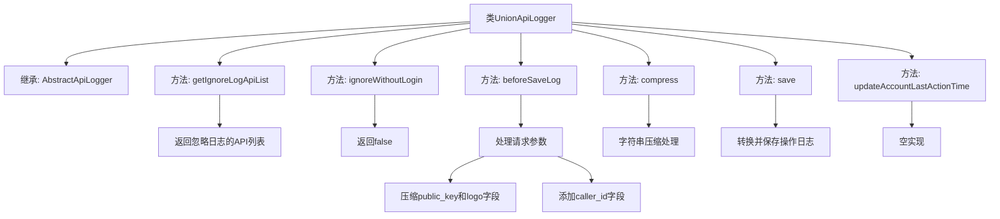

# 基础信息

|      |      |
|------|------|
| 名称 | UnionApiLogger |
| 编码语言 | .java |
| 代码路径 | WeFe/union/union-service/src/main/java/com/welab/wefe/union/service/operation/UnionApiLogger.java |
| 包名 | com.welab.wefe.union.service.operation |
| 依赖项 | ['com.alibaba.fastjson.JSONObject', 'com.welab.wefe.common.data.mongodb.entity.common.OperationLog', 'com.welab.wefe.common.data.mongodb.repo.UnionOperationLogMongoRepo', 'com.welab.wefe.common.web.Launcher', 'com.welab.wefe.common.web.api.base.AbstractApi', 'com.welab.wefe.common.web.delegate.api_log.AbstractApiLogger', 'com.welab.wefe.common.web.delegate.api_log.ApiLog', 'com.welab.wefe.common.web.dto.ApiResult', 'com.welab.wefe.common.web.service.account.AccountInfo', 'com.welab.wefe.union.service.api.common.MemberFileUploadSyncApi', 'com.welab.wefe.union.service.api.common.RealnameAuthAgreementTemplateSyncApi', 'com.welab.wefe.union.service.api.member.FileUploadApi', 'com.welab.wefe.union.service.util.ModelMapper', 'org.springframework.stereotype.Component', 'javax.servlet.http.HttpServletRequest', 'java.util.Arrays', 'java.util.List'] |
| 概述说明 | UnionApiLogger类继承AbstractApiLogger，实现日志记录功能。忽略特定API日志，处理请求参数如压缩公钥和logo，添加调用者ID，保存日志到MongoDB。 |

# 说明

UnionApiLogger是一个继承自AbstractApiLogger的组件类，主要用于API日志记录。它定义了忽略日志的API列表，包括文件上传和同步相关API。该类实现了日志处理逻辑，包括压缩敏感数据（如公钥和logo），提取调用者ID，并将日志保存到MongoDB。此外，它不忽略未登录请求，但未实现更新账户最后操作时间的功能。

# 类列表 Class Summary

| 名称   | 类型  | 说明 |
|-------|------|-------------|
| UnionApiLogger | class | UnionApiLogger类继承AbstractApiLogger，重写日志处理方法，包括忽略特定API日志、压缩敏感数据、保存日志到MongoDB等。 |

## 类 UnionApiLogger

|      |      |
|------|------|
| 访问范围 | @Component;public |
| 类型 | class |
| 名称 | UnionApiLogger |
| 说明 | UnionApiLogger类继承AbstractApiLogger，重写日志处理方法，包括忽略特定API日志、压缩敏感数据、保存日志到MongoDB等。 |

### UML类图

类图描述：
UnionApiLogger是AbstractApiLogger的具体实现类，主要用于API调用日志记录。它重写了父类的多个方法，包括获取忽略日志的API列表、预处理日志数据、保存日志等。该类通过ModelMapper将ApiLog转换为OperationLog，并使用UnionOperationLogMongoRepo进行持久化存储。同时，它提供了compress方法用于敏感数据脱敏处理。图中还展示了与多个API类（FileUploadApi等）的继承关系，以及与其他工具类（ModelMapper）和存储类（UnionOperationLogMongoRepo）的依赖关系。

### 内部方法调用关系图

这段代码定义了一个UnionApiLogger类，继承自AbstractApiLogger，主要用于API日志记录和处理。它实现了多个关键方法：getIgnoreLogApiList返回需要忽略日志的API列表，beforeSaveLog处理请求参数并压缩敏感数据，compress方法对长字符串进行脱敏处理，save方法将日志保存到MongoDB数据库。该类还提供了空实现的updateAccountLastActionTime方法。整体实现了API日志的记录、处理和存储功能。

### 字段列表 Field List

| 名称  | 类型  | 说明 |
|-------|-------|------|

### 方法列表

| 名称  | 类型  | 说明 |
|-------|-------|------|
| getIgnoreLogApiList | List<Class<? extends AbstractApi>> | 该方法返回忽略日志记录的API类列表，包含文件上传、成员文件同步和实名认证协议模板同步三类API。 |
| compress | String | 该方法将输入字符串压缩为前50字符、20个星号和后50字符的组合，保留首尾关键信息。 |
| beforeSaveLog | JSONObject | 方法在保存日志前处理请求参数，压缩data中的public_key和logo字段，提取caller_id并更新到data中，最后返回处理后的参数。 |
| save | void | 该方法将ApiLog对象映射为OperationLog并保存到MongoDB。 |
| ignoreWithoutLogin | boolean | 方法重写，返回false表示不忽略未登录请求。 |
| updateAccountLastActionTime | void | 空方法，未实现更新账户最后操作时间功能。 |

