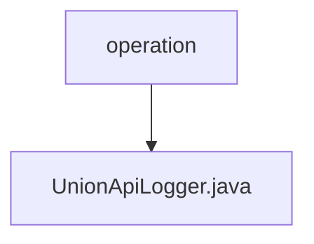

# 基础信息

|      |      |
|------|------|
| 名称 | operation |
| 编码语言 | .java |
| 代码路径 | WeFe/union/union-service/src/main/java/com/welab/wefe/union/service/operation |
| 包名 | docs.union.union-service.src.main.java.com.welab.wefe.union.service.operation |
| 概述说明 | UnionApiLogger类继承AbstractApiLogger，实现日志记录功能。忽略特定API日志，处理请求参数如压缩公钥和logo，添加调用者ID，保存日志到MongoDB。 |

# 说明

UnionApiLogger是一个继承自AbstractApiLogger的组件类，主要用于API日志记录。它定义了忽略日志的API列表，包括文件上传和同步相关API。该类实现了日志处理逻辑，包括压缩敏感数据（如公钥和logo），提取调用者ID，并将日志保存到MongoDB。此外，它不忽略未登录请求，但未实现更新账户最后操作时间的功能。

### 包内部结构视图

该流程图展示了WeFe项目中union-service模块的operation目录结构。operation作为父节点，包含一个子节点UnionApiLogger.java文件，表示该Java文件位于operation目录下。这是一个简单的单层目录结构，清晰地展示了文件与目录的从属关系。

# 文件列表

| 名称   | 类型  | 说明 |
|-------|------|-------------|
| [UnionApiLogger.java](UnionApiLogger.md) | file | UnionApiLogger类继承AbstractApiLogger，实现日志记录功能。忽略特定API日志，处理请求参数如压缩公钥和logo，添加调用者ID，保存日志到MongoDB。 |

