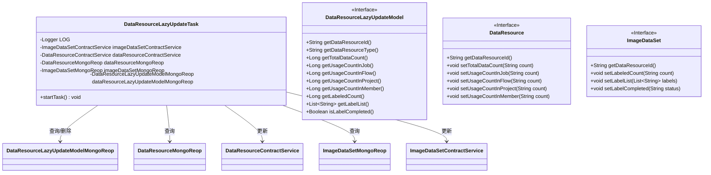
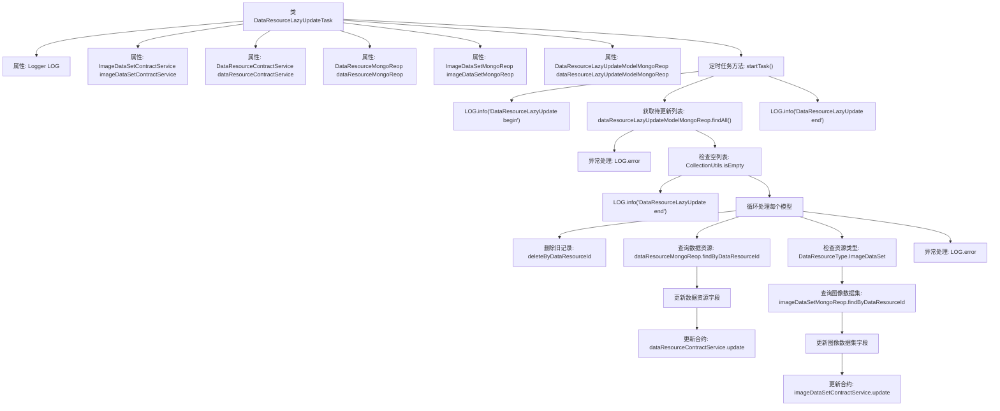

# 基础信息

|      |      |
|------|------|
| 名称 | DataResourceLazyUpdateTask |
| 编码语言 | .java |
| 代码路径 | WeFe/union/union-service/src/main/java/com/welab/wefe/union/service/scheduler/DataResourceLazyUpdateTask.java |
| 包名 | com.welab.wefe.union.service.scheduler |
| 依赖项 | ['com.welab.wefe.common.data.mongodb.entity.union.DataResource', 'com.welab.wefe.common.data.mongodb.entity.union.DataResourceLazyUpdateModel', 'com.welab.wefe.common.data.mongodb.entity.union.ImageDataSet', 'com.welab.wefe.common.data.mongodb.repo.DataResourceLazyUpdateModelMongoReop', 'com.welab.wefe.common.data.mongodb.repo.DataResourceMongoReop', 'com.welab.wefe.common.data.mongodb.repo.ImageDataSetMongoReop', 'com.welab.wefe.common.wefe.enums.DataResourceType', 'com.welab.wefe.union.service.service.contract.DataResourceContractService', 'com.welab.wefe.union.service.service.contract.ImageDataSetContractService', 'org.apache.commons.collections4.CollectionUtils', 'org.slf4j.Logger', 'org.slf4j.LoggerFactory', 'org.springframework.beans.factory.annotation.Autowired', 'org.springframework.context.annotation.Configuration', 'org.springframework.scheduling.annotation.Scheduled', 'java.util.List'] |
| 概述说明 | 这是一个定时任务类，用于延迟更新数据资源和图像数据集信息。它从MongoDB读取待更新记录，更新数据资源的使用统计和图像数据集的标注信息，最后删除已处理的记录。任务每30秒执行一次。 |

# 说明

这是一个名为DataResourceLazyUpdateTask的Java配置类，用于执行数据资源的延迟更新任务。该类通过@Scheduled注解定时执行startTask方法，初始延迟10秒，固定延迟可从配置读取（默认30秒）。任务首先从MongoDB查询待更新数据列表，然后逐个处理：删除原记录、更新数据资源的总数据量和使用计数，若为图像数据集类型还会更新标注相关字段。处理过程中会记录详细日志，包括开始/结束标记和错误信息。通过多个自动注入的服务和Mongo仓库完成数据操作。

# 类列表 Class Summary

| 名称   | 类型  | 说明 |
|-------|------|-------------|
| DataResourceLazyUpdateTask | class | 定时任务类，用于延迟更新数据资源和图像数据集信息，包括数据总数、使用次数和标注状态等。 |

## 类 DataResourceLazyUpdateTask

|      |      |
|------|------|
| 访问范围 | @Configuration;public |
| 类型 | class |
| 名称 | DataResourceLazyUpdateTask |
| 说明 | 定时任务类，用于延迟更新数据资源和图像数据集信息，包括数据总数、使用次数和标注状态等。 |

### UML类图

这段代码展示了一个Spring定时任务类`DataResourceLazyUpdateTask`，用于延迟更新数据资源统计信息。该类通过多个MongoDB仓库接口查询数据，并使用合约服务更新`DataResource`和`ImageDataSet`的统计字段（如使用次数、标注数量等）。核心流程包括：获取待更新列表、逐个处理资源、更新主资源和图像数据集信息。类图清晰地反映了任务类与各数据访问层组件之间的依赖关系，以及关键接口的字段结构。

### 内部方法调用关系图

这段代码是一个Spring定时任务类，用于延迟更新数据资源和图像数据集信息。流程图展示了从任务启动到完成的完整流程：首先获取待更新列表，然后循环处理每个数据资源，更新基础信息后，如果是图像数据集类型则额外更新图像相关字段。整个过程包含异常处理和日志记录，通过多个MongoDB存储库和合约服务完成数据操作。

### 字段列表 Field List

| 名称  | 类型  | 说明 |
|-------|-------|------|
| dataResourceMongoReop | DataResourceMongoReop | 使用@Autowired自动注入DataResourceMongoReop实例。 |
| imageDataSetMongoReop | ImageDataSetMongoReop | 使用@Autowired自动注入ImageDataSetMongoReop仓库实例。 |
| LOG = LoggerFactory.getLogger(this.getClass()) | Logger | 声明一个受保护的final日志对象LOG，使用当前类名初始化。 |
| dataResourceContractService | DataResourceContractService | 自动注入数据资源合约服务实例。 |
| imageDataSetContractService | ImageDataSetContractService | 代码片段使用@Autowired自动注入ImageDataSetContractService服务实例。 |
| dataResourceLazyUpdateModelMongoReop | DataResourceLazyUpdateModelMongoReop | 使用@Autowired自动注入DataResourceLazyUpdateModelMongoReop实例。 |

### 方法列表

| 名称  | 类型  | 说明 |
|-------|-------|------|
| startTask | void | 定时任务，初始延迟10秒，间隔30秒，查询并更新数据资源信息，包括统计数据和图像数据集标签信息，异常时记录日志。 |

