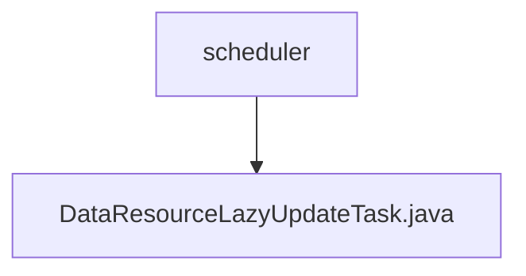

# 基础信息

|      |      |
|------|------|
| 名称 | scheduler |
| 编码语言 | .java |
| 代码路径 | WeFe/union/union-service/src/main/java/com/welab/wefe/union/service/scheduler |
| 包名 | docs.union.union-service.src.main.java.com.welab.wefe.union.service.scheduler |
| 概述说明 | 这是一个定时任务类，用于延迟更新数据资源和图像数据集信息。它从MongoDB读取待更新记录，更新数据资源的使用统计和图像数据集的标注信息，最后删除已处理的记录。任务每30秒执行一次。 |

# 说明

这是一个名为DataResourceLazyUpdateTask的Java配置类，用于执行数据资源的延迟更新任务。该类通过@Scheduled注解定时执行startTask方法，初始延迟10秒，固定延迟可从配置读取（默认30秒）。任务首先从MongoDB查询待更新数据列表，然后逐个处理：删除原记录、更新数据资源的总数据量和使用计数，若为图像数据集类型还会更新标注相关字段。处理过程中会记录详细日志，包括开始/结束标记和错误信息。通过多个自动注入的服务和Mongo仓库完成数据操作。

### 包内部结构视图

该流程图展示了WeFe项目中union-service模块的调度任务结构。根节点为scheduler目录，其下包含一个具体的任务实现文件DataResourceLazyUpdateTask.java。这种结构体现了典型的Java项目任务调度层设计，其中调度器目录作为容器，具体的定时任务类作为其子节点实现具体业务逻辑。

# 文件列表

| 名称   | 类型  | 说明 |
|-------|------|-------------|
| [DataResourceLazyUpdateTask.java](DataResourceLazyUpdateTask.md) | file | 这是一个定时任务类，用于延迟更新数据资源和图像数据集信息。它从MongoDB读取待更新记录，更新数据资源的使用统计和图像数据集的标注信息，最后删除已处理的记录。任务每30秒执行一次。 |

