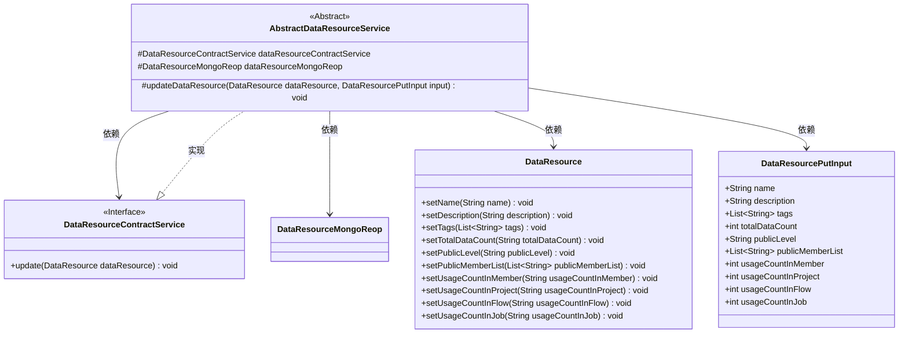
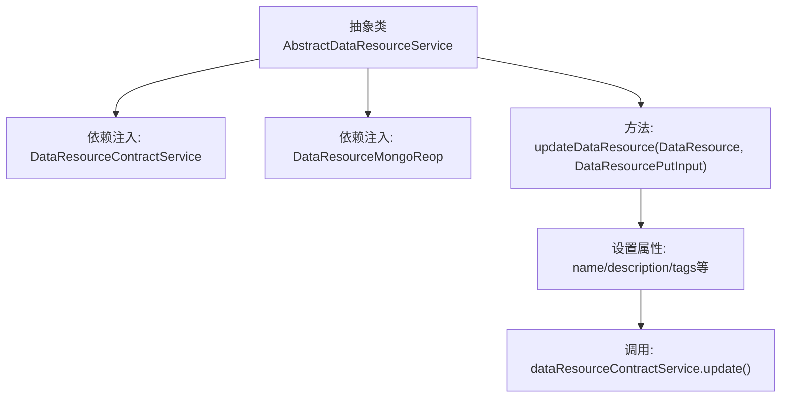

# 基础信息

|      |      |
|------|------|
| 名称 | AbstractDataResourceService |
| 编码语言 | .java |
| 代码路径 | WeFe/union/union-service/src/main/java/com/welab/wefe/union/service/service/AbstractDataResourceService.java |
| 包名 | com.welab.wefe.union.service.service |
| 依赖项 | ['com.welab.wefe.common.data.mongodb.entity.union.DataResource', 'com.welab.wefe.common.data.mongodb.repo.DataResourceMongoReop', 'com.welab.wefe.common.exception.StatusCodeWithException', 'com.welab.wefe.union.service.dto.dataresource.DataResourcePutInput', 'com.welab.wefe.union.service.service.contract.DataResourceContractService', 'org.springframework.beans.factory.annotation.Autowired'] |
| 概述说明 | 抽象类AbstractDataResourceService提供数据资源更新功能，依赖ContractService和MongoReop，通过input参数更新dataResource属性并调用ContractService更新。 |

# 说明

这是一个抽象类AbstractDataResourceService，包含两个自动注入的依赖项：DataResourceContractService和DataResourceMongoReop。它提供了一个受保护的updateDataResource方法，用于更新数据资源对象。该方法接收DataResource对象和DataResourcePutInput输入参数，将输入参数中的名称、描述、标签、总数据量、公开级别、公开成员列表以及各类使用计数等属性值设置到数据资源对象中，最后通过dataResourceContractService执行更新操作。该方法可能抛出StatusCodeWithException异常。

# 类列表 Class Summary

| 名称   | 类型  | 说明 |
|-------|------|-------------|
| AbstractDataResourceService | class | 抽象类AbstractDataResourceService，包含数据资源更新逻辑，通过注入的服务和仓库操作，更新名称、描述等字段并保存。 |

## 类 AbstractDataResourceService

|      |      |
|------|------|
| 访问范围 | public abstract |
| 类型 | class |
| 名称 | AbstractDataResourceService |
| 说明 | 抽象类AbstractDataResourceService，包含数据资源更新逻辑，通过注入的服务和仓库操作，更新名称、描述等字段并保存。 |

### UML类图

该类图展示了一个抽象类`AbstractDataResourceService`及其相关依赖关系。该类通过`DataResourceContractService`接口和`DataResourceMongoReop`类实现数据资源更新功能，主要方法`updateDataResource`接收`DataResource`对象和`DataResourcePutInput`输入参数，更新资源属性后调用合约服务进行持久化。图中清晰体现了抽象类的保护字段、方法可见性以及类间的依赖与实现关系。

### 内部方法调用关系图

该流程图展示了抽象类AbstractDataResourceService的核心结构，包含两个自动注入的服务组件和一个关键更新方法。updateDataResource方法首先设置DataResource对象的多项属性值，最后通过dataResourceContractService完成更新操作。流程清晰体现了从参数输入到属性设置再到服务调用的完整处理链。

### 字段列表 Field List

| 名称  | 类型  | 说明 |
|-------|-------|------|
| dataResourceMongoReop | DataResourceMongoReop | 使用@Autowired自动注入DataResourceMongoReop数据资源库实例。 |
| dataResourceContractService | DataResourceContractService | 自动注入数据资源合约服务实例。 |

### 方法列表

| 名称  | 类型  | 说明 |
|-------|-------|------|
| updateDataResource | void | 更新数据资源方法，设置名称、描述、标签、数据总量、公开级别、公开成员列表及各类使用计数，最后调用更新服务。 |

