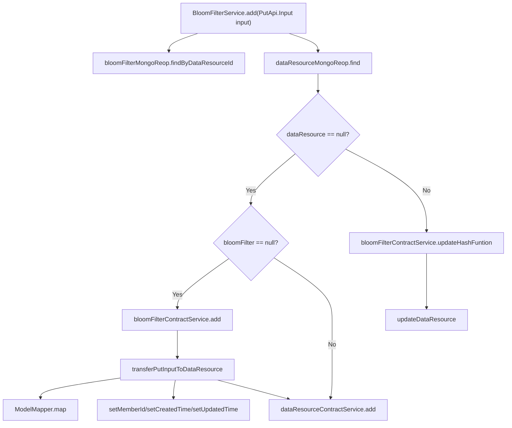

# 基础信息

|      |      |
|------|------|
| 名称 | BloomFilterService |
| 编码语言 | .java |
| 代码路径 | WeFe/union/union-service/src/main/java/com/welab/wefe/union/service/service/BloomFilterService.java |
| 包名 | com.welab.wefe.union.service.service |
| 依赖项 | ['com.welab.wefe.common.data.mongodb.entity.union.BloomFilter', 'com.welab.wefe.common.data.mongodb.entity.union.DataResource', 'com.welab.wefe.common.data.mongodb.repo.BloomFilterMongoReop', 'com.welab.wefe.common.exception.StatusCodeWithException', 'com.welab.wefe.common.util.DateUtil', 'com.welab.wefe.union.service.api.dataresource.bloomfilter.PutApi', 'com.welab.wefe.union.service.service.contract.BloomFilterContractService', 'com.welab.wefe.union.service.util.ModelMapper', 'org.springframework.beans.factory.annotation.Autowired', 'org.springframework.stereotype.Service', 'java.util.Date'] |
| 概述说明 | BloomFilterService处理数据资源添加和更新，检查布隆过滤器和数据资源是否存在，不存在则创建，存在则更新哈希函数和数据资源。 |

# 说明

BloomFilterService是一个服务类，继承自AbstractDataResourceService。它通过注入BloomFilterContractService和BloomFilterMongoReop来处理布隆过滤器相关操作。add方法接收输入参数，检查数据资源是否存在。若不存在且布隆过滤器也不存在，则创建新的布隆过滤器和数据资源；若仅数据资源不存在，则仅创建数据资源。若数据资源已存在，则更新布隆过滤器的哈希函数和数据资源。transferPutInputToDataResource方法将输入参数转换为DataResource对象，并设置成员ID、创建时间和更新时间。

# 类列表 Class Summary

| 名称   | 类型  | 说明 |
|-------|------|-------------|
| BloomFilterService | class | BloomFilterService处理数据资源添加和更新，检查资源是否存在，不存在则创建BloomFilter和数据资源，存在则更新BloomFilter哈希函数和数据资源。 |


## 类 BloomFilterService

|      |      |
|------|------|
| 访问范围 | @Service;public |
| 类型 | class |
| 名称 | BloomFilterService |
| 说明 | BloomFilterService处理数据资源添加和更新，检查资源是否存在，不存在则创建BloomFilter和数据资源，存在则更新BloomFilter哈希函数和数据资源。 |


### UML类图

```mermaid
classDiagram
    class AbstractDataResourceService {
        <<abstract>>
    }
    
    class BloomFilterService {
        -BloomFilterContractService bloomFilterContractService
        -BloomFilterMongoReop bloomFilterMongoReop
        +add(PutApi$Input input) void
        -transferPutInputToDataResource(PutApi$Input input) DataResource
    }
    
    class BloomFilterContractService {
        <<Interface>>
        +add(BloomFilter bloomFilter) void
        +updateHashFuntion(String dataResourceId, String hashFunction) void
    }
    
    class BloomFilterMongoReop {
        +findByDataResourceId(String dataResourceId) BloomFilter
    }
    
    class DataResource {
        -String memberId
        -String createdTime
        -String updatedTime
        +setMemberId(String memberId) void
        +setCreatedTime(String createdTime) void
        +setUpdatedTime(String updatedTime) void
    }
    
    class PutApi$Input {
        -String dataResourceId
        -String hashFunction
        -String curMemberId
        +getDataResourceId() String
        +getHashFunction() String
    }
    
    class BloomFilter {
        -String dataResourceId
        -String hashFunction
        +BloomFilter(String dataResourceId, String hashFunction)
    }
    
    AbstractDataResourceService <|-- BloomFilterService
    BloomFilterService --> BloomFilterContractService : 依赖
    BloomFilterService --> BloomFilterMongoReop : 依赖
    BloomFilterService --> DataResource : 创建
    BloomFilterService --> PutApi$Input : 处理输入
    BloomFilterContractService ..|> BloomFilter : 实现
```

这段代码展示了一个布隆过滤器服务(BloomFilterService)的实现，它继承自抽象数据资源服务(AbstractDataResourceService)。主要功能是通过BloomFilterMongoReop查询布隆过滤器，根据输入参数决定是新增还是更新数据资源和布隆过滤器。类图中清晰地展示了服务间的依赖关系，包括与BloomFilterContractService接口的交互、对MongoDB存储库BloomFilterMongoReop的依赖，以及处理输入输出数据模型(如PutApi$Input和DataResource)的关系。


### 内部方法调用关系图



这段代码是BloomFilterService类的核心业务逻辑，主要处理数据资源的添加和更新操作。流程图清晰地展示了方法执行的完整路径：首先查询BloomFilter和数据资源，根据数据资源是否存在决定后续操作。若不存在则根据BloomFilter状态选择创建新资源或仅添加数据资源；若存在则更新哈希函数并修改资源。辅助方法transferPutInputToDataResource负责输入参数到数据资源对象的转换。整个流程体现了对数据一致性和边界条件的严谨处理。

### 字段列表 Field List

| 名称  | 类型  | 说明 |
|-------|-------|------|
| bloomFilterMongoReop | BloomFilterMongoReop | 使用@Autowired自动注入BloomFilterMongoReop实例。 |
| bloomFilterContractService | BloomFilterContractService | 自动注入布隆过滤器合约服务实例。 |

### 方法列表

| 名称  | 类型  | 说明 |
|-------|-------|------|
| transferPutInputToDataResource | DataResource | 将输入对象转换为数据资源对象，设置成员ID、创建时间和更新时间后返回。 |
| add | void | 方法add处理输入数据，检查资源存在性。若不存在且无布隆过滤器，创建两者；若仅无资源则创建资源。若资源存在，更新布隆过滤器哈希函数并更新资源数据。 |


