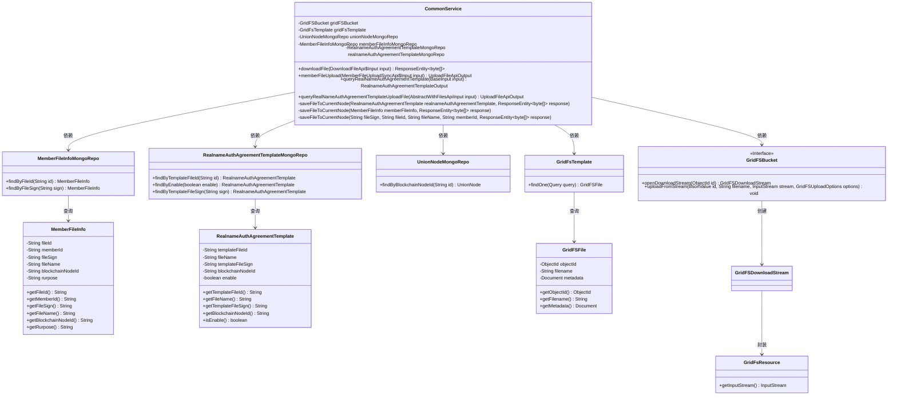
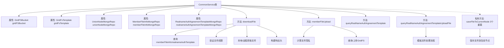

# 基础信息

|      |      |
|------|------|
| 名称 | CommonService |
| 编码语言 | .java |
| 代码路径 | WeFe/union/union-service/src/main/java/com/welab/wefe/union/service/service/CommonService.java |
| 包名 | com.welab.wefe.union.service.service |
| 依赖项 | ['com.mongodb.client.gridfs.GridFSBucket', 'com.mongodb.client.gridfs.GridFSDownloadStream', 'com.mongodb.client.gridfs.model.GridFSFile', 'com.mongodb.client.gridfs.model.GridFSUploadOptions', 'com.welab.wefe.common.StatusCode', 'com.welab.wefe.common.data.mongodb.entity.union.MemberFileInfo', 'com.welab.wefe.common.data.mongodb.entity.union.RealnameAuthAgreementTemplate', 'com.welab.wefe.common.data.mongodb.entity.union.UnionNode', 'com.welab.wefe.common.data.mongodb.repo.MemberFileInfoMongoRepo', 'com.welab.wefe.common.data.mongodb.repo.RealnameAuthAgreementTemplateMongoRepo', 'com.welab.wefe.common.data.mongodb.repo.UnionNodeMongoRepo', 'com.welab.wefe.common.data.mongodb.util.QueryBuilder', 'com.welab.wefe.common.exception.StatusCodeWithException', 'com.welab.wefe.common.util.JObject', 'com.welab.wefe.common.util.Md5', 'com.welab.wefe.common.util.ThreadUtil', 'com.welab.wefe.common.util.UrlUtil', 'com.welab.wefe.common.web.dto.AbstractWithFilesApiInput', 'com.welab.wefe.common.web.dto.UploadFileApiOutput', 'com.welab.wefe.common.wefe.enums.FileRurpose', 'com.welab.wefe.union.service.api.common.DownloadFileApi', 'com.welab.wefe.union.service.api.common.MemberFileUploadSyncApi', 'com.welab.wefe.union.service.dto.base.BaseInput', 'com.welab.wefe.union.service.dto.common.RealnameAuthAgreementTemplateOutput', 'org.apache.commons.io.IOUtils', 'org.bson.BsonObjectId', 'org.bson.BsonValue', 'org.bson.Document', 'org.bson.types.ObjectId', 'org.springframework.beans.factory.annotation.Autowired', 'org.springframework.data.mongodb.gridfs.GridFsResource', 'org.springframework.data.mongodb.gridfs.GridFsTemplate', 'org.springframework.http', 'org.springframework.stereotype.Service', 'org.springframework.web.client.RestTemplate', 'java.io.ByteArrayInputStream', 'java.net.URLEncoder'] |
| 概述说明 | CommonService类提供文件下载、上传及实名认证模板查询功能，使用GridFS存储文件，支持跨节点下载和本地存储，包含权限检查和异常处理。 |

# 说明

CommonService是一个Spring服务类，主要用于文件管理和下载功能。它依赖GridFSBucket、GridFsTemplate和多个MongoDB仓库进行文件操作。主要功能包括：下载文件时检查权限，若文件不存在则从其他节点获取并保存到当前节点；成员文件上传时验证签名并存储到GridFS；查询实名认证协议模板文件信息；处理实名认证协议模板文件上传。此外，还包含私有方法用于将文件保存到当前节点。所有操作均包含异常处理和状态码校验。

# 类列表 Class Summary

| 名称   | 类型  | 说明 |
|-------|------|-------------|
| CommonService | class | CommonService类提供文件下载、上传及实名认证模板查询功能，使用MongoDB存储文件信息，支持跨节点文件同步和权限验证。 |

## 类 CommonService

|      |      |
|------|------|
| 访问范围 | @Service;public |
| 类型 | class |
| 名称 | CommonService |
| 说明 | CommonService类提供文件下载、上传及实名认证模板查询功能，使用MongoDB存储文件信息，支持跨节点文件同步和权限验证。 |

### UML类图

这段类图展示了CommonService的核心结构及其依赖关系。CommonService通过多个MongoDB仓库（MemberFileInfoMongoRepo、RealnameAuthAgreementTemplateMongoRepo等）访问数据，使用GridFsTemplate和GridFSBucket进行文件存储操作。它处理文件下载、上传和查询等业务逻辑，涉及MemberFileInfo和RealnameAuthAgreementTemplate等实体类，并通过GridFSFile和GridFsResource与MongoDB的GridFS系统交互。类图清晰地呈现了服务层与数据访问层、存储基础设施之间的协作关系。

### 内部方法调用关系图

流程图描述：
该流程图展示了CommonService类的核心结构和主要方法调用关系。类包含5个自动装配的MongoDB存储库属性和4个公开业务方法，其中downloadFile方法实现文件下载逻辑（包含权限验证和跨节点获取），memberFileUpload处理成员文件上传，两个query方法分别处理实名认证模板查询。私有方法saveFileToCurrentNode的三个重载实现将文件流保存到当前节点的GridFS存储。各方法通过MongoDB存储库交互，并涉及异常处理和响应构建等关键流程。

### 字段列表 Field List

| 名称  | 类型  | 说明 |
|-------|-------|------|
| realnameAuthAgreementTemplateMongoRepo | RealnameAuthAgreementTemplateMongoRepo | 使用@Autowired自动注入实名认证协议模板的MongoDB仓库实例。 |
| gridFsTemplate | GridFsTemplate | 使用Spring的GridFsTemplate自动注入MongoDB文件存储操作工具。 |
| memberFileInfoMongoRepo | MemberFileInfoMongoRepo | 使用@Autowired自动注入MemberFileInfoMongoRepo依赖。 |
| unionNodeMongoRepo | UnionNodeMongoRepo | 使用@Autowired自动注入UnionNodeMongoRepo实例。 |
| gridFSBucket | GridFSBucket | 使用@Autowired自动注入GridFSBucket实例。 |

### 方法列表

| 名称  | 类型  | 说明 |
|-------|-------|------|
| memberFileUpload | UploadFileApiOutput | 方法实现会员文件上传功能，通过MD5签名校验文件，若不存在则存入GridFS并返回文件ID，异常时抛出状态码错误。 |
| downloadFile | ResponseEntity<byte[]> | 方法下载文件，先检查文件权限，本地无则从节点获取，返回文件流或错误。 |
| queryRealNameAuthAgreementTemplate | RealnameAuthAgreementTemplateOutput | 查询实名认证协议模板，返回启用状态的模板文件ID和文件名。 |
| queryRealNameAuthAgreementTemplateUploadFile | UploadFileApiOutput | 查询实名认证协议模板上传文件，通过MD5签名检查文件是否存在，若不存在则上传至GridFS并返回文件ID，异常时抛出状态码错误。 |
| saveFileToCurrentNode | void | 该方法将实名认证协议模板文件保存到当前节点，调用内部方法并传递文件签名、ID、名称及响应数据。 |
| saveFileToCurrentNode | void | 将成员文件信息保存到当前节点，包括文件签名、ID、名称和成员ID。 |
| saveFileToCurrentNode | void | 方法saveFileToCurrentNode将文件保存到当前节点，设置元数据并上传到GridFS存储。参数包括文件标识、ID、名称、成员ID和响应体。使用BsonObjectId和ByteArrayInputStream处理文件内容。 |

