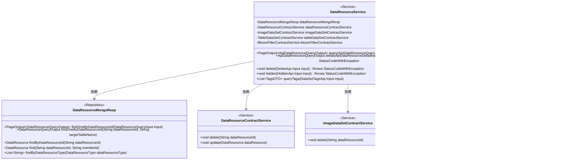

# 基础信息

|      |      |
|------|------|
| 名称 | DataResourceService |
| 编码语言 | .java |
| 代码路径 | WeFe/union/union-service/src/main/java/com/welab/wefe/union/service/service/DataResourceService.java |
| 包名 | com.welab.wefe.union.service.service |
| 依赖项 | ['com.welab.wefe.common.StatusCode', 'com.welab.wefe.common.data.mongodb.constant.MongodbTable', 'com.welab.wefe.common.data.mongodb.dto.PageOutput', 'com.welab.wefe.common.data.mongodb.dto.dataresource.DataResourceQueryOutput', 'com.welab.wefe.common.data.mongodb.entity.union.DataResource', 'com.welab.wefe.common.data.mongodb.repo.DataResourceMongoReop', 'com.welab.wefe.common.exception.StatusCodeWithException', 'com.welab.wefe.common.wefe.enums.DataResourcePublicLevel', 'com.welab.wefe.common.wefe.enums.DataResourceType', 'com.welab.wefe.union.service.api.dataresource.DataSetTagsApi', 'com.welab.wefe.union.service.api.dataresource.DeleteApi', 'com.welab.wefe.union.service.api.dataresource.HiddenApi', 'com.welab.wefe.union.service.dto.dataresource.ApiDataResourceDetailInput', 'com.welab.wefe.union.service.dto.dataresource.ApiDataResourceQueryInput', 'com.welab.wefe.union.service.dto.dataresource.ApiDataResourceQueryOutput', 'com.welab.wefe.union.service.dto.dataresource.TagsDTO', 'com.welab.wefe.union.service.service.contract.BloomFilterContractService', 'com.welab.wefe.union.service.service.contract.DataResourceContractService', 'com.welab.wefe.union.service.service.contract.ImageDataSetContractService', 'com.welab.wefe.union.service.service.contract.TableDataSetContractService', 'com.welab.wefe.union.service.util.MapperUtil', 'org.springframework.beans.factory.annotation.Autowired', 'org.springframework.stereotype.Service', 'java.util', 'java.util.stream.Collectors'] |
| 概述说明 | DataResourceService提供数据资源管理功能，包括分页查询、详情获取、删除、隐藏和标签查询。支持表数据集、图像数据集和布隆过滤器类型，通过MongoDB和合约服务操作数据。 |

# 说明

DataResourceService是一个Spring服务类，提供数据资源管理功能。它依赖多个服务类如DataResourceMongoReop和各种ContractService。主要功能包括分页查询数据资源，根据不同类型（表格数据集、图像数据集、布隆过滤器）返回不同输出；查询资源详情，处理不同类型资源的查询逻辑；删除资源，验证权限后调用对应服务删除；隐藏资源，修改公开级别为仅自己可见；查询标签，统计并按热度排序返回标签列表。方法中包含了类型判断、权限校验和异常处理逻辑。

# 类列表 Class Summary

| 名称   | 类型  | 说明 |
|-------|------|-------------|
| DataResourceService | class | DataResourceService提供数据资源的分页查询、详情、删除、隐藏和标签查询功能，支持不同类型资源处理，包括表格、图像和布隆过滤器。 |

## 类 DataResourceService

|      |      |
|------|------|
| 访问范围 | @Service;public |
| 类型 | class |
| 名称 | DataResourceService |
| 说明 | DataResourceService提供数据资源的分页查询、详情、删除、隐藏和标签查询功能，支持不同类型资源处理，包括表格、图像和布隆过滤器。 |

### UML类图

该代码实现了一个数据资源服务类，包含分页查询、详情查询、删除、隐藏和标签查询等功能。类图中展示了DataResourceService与多个Repository和Service的依赖关系，通过泛型参数和异常处理实现了对不同类型数据资源的操作。核心业务逻辑包括根据资源类型进行分支处理，并调用相应的底层服务完成数据操作。

### 内部方法调用关系图

这段代码实现了一个数据资源服务类，主要提供数据资源的查询、详情获取、删除、隐藏和标签查询功能。通过MongoDB存储库操作数据，根据不同类型调用不同的映射工具进行数据转换，并处理各种异常情况。流程图展示了类结构和依赖关系，时序图详细描述了各方法调用流程和数据流转过程。

### 字段列表 Field List

| 名称  | 类型  | 说明 |
|-------|-------|------|
| bloomFilterContractService | BloomFilterContractService | 自动注入布隆过滤器合约服务实例。 |
| dataResourceMongoReop | DataResourceMongoReop | 使用@Autowired自动注入DataResourceMongoReop数据资源MongoDB仓库。 |
| tableDataSetContractService | TableDataSetContractService | 使用@Autowired自动注入TableDataSetContractService服务实例。 |
| dataResourceContractService | DataResourceContractService | 自动注入DataResourceContractService实例。 |
| imageDataSetContractService | ImageDataSetContractService | 代码片段使用@Autowired自动注入ImageDataSetContractService服务实例。 |

### 方法列表

| 名称  | 类型  | 说明 |
|-------|-------|------|
| hidden | void | 隐藏API方法，检查数据资源是否存在，若存在则将其公开级别设为仅自己可见并更新，否则抛出资源不存在异常。 |
| query | PageOutput<ApiDataResourceQueryOutput> | 该方法根据输入参数查询数据资源，并按类型转换输出结果。返回包含分页信息和转换后列表的PageOutput对象。 |
| detail | ApiDataResourceQueryOutput | 根据输入数据类型查询MongoDB表，返回对应资源详情，无结果返回null，异常抛出错误。 |
| delete | void | 该方法根据输入参数删除数据资源。首先检查资源是否存在及用户权限，然后按资源类型调用不同服务删除，最后统一删除资源记录。若资源不存在、无权限或类型无效则抛出异常。 |
| queryTags | List<TagsDTO> | 该方法根据输入类型查询标签，统计各标签出现次数并按降序排序，返回标签及次数的列表。 |

