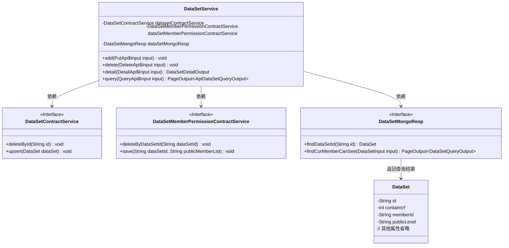

# 基础信息

|      |      |
|------|------|
| 名称 | DataSetService |
| 编码语言 | .java |
| 代码路径 | WeFe/union/union-service/src/main/java/com/welab/wefe/union/service/service/DataSetService.java |
| 包名 | com.welab.wefe.union.service.service |
| 依赖项 | ['com.welab.wefe.common.StatusCode', 'com.welab.wefe.common.data.mongodb.dto.PageOutput', 'com.welab.wefe.common.data.mongodb.dto.dataset.DataSetQueryOutput', 'com.welab.wefe.common.data.mongodb.entity.union.DataSet', 'com.welab.wefe.common.data.mongodb.repo.DataSetMongoReop', 'com.welab.wefe.common.exception.StatusCodeWithException', 'com.welab.wefe.common.wefe.enums.DataResourcePublicLevel', 'com.welab.wefe.union.service.api.dataresource.dataset.nomal.DeleteApi', 'com.welab.wefe.union.service.api.dataresource.dataset.nomal.DetailApi', 'com.welab.wefe.union.service.api.dataresource.dataset.nomal.PutApi', 'com.welab.wefe.union.service.api.dataresource.dataset.nomal.QueryApi', 'com.welab.wefe.union.service.dto.dataresource.dataset.table.ApiDataSetQueryOutput', 'com.welab.wefe.union.service.dto.dataresource.dataset.table.DataSetDetailOutput', 'com.welab.wefe.union.service.service.contract.DataSetContractService', 'com.welab.wefe.union.service.service.contract.DataSetMemberPermissionContractService', 'com.welab.wefe.union.service.util.MapperUtil', 'org.springframework.beans.BeanUtils', 'org.springframework.beans.factory.annotation.Autowired', 'org.springframework.stereotype.Service', 'java.util.List', 'java.util.stream.Collectors'] |
| 概述说明 | DataSetService提供数据集操作功能，包括添加、删除、查询详情和分页查询。添加时根据公开级别处理权限，删除时同步清理关联数据，查询支持详情和分页。 |

# 说明

DataSetService是一个服务类，提供数据集相关操作。它依赖多个服务类如DataSetContractService和DataSetMongoReop。主要功能包括：添加数据集时根据公开级别处理权限，删除数据集及其权限，查询数据集详情，以及分页查询当前用户可见的数据集列表。公开级别支持仅自己、公开和指定成员公开三种模式，异常情况会抛出错误。查询功能支持分页和结果转换。

# 类列表 Class Summary

| 名称   | 类型  | 说明 |
|-------|------|-------------|
| DataSetService | class | DataSetService类提供数据集操作功能，包括添加、删除、查询详情和分页查询。添加时根据公开级别处理权限，删除时清除相关数据，查询详情返回数据集信息，分页查询支持过滤和转换输出。 |

## 类 DataSetService

|      |      |
|------|------|
| 访问范围 | @Service;public |
| 类型 | class |
| 名称 | DataSetService |
| 说明 | DataSetService类提供数据集操作功能，包括添加、删除、查询详情和分页查询。添加时根据公开级别处理权限，删除时清除相关数据，查询详情返回数据集信息，分页查询支持过滤和转换输出。 |

### UML类图

这段代码展示了一个数据集服务类(DataSetService)，它通过依赖注入的方式整合了三个核心服务接口：数据集合约服务(DataSetContractService)、数据集成员权限合约服务(DataSetMemberPermissionContractService)和数据集Mongo仓库(DataSetMongoReop)。该类提供了数据集的新增、删除、详情查询和分页查询功能，实现了不同公开级别(OnlyMyself/Public/PublicWithMemberList)的数据权限管理逻辑。服务通过MongoDB进行数据持久化，并使用DTO对象在不同层之间传输数据。

### 内部方法调用关系图

```mermaid
graph TD
    A["类DataSetService"]
    B["依赖注入: DataSetContractService"]
    C["依赖注入: DataSetMemberPermissionContractService"]
    D["依赖注入: DataSetMongoReop"]
    E["方法: add(PutApi.Input input)"]
    F["方法: delete(DeleteApi.Input input)"]
    G["方法: detail(DetailApi.Input input)"]
    H["方法: query(QueryApi.Input input)"]
    I["创建DataSet对象并复制属性"]
    J["设置containsY和memberId"]
    K["检查publicLevel并处理权限"]
    L["调用dataSetContractService.upsert"]
    M["调用datasetContractService.deleteById"]
    N["调用dataSetMemberPermissionContractService.deleteByDataSetId"]
    O["调用dataSetMongoReop.findDataSetId"]
    P["调用MapperUtil.transferDataSetDetail"]
    Q["调用dataSetMongoReop.findCurMemberCanSee"]
    R["转换查询结果并返回PageOutput"]

    A --> B
    A --> C
    A --> D
    A --> E
    A --> F
    A --> G
    A --> H
    E --> I
    E --> J
    E --> K
    E --> L
    F --> M
    F --> N
    G --> O
    G --> P
    H --> Q
    H --> R
```

这段代码是DataSetService类的实现，主要包含四个核心方法：add()用于添加数据集并处理不同公开级别的权限控制，delete()用于删除数据集及相关权限，detail()用于获取数据集详情，query()用于分页查询当前用户可见的数据集。流程图清晰展示了类结构、依赖关系和方法调用链，特别是add()方法中针对三种不同公开级别(OnlyMyself/Public/PublicWithMemberList)的分支处理逻辑，以及各方法对底层服务(ContractService和MongoReop)的调用关系。

### 字段列表 Field List

| 名称  | 类型  | 说明 |
|-------|-------|------|
| dataSetMemberPermissionContractService | DataSetMemberPermissionContractService | 代码片段使用@Autowired注解自动注入DataSetMemberPermissionContractService服务实例。 |
| dataSetContractService | DataSetContractService | 使用@Autowired自动注入DataSetContractService服务实例。 |
| dataSetMongoReop | DataSetMongoReop | 使用@Autowired自动注入DataSetMongoReop数据集的MongoDB仓库。 |
| datasetContractService | DataSetContractService | 使用@Autowired自动注入DataSetContractService服务实例。 |

### 方法列表

| 名称  | 类型  | 说明 |
|-------|-------|------|
| delete | void | 删除数据集及其成员权限，根据输入ID调用两个服务方法完成操作。 |
| detail | DataSetDetailOutput | 该方法根据输入ID查询数据集，若存在则转换为详情输出，否则返回空。 |
| query | PageOutput<ApiDataSetQueryOutput> | 查询方法：根据输入参数查询当前用户可见的数据集，转换结果后返回分页输出。 |
| add | void | 方法add接收输入对象，复制属性到DataSet，设置包含Y值和成员ID。根据公开级别处理权限：仅自己或公开时删除权限并设置级别；指定成员公开时保存权限并设置级别；无效级别抛出异常。最后更新DataSet。 |

