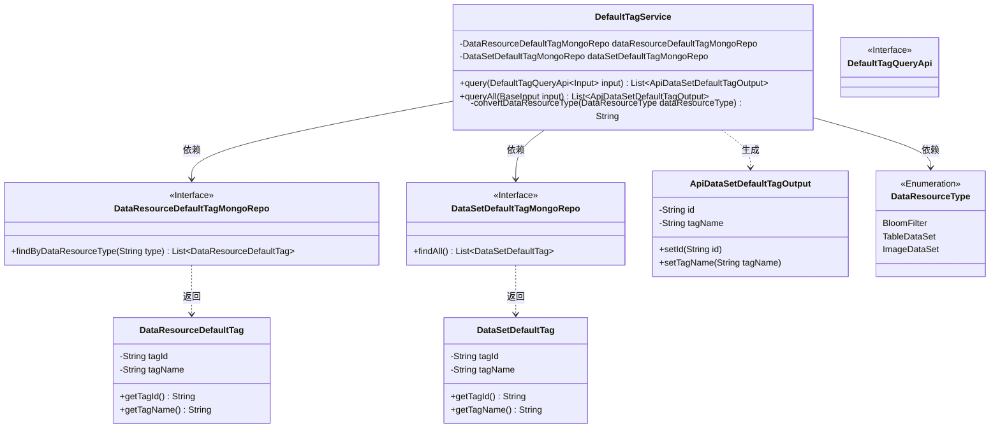
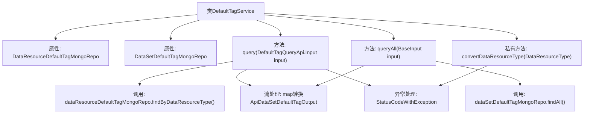

# 基础信息

|      |      |
|------|------|
| 名称 | DefaultTagService |
| 编码语言 | .java |
| 代码路径 | WeFe/union/union-service/src/main/java/com/welab/wefe/union/service/service/DefaultTagService.java |
| 包名 | com.welab.wefe.union.service.service |
| 依赖项 | ['com.welab.wefe.common.data.mongodb.entity.union.DataResourceDefaultTag', 'com.welab.wefe.common.data.mongodb.entity.union.DataSetDefaultTag', 'com.welab.wefe.common.data.mongodb.repo.DataResourceDefaultTagMongoRepo', 'com.welab.wefe.common.data.mongodb.repo.DataSetDefaultTagMongoRepo', 'com.welab.wefe.common.exception.StatusCodeWithException', 'com.welab.wefe.common.wefe.enums.DataResourceType', 'com.welab.wefe.union.service.api.dataresource.DefaultTagQueryApi', 'com.welab.wefe.union.service.dto.base.BaseInput', 'com.welab.wefe.union.service.dto.dataresource.dataset.table.ApiDataSetDefaultTagOutput', 'org.springframework.beans.factory.annotation.Autowired', 'org.springframework.stereotype.Service', 'java.util.List', 'java.util.stream.Collectors'] |
| 概述说明 | DefaultTagService类通过MongoDB仓库查询默认标签数据，提供按资源类型查询和查询全部标签的方法，并将结果转换为统一输出格式。包含类型转换逻辑处理异常情况。 |

# 说明

DefaultTagService是一个Spring服务类，包含两个MongoDB仓库依赖注入。提供两个查询方法：query方法根据输入参数的数据资源类型查询对应标签列表，并转换为统一输出格式；queryAll方法查询所有数据集标签并转换格式。convertDataResourceType私有方法处理数据资源类型转换逻辑，对特定类型进行统一处理，不支持的枚举值会抛出异常。

# 类列表 Class Summary

| 名称   | 类型  | 说明 |
|-------|------|-------------|
| DefaultTagService | class | DefaultTagService类提供查询默认标签功能，包含两个方法：query根据资源类型筛选标签，queryAll返回所有标签，均转换为ApiDataSetDefaultTagOutput输出。convertDataResourceType方法处理资源类型转换。 |

## 类 DefaultTagService

|      |      |
|------|------|
| 访问范围 | @Service;public |
| 类型 | class |
| 名称 | DefaultTagService |
| 说明 | DefaultTagService类提供查询默认标签功能，包含两个方法：query根据资源类型筛选标签，queryAll返回所有标签，均转换为ApiDataSetDefaultTagOutput输出。convertDataResourceType方法处理资源类型转换。 |

### UML类图

这段代码描述了一个标签服务类`DefaultTagService`，它通过两个MongoDB仓库接口(`DataResourceDefaultTagMongoRepo`和`DataSetDefaultTagMongoRepo`)查询不同类型的标签数据，并将其转换为统一的输出格式`ApiDataSetDefaultTagOutput`。服务类包含两个主要查询方法：`query`根据资源类型筛选标签，`queryAll`获取所有标签。其中`query`方法涉及枚举类型转换逻辑，处理不当会抛出异常。整体架构采用仓库模式进行数据访问，并通过流式处理进行数据转换。

### 内部方法调用关系图

这段代码流程图展示了DefaultTagService类的核心结构和调用关系。该类通过两个MongoDB仓库(dataResourceDefaultTagMongoRepo和dataSetDefaultTagMongoRepo)提供数据查询功能，包含query和queryAll两个主要方法，都涉及数据转换和流处理。私有方法convertDataResourceType处理资源类型转换并可能抛出异常。整体流程清晰展示了从数据查询到结果转换的处理链条，体现了Spring服务层组件的典型设计模式。

### 字段列表 Field List

| 名称  | 类型  | 说明 |
|-------|-------|------|
| dataResourceDefaultTagMongoRepo | DataResourceDefaultTagMongoRepo | 使用@Autowired自动注入DataResourceDefaultTagMongoRepo实例。 |
| dataSetDefaultTagMongoRepo | DataSetDefaultTagMongoRepo | 使用@Autowired自动注入DataSetDefaultTagMongoRepo实例。 |

### 方法列表

| 名称  | 类型  | 说明 |
|-------|-------|------|
| query | List<ApiDataSetDefaultTagOutput> | 该方法根据输入参数查询数据资源默认标签列表，转换为指定输出格式后返回。处理过程中可能抛出StatusCodeWithException异常。 |
| queryAll | List<ApiDataSetDefaultTagOutput> | 查询所有数据集默认标签，返回包含标签ID和名称的列表。 |
| convertDataResourceType | String | 该方法将DataResourceType枚举转换为字符串，BloomFilter和TableDataSet统一返回TableDataSet，ImageDataSet返回自身，其他类型抛出异常。 |

