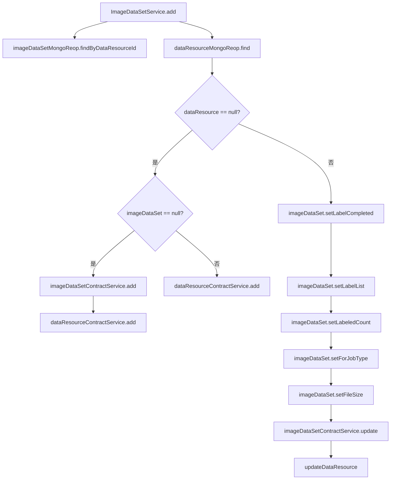

# 基础信息

|      |      |
|------|------|
| 名称 | ImageDataSetService |
| 编码语言 | .java |
| 代码路径 | WeFe/union/union-service/src/main/java/com/welab/wefe/union/service/service/ImageDataSetService.java |
| 包名 | com.welab.wefe.union.service.service |
| 依赖项 | ['com.welab.wefe.common.data.mongodb.entity.union.DataResource', 'com.welab.wefe.common.data.mongodb.entity.union.ImageDataSet', 'com.welab.wefe.common.data.mongodb.repo.ImageDataSetMongoReop', 'com.welab.wefe.common.exception.StatusCodeWithException', 'com.welab.wefe.union.service.api.dataresource.dataset.image.PutApi', 'com.welab.wefe.union.service.service.contract.ImageDataSetContractService', 'com.welab.wefe.union.service.util.MapperUtil', 'org.springframework.beans.factory.annotation.Autowired', 'org.springframework.stereotype.Service'] |
| 概述说明 | ImageDataSetService类处理图像数据集操作，包含新增和更新逻辑。通过检查数据资源是否存在决定执行新增或更新操作，涉及ImageDataSet和DataResource的存储与修改。 |

# 说明

该代码定义了一个名为ImageDataSetService的服务类，继承自AbstractDataResourceService。它通过自动装配依赖的ImageDataSetContractService和ImageDataSetMongoReop组件来处理图像数据集操作。主要方法add接收输入参数，首先查询现有数据集和数据资源，若不存在则创建新记录，否则更新现有记录的标签完成状态、标签列表、标注数量、作业类型和文件大小等信息，并同步更新数据资源。整个过程包含数据校验和转换逻辑。

# 类列表 Class Summary

| 名称   | 类型  | 说明 |
|-------|------|-------------|
| ImageDataSetService | class | ImageDataSetService处理图像数据集操作，包括新增和更新数据集及关联资源，涉及MongoDB存储和合约服务调用。 |


## 类 ImageDataSetService

|      |      |
|------|------|
| 访问范围 | @Service;public |
| 类型 | class |
| 名称 | ImageDataSetService |
| 说明 | ImageDataSetService处理图像数据集操作，包括新增和更新数据集及关联资源，涉及MongoDB存储和合约服务调用。 |


### UML类图

```mermaid
classDiagram
    class ImageDataSetService {
        -ImageDataSetContractService imageDataSetContractService
        -ImageDataSetMongoReop imageDataSetMongoReop
        +add(PutApi$Input input) void
    }
    class AbstractDataResourceService {
        <<Abstract>>
    }
    class ImageDataSetContractService {
        <<Interface>>
        +add(ImageDataSet imageDataSet) void
        +update(ImageDataSet imageDataSet) void
    }
    class ImageDataSetMongoReop {
        +findByDataResourceId(String dataResourceId) ImageDataSet
    }
    class DataResource {
        // 数据资源实体类
    }
    class PutApi$Input {
        // 输入参数嵌套类
    }
    class MapperUtil {
        <<Utility>>
        +transferPutInputToImageDataSet(PutApi$Input input) ImageDataSet
        +transferPutInputToDataResource(PutApi$Input input) DataResource
    }

    ImageDataSetService --> ImageDataSetContractService : 依赖
    ImageDataSetService --> ImageDataSetMongoReop : 依赖
    ImageDataSetService --|> AbstractDataResourceService : 继承
    ImageDataSetContractService ..|> ImageDataSetContractService : 实现
    ImageDataSetService --> MapperUtil : 调用工具类
    ImageDataSetService --> PutApi$Input : 处理输入
    ImageDataSetService --> DataResource : 操作数据实体
```

这段类图展示了ImageDataSetService的核心结构和依赖关系。该服务继承自AbstractDataResourceService，主要依赖ImageDataSetContractService接口和ImageDataSetMongoReop仓库类，通过MapperUtil工具类进行对象转换。服务核心方法add()接收PutApi$Input参数，根据数据资源是否存在分别执行创建或更新操作，涉及ImageDataSet和DataResource两类实体的协同处理，体现了对图像数据集的增改逻辑和状态管理能力。


### 内部方法调用关系图



这段代码是ImageDataSetService类中的add方法，主要用于处理图像数据集的添加和更新逻辑。首先通过dataResourceId查询imageDataSet和dataResource，然后根据dataResource是否存在进行分支处理。如果不存在，则根据imageDataSet是否存在决定调用不同的添加方法；如果存在，则更新imageDataSet的多个属性并调用更新方法。整个流程包含了数据查询、条件判断、数据转换和持久化操作等多个步骤。

### 字段列表 Field List

| 名称  | 类型  | 说明 |
|-------|-------|------|
| imageDataSetMongoReop | ImageDataSetMongoReop | 使用@Autowired自动注入ImageDataSetMongoReop实例。 |
| imageDataSetContractService | ImageDataSetContractService | 使用@Autowired自动注入ImageDataSetContractService服务实例。 |

### 方法列表

| 名称  | 类型  | 说明 |
|-------|-------|------|
| add | void | 方法根据输入参数处理图像数据集和数据资源。若数据资源不存在，则创建新的数据集或资源；若存在，则更新数据集标签、大小等信息并更新数据资源。 |


