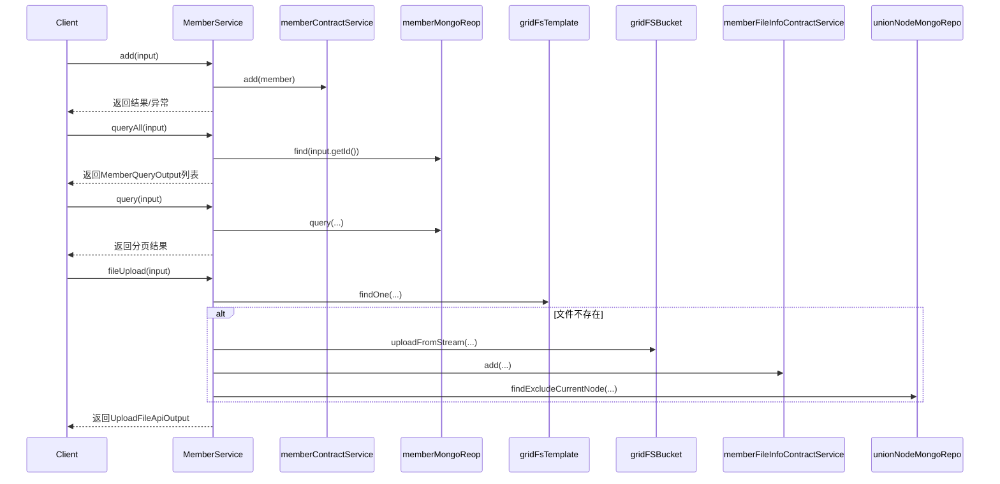

# 基础信息

|      |      |
|------|------|
| 名称 | MemberService |
| 编码语言 | .java |
| 代码路径 | WeFe/union/union-service/src/main/java/com/welab/wefe/union/service/service/MemberService.java |
| 包名 | com.welab.wefe.union.service.service |
| 依赖项 | ['com.alibaba.fastjson.JSON', 'com.mongodb.client.gridfs.GridFSBucket', 'com.mongodb.client.gridfs.model.GridFSFile', 'com.mongodb.client.gridfs.model.GridFSUploadOptions', 'com.welab.wefe.common.StatusCode', 'com.welab.wefe.common.constant.SecretKeyType', 'com.welab.wefe.common.data.mongodb.dto.PageOutput', 'com.welab.wefe.common.data.mongodb.dto.member.MemberAuthQueryOutput', 'com.welab.wefe.common.data.mongodb.dto.member.RealnameAuthInfoQueryOutput', 'com.welab.wefe.common.data.mongodb.entity.union.MemberFileInfo', 'com.welab.wefe.common.data.mongodb.entity.union.UnionNode', 'com.welab.wefe.common.data.mongodb.entity.union.ext.MemberExtJSON', 'com.welab.wefe.common.data.mongodb.entity.union.ext.RealnameAuthFileInfo', 'com.welab.wefe.common.data.mongodb.repo.MemberAuthTypeMongoRepo', 'com.welab.wefe.common.data.mongodb.repo.MemberMongoReop', 'com.welab.wefe.common.data.mongodb.repo.UnionNodeMongoRepo', 'com.welab.wefe.common.data.mongodb.util.QueryBuilder', 'com.welab.wefe.common.exception.StatusCodeWithException', 'com.welab.wefe.common.util.DateUtil', 'com.welab.wefe.common.util.JObject', 'com.welab.wefe.common.util.Md5', 'com.welab.wefe.common.util.StringUtil', 'com.welab.wefe.common.web.dto.UploadFileApiOutput', 'com.welab.wefe.common.wefe.enums.FileRurpose', 'com.welab.wefe.union.service.api.member', 'com.welab.wefe.union.service.cache.UnionNodeConfigCache', 'com.welab.wefe.union.service.constant.CertStatusEnums', 'com.welab.wefe.union.service.dto.base.BaseInput', 'com.welab.wefe.union.service.dto.member.MemberQueryOutput', 'com.welab.wefe.union.service.entity.Member', 'com.welab.wefe.union.service.service.contract.MemberContractService', 'com.welab.wefe.union.service.service.contract.MemberFileInfoContractService', 'com.welab.wefe.union.service.task.UploadFileSyncToUnionTask', 'com.welab.wefe.union.service.util.FileCheckerUtil', 'com.welab.wefe.union.service.util.MapperUtil', 'org.apache.http.entity.ContentType', 'org.apache.http.entity.mime.content.InputStreamBody', 'org.bson.Document', 'org.slf4j.Logger', 'org.slf4j.LoggerFactory', 'org.springframework.beans.factory.annotation.Autowired', 'org.springframework.data.mongodb.gridfs.GridFsTemplate', 'org.springframework.stereotype.Service', 'org.springframework.util.MultiValueMap', 'org.springframework.web.multipart.MultipartFile', 'java.io.IOException', 'java.util', 'java.util.stream.Collectors'] |
| 概述说明 | MemberService类提供成员管理功能，包括添加、查询、更新成员信息，实名认证及文件上传。依赖多个服务与存储库，处理成员数据、文件存储及区块链同步。 |

# 说明

该代码定义了一个名为MemberService的Spring服务类，主要用于管理成员信息。它包含添加成员、查询成员列表、分页查询、实名认证、文件上传等功能。服务通过自动注入多个依赖组件如MemberContractService、GridFsTemplate等实现数据存储和操作。主要方法包括处理成员信息的增删改查，支持文件上传和实名认证流程，涉及MongoDB和区块链存储。异常处理通过StatusCodeWithException捕获并记录日志。

# 类列表 Class Summary

| 名称   | 类型  | 说明 |
|-------|------|-------------|
| MemberService | class | MemberService类提供成员管理功能，包括添加、查询、更新成员信息，实名认证和文件上传。依赖多个服务如MemberContractService和MongoDB存储。支持分页查询、字段筛选和文件同步到其他节点。 |

## 类 MemberService

|      |      |
|------|------|
| 访问范围 | @Service;public |
| 类型 | class |
| 名称 | MemberService |
| 说明 | MemberService类提供成员管理功能，包括添加、查询、更新成员信息，实名认证和文件上传。依赖多个服务如MemberContractService和MongoDB存储。支持分页查询、字段筛选和文件同步到其他节点。 |

### UML类图

```mermaid
classDiagram
    class MemberService {
        -Logger LOG
        -MemberContractService memberContractService
        -UnionNodeMongoRepo unionNodeMongoRepo
        -GridFsTemplate gridFsTemplate
        -GridFSBucket gridFSBucket
        -MemberFileInfoContractService memberFileInfoContractService
        -MemberMongoReop memberMongoReop
        -MemberAuthTypeMongoRepo memberAuthTypeMongoRepo
        +add(AddApi$Input input) void
        +queryAll(QueryAllApi$Input input) List~MemberQueryOutput~
        +query(QueryApi$Input input) PageOutput~MemberQueryOutput~
        +queryMap(BaseInput input) Map~String, JObject~
        +queryAllAuthType(BaseInput input) List~MemberAuthQueryOutput~
        +realNameAuth(RealnameAuthApi$Input input) void
        +fileUpload(FileUploadApi$Input input) UploadFileApiOutput
        +queryRealNameAuthInfo(RealnameAuthInfoQueryApi$Input input) RealnameAuthInfoQueryOutput
        +update(UpdateApi$Input input) void
        -putUpdateField(UpdateApi$Input input) Member
        -saveFileInfoToBlockchain(String memberId, String fileId, String fileName, String fileSign, long fileSize, String purpose, String filePublicLevel, String describe) void
        -buildFileStreamBodyMap(MultiValueMap~String, MultipartFile~ files) Map~String, InputStreamBody~
        -syncDataToOtherUnionNode(String memberId, Map~String, InputStreamBody~ fileStreamBodyMap) void
        -apply(com.welab.wefe.common.data.mongodb.entity.union.Member member) JObject
    }

    class MemberContractService {
        <<Interface>>
        +add(Member member) void
        +updateExtJson(String curMemberId, MemberExtJSON extJSON) void
        +queryAll(String id) List~Member~
        +upsert(Member member) void
    }

    class UnionNodeMongoRepo {
        <<Interface>>
        +findExcludeCurrentNode(String currentNodeId) List~UnionNode~
    }

    class GridFsTemplate {
        <<Interface>>
        +findOne(QueryBuilder query) GridFSFile
    }

    class GridFSBucket {
        <<Interface>>
        +uploadFromStream(String filename, InputStream stream, GridFSUploadOptions options) ObjectId
    }

    class MemberFileInfoContractService {
        <<Interface>>
        +add(MemberFileInfo memberFileInfo) void
    }

    class MemberMongoReop {
        <<Interface>>
        +find(String id) List~com.welab.wefe.common.data.mongodb.entity.union.Member~
        +query(int pageIndex, int pageSize, String id, String name) PageOutput~com.welab.wefe.common.data.mongodb.entity.union.Member~
        +findMemberId(String memberId) com.welab.wefe.common.data.mongodb.entity.union.Member
    }

    class MemberAuthTypeMongoRepo {
        <<Interface>>
        +findList() List~MemberAuthType~
    }

    MemberService --> MemberContractService : 依赖
    MemberService --> UnionNodeMongoRepo : 依赖
    MemberService --> GridFsTemplate : 依赖
    MemberService --> GridFSBucket : 依赖
    MemberService --> MemberFileInfoContractService : 依赖
    MemberService --> MemberMongoReop : 依赖
    MemberService --> MemberAuthTypeMongoRepo : 依赖
```

这段类图展示了MemberService的核心结构和依赖关系。MemberService是一个Spring服务类，提供了成员管理相关的各种功能，包括添加成员、查询成员信息、实名认证、文件上传等。它依赖多个接口服务，如MemberContractService用于成员合约操作，UnionNodeMongoRepo用于联盟节点数据访问，GridFsTemplate和GridFSBucket用于文件存储操作等。类图清晰地展示了这些依赖关系，以及MemberService提供的各种公有和私有方法。

### 内部方法调用关系图

```mermaid
graph TD
    A["类MemberService"]
    B["属性: Logger LOG"]
    C["属性: MemberContractService memberContractService"]
    D["属性: UnionNodeMongoRepo unionNodeMongoRepo"]
    E["属性: GridFsTemplate gridFsTemplate"]
    F["属性: GridFSBucket gridFSBucket"]
    G["属性: MemberFileInfoContractService memberFileInfoContractService"]
    H["属性: MemberMongoReop memberMongoReop"]
    I["属性: MemberAuthTypeMongoRepo memberAuthTypeMongoRepo"]
    J["方法: add(AddApi.Input input)"]
    K["方法: queryAll(QueryAllApi.Input input)"]
    L["方法: query(QueryApi.Input input)"]
    M["方法: queryMap(BaseInput input)"]
    N["方法: queryAllAuthType(BaseInput input)"]
    O["方法: realNameAuth(RealnameAuthApi.Input input)"]
    P["方法: fileUpload(FileUploadApi.Input input)"]
    Q["方法: queryRealNameAuthInfo(RealnameAuthInfoQueryApi.Input input)"]
    R["方法: update(UpdateApi.Input input)"]
    S["私有方法: putUpdateField(UpdateApi.Input input)"]
    T["私有方法: saveFileInfoToBlockchain(...)"]
    U["私有方法: buildFileStreamBodyMap(...)"]
    V["私有方法: syncDataToOtherUnionNode(...)"]
    W["静态方法: apply(...)"]

    A --> B
    A --> C
    A --> D
    A --> E
    A --> F
    A --> G
    A --> H
    A --> I
    A --> J
    A --> K
    A --> L
    A --> M
    A --> N
    A --> O
    A --> P
    A --> Q
    A --> R
    A --> S
    A --> T
    A --> U
    A --> V
    A -.-> W
```

该流程图展示了MemberService类的完整结构，包含8个自动注入的属性和12个主要方法。时序图重点描述了add()、queryAll()、query()和fileUpload()四个核心方法的调用流程，展示了与memberContractService、memberMongoReop等组件的交互过程。其中fileUpload方法包含文件存在性检查、上传处理和区块链存储等复杂逻辑，体现了完整的文件管理流程。

### 字段列表 Field List

| 名称  | 类型  | 说明 |
|-------|-------|------|
| unionNodeMongoRepo | UnionNodeMongoRepo | 使用@Autowired自动注入UnionNodeMongoRepo实例。 |
| gridFSBucket | GridFSBucket | 使用@Autowired自动注入GridFSBucket对象。 |
| memberContractService | MemberContractService | 使用@Autowired自动注入MemberContractService实例。 |
| LOG = LoggerFactory.getLogger(this.getClass()) | Logger | 声明一个受保护的final日志对象，使用当前类名初始化。 |
| memberMongoReop | MemberMongoReop | 使用@Autowired自动注入MemberMongoReop成员变量。 |
| memberAuthTypeMongoRepo | MemberAuthTypeMongoRepo | 使用@Autowired自动注入MemberAuthTypeMongoRepo成员变量。 |
| gridFsTemplate | GridFsTemplate | 使用@Autowired自动注入GridFsTemplate对象。 |
| memberFileInfoContractService | MemberFileInfoContractService | 自动注入会员文件信息合同服务实例。 |

### 方法列表

| 名称  | 类型  | 说明 |
|-------|-------|------|
| queryAllAuthType | List<MemberAuthQueryOutput> | 查询所有会员认证类型，返回包含类型ID、名称和状态的列表。 |
| add | void | 方法add接收输入参数，创建Member对象并设置属性，包括ID、姓名、手机等，处理异常状态码。 |
| queryMap | Map<String, JObject> | 该方法查询MongoDB成员列表并转换为Map，键为成员ID，值为处理后的JObject。 |
| queryAll | List<MemberQueryOutput> | 方法queryAll根据输入参数input查询成员列表，若input不包含logo则清空logo字段，最后将结果转换为MemberQueryOutput列表返回。 |
| saveFileInfoToBlockchain | void | 方法将文件信息存入区块链，包括成员ID、文件ID、名称、签名、大小、用途、公开级别和描述。 |
| fileUpload | UploadFileApiOutput | 文件上传方法，验证文件类型和用途，计算MD5签名，检查重复后存储到GridFS和区块链，返回文件ID。处理异常并同步数据到其他节点。 |
| update | void | 更新成员信息方法：处理输入参数，更新成员字段并保存，捕获异常时记录日志并抛出系统错误状态。 |
| realNameAuth | void | 方法realNameAuth处理实名认证，设置用户扩展信息并验证文件存在性，最后更新用户数据。 |
| putUpdateField | Member | 方法根据输入更新会员信息，包括名称、手机、隐藏状态等，并设置最后更新时间。 |
| queryRealNameAuthInfo | RealnameAuthInfoQueryOutput | 查询成员实名认证信息，包括认证类型、审核意见、证书内容及文件列表。若成员不存在或查询失败，抛出异常。 |
| query | PageOutput<MemberQueryOutput> | 该方法通过MongoDB分页查询成员信息，转换结果后返回。异常时记录日志并抛出系统错误。 |
| buildFileStreamBodyMap | Map<String, InputStreamBody> | 将MultipartFile映射转换为InputStreamBody映射，处理文件流和内容类型，异常时抛出错误。 |
| syncDataToOtherUnionNode | void | 同步数据到其他联盟节点：遍历非当前节点列表，为每个节点启动上传文件同步任务，包含成员ID和文件流数据。 |
| apply | JObject | 将Member对象转换为JObject，包含name、hidden、freezed和lostContact字段。 |

