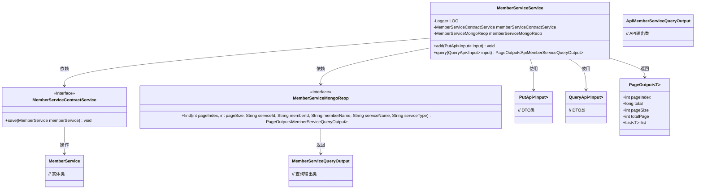
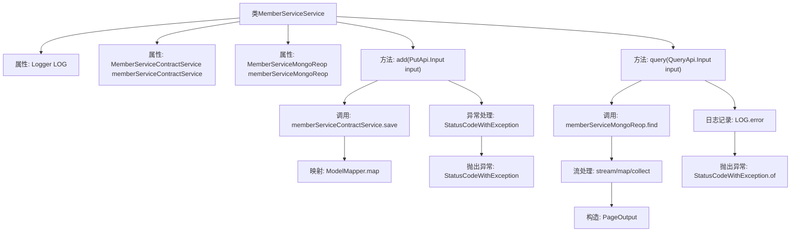

# 基础信息

|      |      |
|------|------|
| 名称 | MemberServiceService |
| 编码语言 | .java |
| 代码路径 | WeFe/union/union-service/src/main/java/com/welab/wefe/union/service/service/MemberServiceService.java |
| 包名 | com.welab.wefe.union.service.service |
| 依赖项 | ['com.welab.wefe.common.StatusCode', 'com.welab.wefe.common.data.mongodb.dto.PageOutput', 'com.welab.wefe.common.data.mongodb.dto.member.MemberServiceQueryOutput', 'com.welab.wefe.common.data.mongodb.entity.union.MemberService', 'com.welab.wefe.common.data.mongodb.repo.MemberServiceMongoReop', 'com.welab.wefe.common.exception.StatusCodeWithException', 'com.welab.wefe.union.service.api.service.PutApi', 'com.welab.wefe.union.service.api.service.QueryApi', 'com.welab.wefe.union.service.dto.member.ApiMemberServiceQueryOutput', 'com.welab.wefe.union.service.service.contract.MemberServiceContractService', 'com.welab.wefe.union.service.util.MapperUtil', 'com.welab.wefe.union.service.util.ModelMapper', 'org.slf4j.Logger', 'org.slf4j.LoggerFactory', 'org.springframework.beans.factory.annotation.Autowired', 'org.springframework.stereotype.Service', 'java.util.List', 'java.util.stream.Collectors'] |
| 概述说明 | MemberServiceService类提供成员服务添加和分页查询功能，依赖ContractService和MongoReop，处理异常并记录日志。 |

# 说明

这是一个名为MemberServiceService的Spring服务类，包含两个核心方法。add方法接收输入参数，通过memberServiceContractService保存映射后的MemberService对象，异常时抛出状态码异常。query方法通过memberServiceMongoReop进行分页查询，参数包括页码、页大小及多个过滤条件，查询结果转换为ApiMemberServiceQueryOutput列表后返回分页对象，异常时记录错误日志并抛出系统错误状态码。类中注入了MemberServiceContractService和MemberServiceMongoReop两个依赖服务。

# 类列表 Class Summary

| 名称   | 类型  | 说明 |
|-------|------|-------------|
| MemberServiceService | class | MemberServiceService类提供添加和查询会员服务功能。添加功能调用ContractService保存数据，查询功能通过MongoReop分页获取数据并转换输出。异常时抛出系统错误。 |

## 类 MemberServiceService

|      |      |
|------|------|
| 访问范围 | @Service;public |
| 类型 | class |
| 名称 | MemberServiceService |
| 说明 | MemberServiceService类提供添加和查询会员服务功能。添加功能调用ContractService保存数据，查询功能通过MongoReop分页获取数据并转换输出。异常时抛出系统错误。 |

### UML类图

类图描述：MemberServiceService 是一个服务类，依赖 MemberServiceContractService 和 MemberServiceMongoReop 两个接口，分别用于保存会员服务和分页查询会员服务信息。它提供了 add 和 query 两个主要方法，处理输入参数并返回分页结果。类图中包含了相关的 DTO 类和输出类，展示了服务类与其它组件之间的依赖关系。

### 内部方法调用关系图

这段代码是MemberServiceService类的实现，主要包含两个核心方法：add和query。add方法用于保存会员服务信息，通过调用memberServiceContractService的save方法实现，并处理可能出现的异常。query方法用于分页查询会员信息，通过memberServiceMongoReop的find方法获取数据，经过流处理后返回分页结果，同时捕获并记录查询过程中的异常。两个方法都涉及异常处理和日志记录，确保系统稳定性和可追溯性。

### 字段列表 Field List

| 名称  | 类型  | 说明 |
|-------|-------|------|
| memberServiceMongoReop | MemberServiceMongoReop | 使用@Autowired自动注入MemberServiceMongoReop实例。 |
| memberServiceContractService | MemberServiceContractService | 使用@Autowired自动注入MemberServiceContractService实例。 |
| LOG = LoggerFactory.getLogger(MemberServiceService.class) | Logger | 类MemberServiceService中定义了一个静态不可变的日志记录器LOG。 |

### 方法列表

| 名称  | 类型  | 说明 |
|-------|-------|------|
| query | PageOutput<ApiMemberServiceQueryOutput> | 该方法通过输入参数分页查询成员服务信息，转换结果后返回。异常时记录日志并抛出系统错误提示。 |
| add | void | 该方法接收输入对象，调用服务保存映射后的成员服务数据。成功则保存，失败则抛出原始异常或系统错误异常。 |

