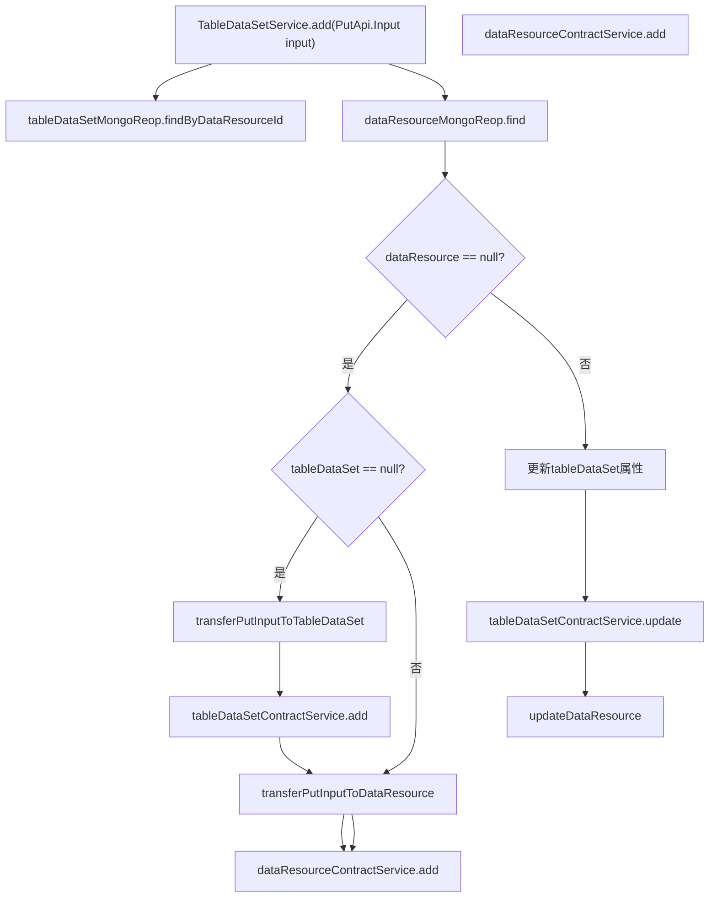
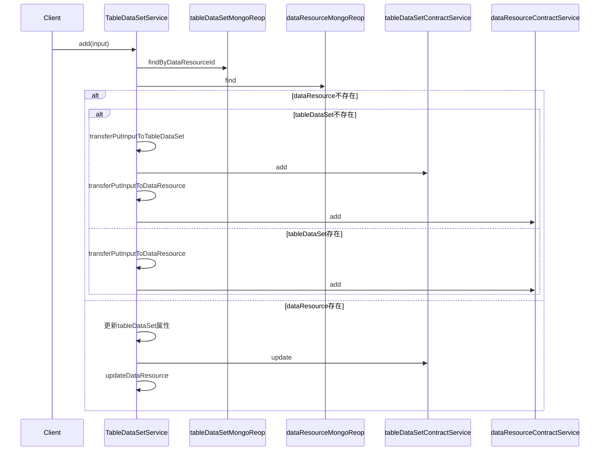

# 基础信息

|      |      |
|------|------|
| 名称 | TableDataSetService |
| 编码语言 | .java |
| 代码路径 | WeFe/union/union-service/src/main/java/com/welab/wefe/union/service/service/TableDataSetService.java |
| 包名 | com.welab.wefe.union.service.service |
| 依赖项 | ['com.welab.wefe.common.data.mongodb.entity.union.DataResource', 'com.welab.wefe.common.data.mongodb.entity.union.TableDataSet', 'com.welab.wefe.common.data.mongodb.repo.TableDataSetMongoReop', 'com.welab.wefe.common.exception.StatusCodeWithException', 'com.welab.wefe.common.util.DateUtil', 'com.welab.wefe.union.service.api.dataresource.dataset.table.PutApi', 'com.welab.wefe.union.service.service.contract.TableDataSetContractService', 'com.welab.wefe.union.service.util.ModelMapper', 'org.springframework.beans.factory.annotation.Autowired', 'org.springframework.stereotype.Service'] |
| 概述说明 | TableDataSetService处理数据资源添加和更新。检查数据存在性后，通过ContractService和MongoRepo进行新增或更新操作，包含字段转换逻辑。 |

# 说明

该代码定义了一个TableDataSetService类，继承自AbstractDataResourceService，用于处理表格数据集的增改操作。通过注入TableDataSetContractService和TableDataSetMongoReop依赖，实现数据资源的新增或更新。主要逻辑包括：根据输入参数检查数据资源是否存在，不存在则创建新的数据集和资源记录；存在则更新现有数据集的包含Y值、列数、列名列表、特征数和特征名列表等属性，并同步更新数据资源。辅助方法负责将输入参数映射为DataResource和TableDataSet对象，并设置创建时间、更新时间等字段。

# 类列表 Class Summary

| 名称   | 类型  | 说明 |
|-------|------|-------------|
| TableDataSetService | class | TableDataSetService处理数据资源添加和更新。根据输入检查数据是否存在，不存在则创建TableDataSet和DataResource，存在则更新TableDataSet字段并更新DataResource。包含数据转换方法。 |


## 类 TableDataSetService

|      |      |
|------|------|
| 访问范围 | @Service;public |
| 类型 | class |
| 名称 | TableDataSetService |
| 说明 | TableDataSetService处理数据资源添加和更新。根据输入检查数据是否存在，不存在则创建TableDataSet和DataResource，存在则更新TableDataSet字段并更新DataResource。包含数据转换方法。 |


### UML类图

```mermaid
classDiagram
    class TableDataSetService {
        -TableDataSetContractService tableDataSetContractService
        -TableDataSetMongoReop tableDataSetMongoReop
        +add(PutApi$Input input) void
        -transferPutInputToDataResource(PutApi$Input input) DataResource
        -transferPutInputToTableDataSet(PutApi$Input input) TableDataSet
    }

    class AbstractDataResourceService {
        <<Abstract>>
    }

    class TableDataSetContractService {
        <<Interface>>
        +add(TableDataSet tableDataSet) void
        +update(TableDataSet tableDataSet) void
    }

    class TableDataSetMongoReop {
        +findByDataResourceId(String dataResourceId) TableDataSet
    }

    class PutApi$Input {
        +getDataResourceId() String
        +getCurMemberId() String
        +isContainsY() boolean
        +getColumnCount() int
        +getColumnNameList() List~String~
        +getFeatureCount() int
        +getFeatureNameList() List~String~
    }

    class TableDataSet {
        +setContainsY(String containsY) void
        +setColumnCount(String columnCount) void
        +setColumnNameList(List~String~ columnNameList) void
        +setFeatureCount(String featureCount) void
        +setFeatureNameList(List~String~ featureNameList) void
    }

    class DataResource {
        +setMemberId(String memberId) void
    }

    TableDataSetService --|> AbstractDataResourceService : 继承
    TableDataSetService --> TableDataSetContractService : 依赖
    TableDataSetService --> TableDataSetMongoReop : 依赖
    TableDataSetService --> PutApi$Input : 使用
    TableDataSetService --> TableDataSet : 操作
    TableDataSetService --> DataResource : 操作
```

这段代码展示了一个表格数据集服务类(TableDataSetService)，它继承自抽象数据资源服务类(AbstractDataResourceService)，主要功能是处理表格数据集的添加和更新操作。该类通过依赖注入的方式使用TableDataSetContractService接口和TableDataSetMongoReop类，提供了将输入参数转换为TableDataSet和DataResource对象的方法，并根据不同条件执行添加或更新操作。整个设计体现了分层架构思想，服务层负责业务逻辑处理，与数据访问层和合约服务层解耦。


### 内部方法调用关系图





这段代码是TableDataSetService类中的add方法实现，主要处理数据资源的添加和更新逻辑。当输入数据资源不存在时，会根据tableDataSet是否存在分别创建新记录；当数据资源已存在时，则更新现有记录。流程图中清晰展示了条件判断分支和对应的操作路径，时序图则详细描述了各组件间的交互顺序。方法涉及多个数据库操作和业务逻辑处理，确保数据一致性和完整性。

### 字段列表 Field List

| 名称  | 类型  | 说明 |
|-------|-------|------|
| tableDataSetContractService | TableDataSetContractService | 自动注入TableDataSetContractService服务实例。 |
| tableDataSetMongoReop | TableDataSetMongoReop | 使用@Autowired自动注入TableDataSetMongoReop的MongoDB仓库实例。 |

### 方法列表

| 名称  | 类型  | 说明 |
|-------|-------|------|
| add | void | 方法add处理数据资源添加或更新：检查资源是否存在，不存在则创建表数据集和数据资源；存在则更新表数据集字段并更新数据资源。 |
| transferPutInputToTableDataSet | TableDataSet | 将PutApi.Input转换为TableDataSet，设置containsY为1或0，并添加当前时间作为创建和更新时间。 |
| transferPutInputToDataResource | DataResource | 将输入对象转换为数据资源对象，设置成员ID后返回。 |


