# 基础信息

|      |      |
|------|------|
| 名称 | service |
| 编码语言 | .java |
| 代码路径 | WeFe/union/union-service/src/main/java/com/welab/wefe/union/service/service |
| 包名 | docs.union.union-service.src.main.java.com.welab.wefe.union.service.service |
| 概述说明 | 区块链数据管理服务模块，通过智能合约实现数据增删改查及权限管理，支持联邦学习多方协同。包含数据资源、布隆过滤器等关键结构，依赖加密组件和MongoDB。提供健康检查、成员管理、数据集操作等功能，覆盖全生命周期和细粒度控制。 |

# 说明

## 概述  
该模块是区块链数据管理服务集合，核心职责为通过智能合约实现数据资源的全生命周期管理和健康检查，类似分布式数据库中间件。接口规范包含交易回执解析模板（如AbstractContractService派生的校验方法）和统一检查模式（如AbstractCheckpoint基类）。关键数据结构包括DataResource（含ID/成员ID/标签）、BloomFilter（含哈希函数）和服务类型枚举（MongodbService/BlockChainService）。外部依赖项包括CryptoSuite加密组件、TransactionDecoderService和MongoDB存储驱动。例如ImageDataSetService通过MongoDB存储图像元数据，BlockChainCheckpoint验证节点存活。

## 主要业务场景  
模块支持联邦学习场景下的多方数据协同，典型流程为：1)成员注册校验（MemberService）；2)数据集权限管理（DataSetService）；3)资源元数据操作（DataResourceService）。交互模式采用"本地校验+链上操作"双阶段，例如布隆过滤器更新前先验证成员ID。功能完整性体现在细粒度控制（如三种公开级别）和健康检查机制（类似探针）。API类型涵盖CRUD基础操作（如表数据列更新）和扩展功能（如文件下载），集成案例包括实名认证流程与数据资源联动。

### 包内部结构视图

```mermaid
graph TD
    service --> contract
    service --> ImageDataSetService.java
    service --> DefaultTagService.java
    service --> available
    service --> MemberServiceService.java
    service --> AbstractDataResourceService.java
    service --> BloomFilterService.java
    service --> MemberService.java
    service --> DataSetService.java
    service --> DataResourceService.java
    service --> TableDataSetService.java
    service --> CommonService.java
    contract --> MemberFileInfoContractService.java
    contract --> BloomFilterContractService.java
    contract --> DataResourceContractService.java
    contract --> DataSetContractService.java
    contract --> AbstractContractService.java
    contract --> ImageDataSetContractService.java
    contract --> MemberServiceContractService.java
    contract --> DataSetMemberPermissionContractService.java
    contract --> TableDataSetContractService.java
    contract --> UnionNodeContractService.java
    contract --> MemberContractService.java
    available --> checkpoint
    checkpoint --> MongoCheckpoint.java
    checkpoint --> BlockChainCheckpoint.java
```

该流程图展示了WeFe联合服务项目的服务层结构，包含service主目录及其子目录contract和available。contract目录下包含13个合约服务实现类，available目录下包含checkpoint子目录及两个检查点实现类。主目录还直接包含9个独立服务类，整体呈现清晰的多层级服务架构。

# 文件列表

| 名称   | 类型  | 说明 |
|-------|------|-------------|
| [ImageDataSetService.java](ImageDataSetService.md) | file | ImageDataSetService类处理图像数据集操作，包含新增和更新逻辑。通过检查数据资源是否存在决定执行新增或更新操作，涉及ImageDataSet和DataResource的存储与修改。 |
| [DefaultTagService.java](DefaultTagService.md) | file | DefaultTagService类通过MongoDB仓库查询默认标签数据，提供按资源类型查询和查询全部标签的方法，并将结果转换为统一输出格式。包含类型转换逻辑处理异常情况。 |
| [MemberServiceService.java](MemberServiceService.md) | file | MemberServiceService类提供成员服务添加和分页查询功能，依赖ContractService和MongoReop，处理异常并记录日志。 |
| [AbstractDataResourceService.java](AbstractDataResourceService.md) | file | 抽象类AbstractDataResourceService提供数据资源更新功能，依赖ContractService和MongoReop，通过input参数更新dataResource属性并调用ContractService更新。 |
| [BloomFilterService.java](BloomFilterService.md) | file | BloomFilterService处理数据资源添加和更新，检查布隆过滤器和数据资源是否存在，不存在则创建，存在则更新哈希函数和数据资源。 |
| [MemberService.java](MemberService.md) | file | MemberService类提供成员管理功能，包括添加、查询、更新成员信息，实名认证及文件上传。依赖多个服务与存储库，处理成员数据、文件存储及区块链同步。 |
| [DataSetService.java](DataSetService.md) | file | DataSetService提供数据集操作功能，包括添加、删除、查询详情和分页查询。添加时根据公开级别处理权限，删除时同步清理关联数据，查询支持详情和分页。 |
| [DataResourceService.java](DataResourceService.md) | file | DataResourceService提供数据资源管理功能，包括分页查询、详情获取、删除、隐藏和标签查询。支持表数据集、图像数据集和布隆过滤器类型，通过MongoDB和合约服务操作数据。 |
| [TableDataSetService.java](TableDataSetService.md) | file | TableDataSetService处理数据资源添加和更新。检查数据存在性后，通过ContractService和MongoRepo进行新增或更新操作，包含字段转换逻辑。 |
| [CommonService.java](CommonService.md) | file | CommonService类提供文件下载、上传及实名认证模板查询功能，使用GridFS存储文件，支持跨节点下载和本地存储，包含权限检查和异常处理。 |
| [available](available/_module.md) | package | MongoCheckpoint检查MongoDB服务状态，通过existsByMemberId验证连接。BlockChainCheckpoint检查区块链服务状态，通过isExist验证成员存在性。两者均无配置值，核心逻辑为存在性验证。 |
| [contract](contract/_module.md) | package | 多个服务类继承AbstractContractService，处理区块链交易。功能包括成员文件管理、布隆过滤器操作、数据资源增删改查、数据集权限管理、节点管理等。各服务类通过智能合约交互，包含参数生成、交易回执处理和异常捕获。 |

