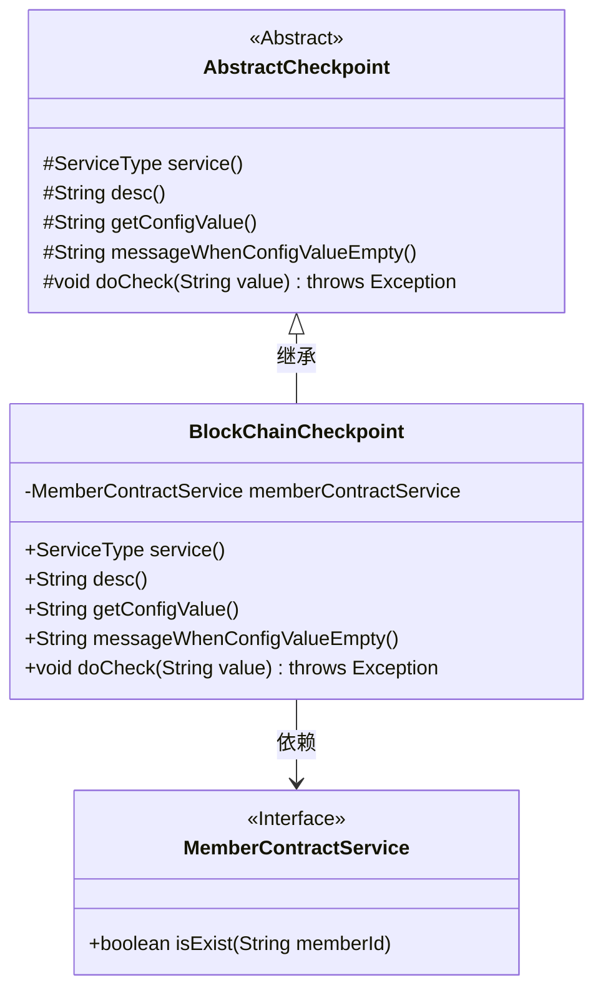
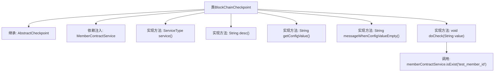

# 基础信息

|      |      |
|------|------|
| 名称 | BlockChainCheckpoint |
| 编码语言 | .java |
| 代码路径 | WeFe/union/union-service/src/main/java/com/welab/wefe/union/service/service/available/checkpoint/BlockChainCheckpoint.java |
| 包名 | com.welab.wefe.union.service.service.available.checkpoint |
| 依赖项 | ['com.welab.wefe.common.wefe.checkpoint.AbstractCheckpoint', 'com.welab.wefe.common.wefe.enums.ServiceType', 'com.welab.wefe.union.service.service.contract.MemberContractService', 'org.springframework.beans.factory.annotation.Autowired', 'org.springframework.stereotype.Service'] |
| 概述说明 | BlockChainCheckpoint类继承AbstractCheckpoint，检查区块链服务运行状态，通过memberContractService验证成员存在性。 |

# 说明

BlockChainCheckpoint是一个继承AbstractCheckpoint的服务类，用于检查区块链服务运行状态。它通过MemberContractService的isExist方法验证测试成员ID是否存在。该服务类型为BlockChainService，描述为检查区块链服务是否运行良好。类中未配置具体配置值和空值提示信息，核心检查逻辑仅包含成员存在性验证。

# 类列表 Class Summary

| 名称   | 类型  | 说明 |
|-------|------|-------------|
| BlockChainCheckpoint | class | BlockChainCheckpoint类继承AbstractCheckpoint，检查区块链服务状态，通过memberContractService验证成员存在性。 |

## 类 BlockChainCheckpoint

|      |      |
|------|------|
| 访问范围 | @Service;public |
| 类型 | class |
| 名称 | BlockChainCheckpoint |
| 说明 | BlockChainCheckpoint类继承AbstractCheckpoint，检查区块链服务状态，通过memberContractService验证成员存在性。 |

### UML类图

该类图展示了区块链检查点服务的核心结构。BlockChainCheckpoint继承自抽象类AbstractCheckpoint，实现了5个受保护的抽象方法，其中doCheck方法通过依赖注入的MemberContractService接口验证成员存在性。MemberContractService作为接口独立存在，体现了依赖倒置原则。整体设计符合Spring服务组件的典型模式，通过继承实现模板方法模式，通过接口依赖实现松耦合。

### 内部方法调用关系图

该流程图展示了BlockChainCheckpoint类的结构及其与父类AbstractCheckpoint的继承关系。作为Spring服务组件，它通过@Autowired注入MemberContractService，并实现了5个抽象方法。核心检查逻辑在doCheck方法中，通过调用memberContractService.isExist()验证区块链服务状态。所有配置相关方法返回null，表明该类主要依赖外部服务调用而非配置检查。

### 字段列表 Field List

| 名称  | 类型  | 说明 |
|-------|-------|------|
| memberContractService | MemberContractService | 代码片段使用@Autowired注解自动注入MemberContractService实例。 |

### 方法列表

| 名称  | 类型  | 说明 |
|-------|-------|------|
| doCheck | void | 检查成员ID是否存在，调用memberContractService的isExist方法验证"test_member_id"。 |
| messageWhenConfigValueEmpty | String | Java方法重写，返回空值表示配置值为空时的提示信息。 |
| service | ServiceType | 该方法重写父类方法，返回服务类型为区块链服务。 |
| desc | String | 检查区块链服务运行状态 |
| getConfigValue | String | 这是一个Java方法重写，返回null作为配置值。 |

