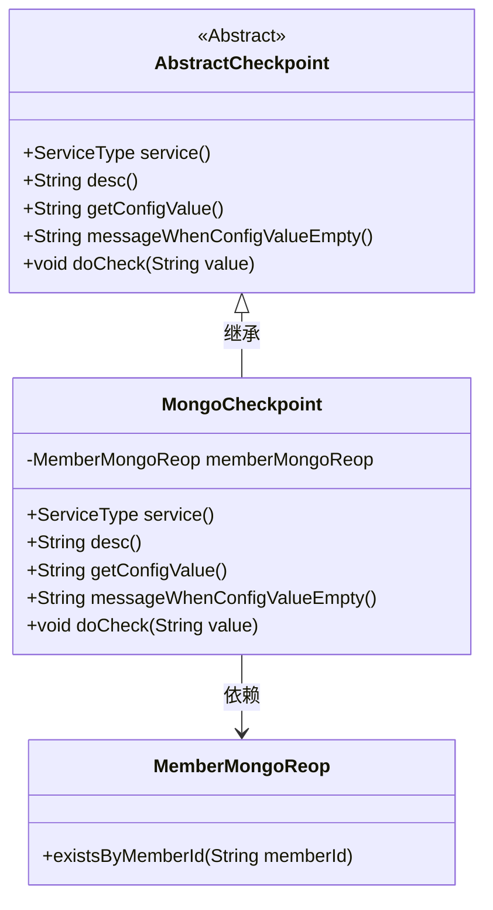
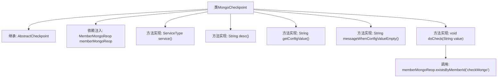

# 基础信息

|      |      |
|------|------|
| 名称 | MongoCheckpoint |
| 编码语言 | .java |
| 代码路径 | WeFe/union/union-service/src/main/java/com/welab/wefe/union/service/service/available/checkpoint/MongoCheckpoint.java |
| 包名 | com.welab.wefe.union.service.service.available.checkpoint |
| 依赖项 | ['com.welab.wefe.common.data.mongodb.repo.MemberMongoReop', 'com.welab.wefe.common.wefe.checkpoint.AbstractCheckpoint', 'com.welab.wefe.common.wefe.enums.ServiceType', 'org.springframework.beans.factory.annotation.Autowired', 'org.springframework.stereotype.Service'] |
| 概述说明 | MongoCheckpoint类继承AbstractCheckpoint，检查MongoDB服务状态，通过memberMongoReop.existsByMemberId方法验证。 |

# 说明

MongoCheckpoint是一个继承自AbstractCheckpoint的服务类，用于检查MongoDB服务的运行状态。它通过注入MemberMongoReop成员变量来执行数据库操作。该服务类型定义为MongodbService，描述信息为检查mongodb服务是否运行良好。在检查过程中，会调用memberMongoReop的existsByMemberId方法验证数据库连接。配置值和空配置提示信息均为空，核心检查逻辑仅包含数据库存在性验证。

# 类列表 Class Summary

| 名称   | 类型  | 说明 |
|-------|------|-------------|
| MongoCheckpoint | class | MongoCheckpoint类继承AbstractCheckpoint，检查MongoDB服务状态，通过memberMongoReop.existsByMemberId验证运行情况。 |

## 类 MongoCheckpoint

|      |      |
|------|------|
| 访问范围 | @Service;public |
| 类型 | class |
| 名称 | MongoCheckpoint |
| 说明 | MongoCheckpoint类继承AbstractCheckpoint，检查MongoDB服务状态，通过memberMongoReop.existsByMemberId验证运行情况。 |

### UML类图

这段代码展示了一个MongoDB检查点服务MongoCheckpoint，它继承自抽象基类AbstractCheckpoint并实现了多个检查相关的抽象方法。类图中清晰地显示了继承关系和依赖关系，其中MongoCheckpoint通过成员变量依赖MemberMongoReop来执行实际的MongoDB检查操作。该设计遵循了模板方法模式，父类定义检查流程框架，子类实现具体检查逻辑。

### 内部方法调用关系图

该流程图展示了MongoCheckpoint类的结构及其与父类AbstractCheckpoint的继承关系。类中通过@Autowired注入MemberMongoReop依赖，并实现了5个抽象方法，其中核心方法doCheck()会调用memberMongoReop.existsByMemberId()进行MongoDB健康检查。所有方法实现均遵循抽象父类的约束，但getConfigValue()和messageWhenConfigValueEmpty()返回空值，表明可能未完全实现配置相关功能。

### 字段列表 Field List

| 名称  | 类型  | 说明 |
|-------|-------|------|
| memberMongoReop | MemberMongoReop | 使用@Autowired自动注入MemberMongoReop成员变量。 |

### 方法列表

| 名称  | 类型  | 说明 |
|-------|-------|------|
| getConfigValue | String | 重写getConfigValue方法，返回null。 |
| service | ServiceType | 该方法重写父类方法，返回MongodbService服务类型。 |
| desc | String | 检查MongoDB服务运行状态。 |
| messageWhenConfigValueEmpty | String | 方法重写，当配置值为空时返回null。 |
| doCheck | void | 方法doCheck检查成员ID在MongoDB中是否存在，调用memberMongoReop.existsByMemberId方法。 |

