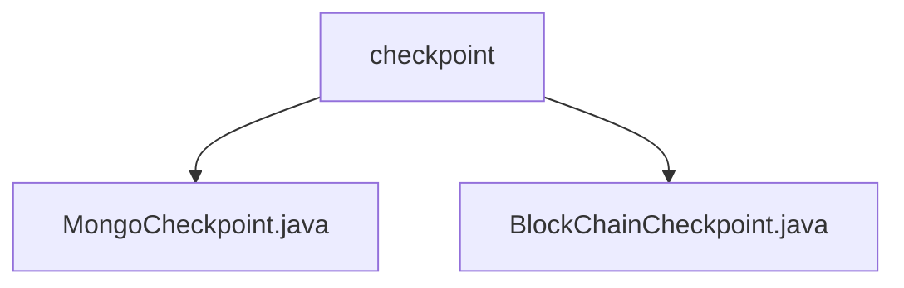

# 基础信息

|      |      |
|------|------|
| 名称 | checkpoint |
| 编码语言 | .java |
| 代码路径 | WeFe/union/union-service/src/main/java/com/welab/wefe/union/service/service/available/checkpoint |
| 包名 | docs.union.union-service.src.main.java.com.welab.wefe.union.service.service.available.checkpoint |
| 概述说明 | MongoCheckpoint检查MongoDB服务状态，通过existsByMemberId验证连接。BlockChainCheckpoint检查区块链服务状态，通过isExist验证成员存在性。两者均无配置值，核心逻辑为存在性验证。 |

# 说明

## 概述  
该模块核心职责是提供多类型服务的健康检查能力，包括MongoDB和区块链服务的运行状态验证。接口规范统一继承AbstractCheckpoint基类，通过注入特定组件（如MemberMongoReop或MemberContractService）执行存在性检查。关键数据结构包含服务类型枚举（MongodbService/BlockChainService）和成员ID参数。外部依赖项涉及MongoDB驱动和区块链合约服务。例如MongoCheckpoint通过existsByMemberId验证连接，BlockChainCheckpoint调用isExist确认成员存在。

## 主要业务场景  
模块采用统一检查模式：初始化服务类型→注入依赖组件→执行原子化验证（类似探针机制）。完整业务流程包含数据库连接测试和链上合约查询两类场景，典型应用如联盟节点启动时的服务预检。API类型均为无参检查接口，集成案例包括MongoDB连接池健康监测和区块链节点存活验证。例如通过成员ID查询验证区块链服务可用性，或检查MongoDB集合可访问性。

### 包内部结构视图

该流程图展示了WeFe项目中union-service模块下checkpoint目录的层级结构。checkpoint作为父节点，包含两个子节点文件：MongoCheckpoint.java和BlockChainCheckpoint.java，这两个文件分别实现了不同类型的检查点功能。整个结构清晰地反映了检查点相关服务的代码组织方式，符合模块化开发规范。

# 文件列表

| 名称   | 类型  | 说明 |
|-------|------|-------------|
| [MongoCheckpoint.java](MongoCheckpoint.md) | file | MongoCheckpoint类继承AbstractCheckpoint，检查MongoDB服务状态，通过memberMongoReop.existsByMemberId方法验证。 |
| [BlockChainCheckpoint.java](BlockChainCheckpoint.md) | file | BlockChainCheckpoint类继承AbstractCheckpoint，检查区块链服务运行状态，通过memberContractService验证成员存在性。 |

