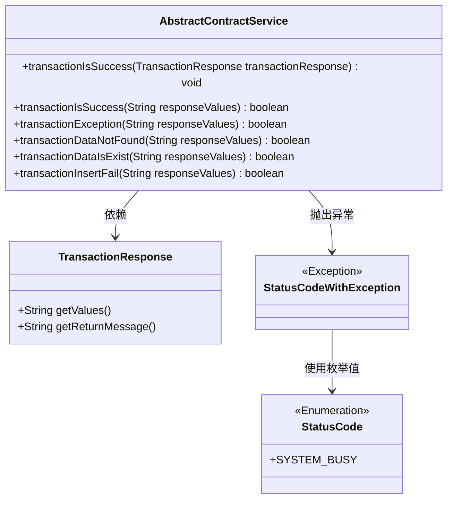

# 基础信息

|      |      |
|------|------|
| 名称 | AbstractContractService |
| 编码语言 | .java |
| 代码路径 | WeFe/union/union-service/src/main/java/com/welab/wefe/union/service/service/contract/AbstractContractService.java |
| 包名 | com.welab.wefe.union.service.service.contract |
| 依赖项 | ['com.alibaba.fastjson.JSONArray', 'com.welab.wefe.common.StatusCode', 'com.welab.wefe.common.exception.StatusCodeWithException', 'com.welab.wefe.common.util.JObject', 'org.fisco.bcos.sdk.transaction.model.dto.TransactionResponse'] |
| 概述说明 | AbstractContractService类提供交易状态检查方法，处理不同返回码（0成功，-1数据存在，-2失败，-3数据不存在），包含异常判断及数据存在性验证。 |

# 说明

AbstractContractService类提供了处理区块链交易响应的方法。transactionIsSuccess方法检查交易是否成功，根据返回码抛出不同异常，包括数据已存在、交易失败、数据不存在等。其他辅助方法包括transactionIsSuccess（布尔返回值）、transactionException（检查响应是否异常）、transactionDataNotFound（检查数据是否存在）、transactionDataIsExist（检查数据是否已存在）和transactionInsertFail（检查插入是否失败）。这些方法通过解析JSON格式的响应值进行判断。

# 类列表 Class Summary

| 名称   | 类型  | 说明 |
|-------|------|-------------|
| AbstractContractService | class | AbstractContractService类提供交易状态检查方法，解析区块链响应值，处理不同返回码（0成功，-1数据存在，-2失败，-3数据不存在），包含异常判断及数据存在性验证功能。 |

## 类 AbstractContractService

|      |      |
|------|------|
| 访问范围 | public |
| 类型 | class |
| 名称 | AbstractContractService |
| 说明 | AbstractContractService类提供交易状态检查方法，解析区块链响应值，处理不同返回码（0成功，-1数据存在，-2失败，-3数据不存在），包含异常判断及数据存在性验证功能。 |

### UML类图

该类图展示了AbstractContractService及其关联类的关系。AbstractContractService提供了多个方法用于处理交易响应，包括检查交易状态、数据存在性等。TransactionResponse作为输入参数类提供响应数据，StatusCodeWithException是自定义异常类，使用StatusCode枚举表示错误类型。所有方法都围绕解析JSON格式的交易响应值进行状态判断，形成完整的交易状态处理逻辑。

### 内部方法调用关系图

```mermaid
graph TD
    A["AbstractContractService"]
    B["transactionIsSuccess(TransactionResponse)"]
    C["transactionIsSuccess(String)"]
    D["transactionException(String)"]
    E["transactionDataNotFound(String)"]
    F["transactionDataIsExist(String)"]
    G["transactionInsertFail(String)"]

    A --> B
    A --> C
    A --> D
    A --> E
    A --> F
    A --> G

    B --> H["getValues()"]
    B --> I["parseArray()"]
    B --> J["isEmpty()"]
    B --> K["getIntValue(0)"]
    B --> L["StatusCodeWithException"]

    C --> M["parseArray()"]
    C --> N["isEmpty()"]
    C --> O["getIntValue(0)"]

    D --> P["parseArray()"]
    D --> Q["isEmpty()"]

    E --> R["parseArray()"]
    E --> S["transactionException()"]
    E --> T["getIntValue(0)"]

    F --> U["parseArray()"]
    F --> V["transactionException()"]
    F --> W["getIntValue(0)"]

    G --> X["parseArray()"]
    G --> Y["transactionException()"]
    G --> Z["getIntValue(0)"]
```

流程图描述了AbstractContractService类中多个方法的调用关系。核心方法transactionIsSuccess有两个重载版本，分别处理TransactionResponse对象和String类型的响应值。其他辅助方法如transactionException、transactionDataNotFound等均依赖JSONArray解析和基础校验逻辑。所有方法共享parseArray和getIntValue操作，异常处理集中在第一个重载方法中。

### 字段列表 Field List

| 名称  | 类型  | 说明 |
|-------|-------|------|

### 方法列表

| 名称  | 类型  | 说明 |
|-------|-------|------|
| transactionIsSuccess | void | 检查交易响应，解析JSON数组。若为空或错误码非0，抛出对应异常：-1数据已存在，-2交易失败，-3数据不存在，其他未知错误码。 |
| transactionDataNotFound | boolean | 检查响应数据是否无效：非异常且首元素为负数时返回真。 |
| transactionException | boolean | 检查JSON响应是否为空或无效。 |
| transactionIsSuccess | boolean | 检查响应值是否为有效JSON数组且首元素非负，否则返回失败。 |
| transactionDataIsExist | boolean | 检查交易数据是否存在：非异常且首值为-1时返回真。 |
| transactionInsertFail | boolean | 检查响应值是否为非异常且首元素为-2，返回布尔结果。 |

